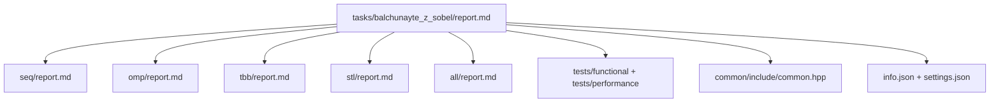

# Выделение ребер на изображении с использованием оператора Собеля

- Student: Бальчунайте Злата Денисовна, group 3823Б1ПР3
- Variant: 27
- Local reports:
  - `seq/report.md`
  - `omp/report.md`
  - `tbb/report.md`
  - `stl/report.md`
  - `all/report.md`

## 1. Введение

Оператор Собеля нужен для выделения границ на изображении.
Он ищет участки изображения, где яркость пикселей резко меняется.
Для этого для каждого внутреннего пикселя берётся окно `3×3`, считаются два градиента:
по горизонтали `Gx` и по вертикали `Gy`.

Эта задача удобна для сравнения разных моделей параллельного программирования,
потому что разные строки изображения можно обрабатывать независимо.
Значение одного внутреннего пикселя не зависит от того, что получилось у другого пикселя.
Поэтому изображение удобно делить на части и отдавать эти части разным потокам.

В работе реализованы пять версий:

- `SEQ` - последовательная версия;
- `OMP` - версия на OpenMP;
- `TBB` - версия на oneTBB;
- `STL` - версия на `std::thread`;
- `ALL` - гибридная версия, где используются MPI, OpenMP, `std::thread` и oneTBB.

Главная цель - проверить, что все версии считают одинаковый результат,
и сравнить их время работы на одном и том же входном изображении.

## 2. Единая постановка задачи

### 2.1. Входные данные

На вход подаётся RGB-изображение. В коде оно хранится в структуре `Image`:

```cpp
struct Image {
  int width = 0;
  int height = 0;
  std::vector<Pixel> data;
};
```

Каждый пиксель хранит три компоненты цвета:

```cpp
struct Pixel {
  uint8_t r = 0;
  uint8_t g = 0;
  uint8_t b = 0;
};
```

Массив `data` одномерный, но логически он соответствует двумерному изображению. Его размер должен быть равен:

```text
width * height
```

### 2.2. Выходные данные

Результат работы - массив целых чисел:

```cpp
using OutType = std::vector<int>;
```

Каждый элемент выходного массива показывает величину градиента для соответствующего пикселя.
Для каждого внутреннего пикселя считаются `Gx` и `Gy`, после чего итоговое значение берётся так:

```text
|Gx| + |Gy|
```

Дополнительная нормализация не выполняется.

### 2.3. Ограничения

Оператор Собеля использует окно `3×3`, поэтому его нельзя применить к самым крайним пикселям изображения.
Из-за этого первая и последняя строки, а также первый и последний столбцы не пересчитываются.
В выходном массиве для них остаются нули.

Перед запуском алгоритма проверяется, что входные данные корректные:

- ширина и высота изображения больше нуля;
- количество пикселей в массиве действительно равно `width * height`;
- выходной массив перед началом работы пустой.

Если изображение меньше `3×3`, то внутренних пикселей для обработки нет.
В таком случае алгоритм просто оставляет выходной массив заполненным нулями.

### 2.4. Критерий корректности

Версия считается корректной, если она даёт такой же результат,
как последовательная версия `SEQ`, и проходит функциональные тесты с заранее известным ожидаемым ответом.

## 3. Единая методика эксперимента

### 3.1. Конфигурация системы

| Параметр                       | Значение                                        |
|--------------------------------|-------------------------------------------------|
| OS                             | Microsoft Windows 10 Home Single Language       |
| Version                        | 10.0.19045                                      |
| CPU                            | 11th Gen Intel(R) Core(TM) i5-1135G7 @ 2.40 GHz |
| CPU cores / logical processors | 4 cores / 8 logical processors                  |
| RAM                            | 8 GB                                            |
| Compiler                       | MSVC 19.40.33811.0                              |
| Build type                     | Release                                         |
| IDE                            | Visual Studio 2022                              |
| MPI                            | Microsoft MPI                                   |

### 3.2. Переменные окружения

Для обычных потоковых backend-ов (`SEQ`, `OMP`, `TBB`, `STL`) использовалась конфигурация на 8 потоков:

```powershell
$env:PPC_NUM_THREADS="8"
$env:OMP_NUM_THREADS="8"
```

Для гибридной версии `ALL` использовалась конфигурация:

```powershell
$env:PPC_NUM_THREADS="4"
$env:OMP_NUM_THREADS="4"
$env:PPC_NUM_PROC="2"
```

`ALL` запускался через `mpiexec`:

```powershell
mpiexec -n 2
```

То есть для `ALL` в таблицах используется условная конфигурация:

```text
2 MPI processes × 4 threads = 8 workers
```

### 3.3. Входные данные для performance-тестов

Для performance-тестов использовалось изображение размером:

```text
512 × 512
```

Изображение генерируется прямо в тесте. Яркость пикселя зависит от номера столбца,
поэтому получается плавный горизонтальный градиент. Для каждого пикселя значения `r`, `g` и `b` одинаковые.

Такой вход удобен тем, что все версии работают с одним и тем же изображением
и выполняют одинаковую вычислительную работу.

### 3.4. Что именно измерялось

Для каждой реализации запускались два режима:

- `task_run`;
- `pipeline`.

`task_run` показывает время основной вычислительной части.

`pipeline` показывает время полного конвейера задачи:

- `ValidationImpl`;
- `PreProcessingImpl`;
- `RunImpl`;
- `PostProcessingImpl`.

Эти режимы в отчёте разделены, потому что они измеряют не совсем одно и то же.

### 3.5. Как считалось ускорение

Ускорение считалось относительно последовательной версии:

```text
S = Tseq / Tparallel
```

где:

- `Tseq` — время `SEQ`;
- `Tparallel` — время параллельной версии.

Если `S > 1`, значит версия быстрее `SEQ`. Если `S < 1`, значит версия медленнее.

### 3.6. Как считалась эффективность

Эффективность считалась так:

```text
E = S / P
```

где:

- `S` — ускорение;
- `P` — количество workers.

Для `SEQ`:

```text
P = 1
```

Для `OMP`, `TBB`, `STL`:

```text
P = 8
```

Для `ALL`:

```text
P = 8
```

Для `ALL` эффективность стоит воспринимать аккуратно, потому что там есть
дополнительные расходы на MPI-запуск и синхронизацию.

### 3.7. Повторы и агрегация

Тесты производительности запускались через стандартный performance runner проекта.
В таблицах записано время, которое вывел runner для каждого режима.

Отдельная ручная серия повторов не выполнялась. Поэтому эти числа лучше использовать не как
абсолютный эталон производительности, а как сравнение backend-ов в одинаковом локальном окружении
и в одинаковых условиях.

### 3.8. Ограничения замеров

Замеры выполнялись на обычном рабочем компьютере под Windows, а не на отдельном сервере.
На результат могли влиять фоновые процессы, работа IDE и состояние системы в момент запуска.

Поэтому важнее смотреть не на сами секунды, а на сравнение реализаций между собой.

## 4. Сводка корректности

Функциональные тесты проверяют базовые случаи для оператора Собеля. Использовались три теста:

| Тест             | Что проверяет                                                       |
|------------------|---------------------------------------------------------------------|
| `ConstantImage`  | На однотонном изображении границ нет, результат должен быть нулевым |
| `VerticalEdge`   | Проверяется вертикальная граница                                    |
| `HorizontalEdge` | Проверяется горизонтальная граница                                  |

Размер тестового изображения — `4×4`. Для тестов с вертикальной и горизонтальной
границей ожидаемое значение градиента для внутренних пикселей равно `1020`.

Функциональные тесты запускались отдельно:

- для `SEQ`, `OMP`, `TBB`, `STL` - обычным запуском;
- для `ALL` - через `mpiexec`, так как `kALL` требует MPI-запуска.

Команда для `SEQ`, `OMP`, `TBB`, `STL`:

```powershell
$env:PPC_NUM_THREADS="8"
$env:OMP_NUM_THREADS="8"

.\build\bin\ppc_func_tests.exe --gtest_filter=*balchunayte_z_sobel_seq*:*balchunayte_z_sobel_omp*
:*balchunayte_z_sobel_tbb*:*balchunayte_z_sobel_stl*
```

Результат:

```text
[  PASSED  ] 12 tests.
```

Команда для `ALL`:

```powershell
$env:PPC_NUM_THREADS="4"
$env:OMP_NUM_THREADS="4"
$env:PPC_NUM_PROC="2"

mpiexec -n 2 .\build\bin\ppc_func_tests.exe --gtest_filter=*balchunayte_z_sobel_all*
```

Результат:

```text
[  PASSED  ] 3 tests.
```

Все версии прошли функциональные тесты, значит результаты вычислений совпадают с ожидаемыми.

## 5. Агрегированные результаты

### 5.1. Результаты режима task_run

| Backend | Workers |      Time, s | Speedup vs SEQ | Efficiency | Комментарий            |
|---------|--------:|-------------:|---------------:|-----------:|------------------------|
| SEQ     |       1 | 0.0107273000 |           1.00 |    100.00% | Базовая версия         |
| OMP     |       8 | 0.0034280800 |           3.13 |     39.12% | Лучшее время           |
| TBB     |       8 | 0.0038740800 |           2.77 |     34.61% | Близко к OMP           |
| STL     |       8 | 0.0045101000 |           2.38 |     29.73% | Есть накладные расходы |
| ALL     |       8 | 0.0106179000 |           1.01 |     12.63% | Почти равно SEQ        |

### 5.2. Результаты режима pipeline

| Backend | Workers |      Time, s | Speedup vs SEQ | Efficiency | Комментарий                                        |
|---------|--------:|-------------:|---------------:|-----------:|----------------------------------------------------|
| SEQ     |       1 | 0.0202614000 |           1.00 |    100.00% | Базовая версия                                     |
| OMP     |       8 | 0.0047181800 |           4.29 |     53.68% | Хорошо ускоряется на полном конвейере              |
| TBB     |       8 | 0.0044883200 |           4.51 |     56.43% | Немного быстрее OMP                                |
| STL     |       8 | 0.0043504800 |           4.66 |     58.22% | Лучшее время в режиме `pipeline`                   |
| ALL     |       8 | 0.0120502600 |           1.68 |     21.02% | Быстрее SEQ, но заметно медленнее потоковых версий |

### 5.3. Краткое сравнение

В режиме `task_run` лучшей оказалась версия `OMP`: она показала минимальное время среди всех backend-ов.
Версии `TBB` и `STL` тоже ускорились относительно `SEQ`, но оказались немного медленнее.

В режиме `pipeline` лучшее время получилось у `STL`, при этом `TBB` и `OMP` идут очень близко.
Поэтому по одному запуску нельзя утверждать, что одна из этих технологий всегда лучше.
Корректнее сказать, что на данном изображении и в данном окружении все три потоковые версии дали хороший выигрыш.

`ALL` работает корректно и в `pipeline` ускоряется относительно `SEQ`, но проигрывает чистым потоковым версиям.
Для изображения `512×512` гибридная схема получается тяжеловатой:
расходы на MPI-запуск и синхронизацию заметны по сравнению с самой вычислительной работой.

## 6. Интерпретация различий

### 6.1. SEQ

`SEQ` - это базовая версия. Она нужна для двух вещей:

- как эталон правильного ответа;
- как база для расчёта ускорения.

В этой версии изображение обрабатывается обычными вложенными циклами по строкам и столбцам.

### 6.2. OMP

В `OMP` распараллелен внешний цикл по строкам:

```cpp
#pragma omp parallel for default(none) schedule(static)
```

Для этой задачи это удобный вариант, потому что строки можно обрабатывать независимо.
Каждый поток записывает результат в свои элементы выходного массива, поэтому отдельный `mutex` или `critical` не нужен.

В `task_run` эта версия стала самой быстрой.
Это показывает, что OpenMP хорошо подходит для такой простой регулярной задачи, где нужно распараллелить цикл.

### 6.3. TBB

В `TBB` используется `oneapi::tbb::parallel_for`. Здесь работа тоже делится по строкам изображения.

TBB даёт задачно-ориентированную модель. Это удобно, потому что runtime сам занимается
распределением работы. В этом запуске `TBB` хорошо показал себя:
в `task_run` он быстрее `SEQ` примерно в `2.77` раза, а в `pipeline` - примерно в `4.51` раза.

При этом результат может зависеть от размера изображения и от того, насколько расходы runtime
перекрываются полезной работой.

### 6.4. STL

В `STL` используется `std::thread`. Внутренние строки изображения делятся на диапазоны,
после чего создаются потоки. Каждый поток обрабатывает свой диапазон строк.

После запуска всех потоков выполняется `join`, чтобы дождаться их завершения.
Это важно, потому что без `join` нельзя гарантировать, что все потоки успели закончить работу.

Синхронизация через `mutex` здесь не нужна: каждый поток пишет в свой диапазон выходного массива,
и общих изменяемых элементов между потоками нет.

В `pipeline` эта версия показала лучшее время. Но у `std::thread` есть минус:
потоками нужно управлять вручную, поэтому код получается более длинным и менее удобным, чем в OpenMP.

### 6.5. ALL

`ALL` - гибридная версия. В ней используются:

- MPI;
- OpenMP;
- `std::thread`;
- oneTBB.

В начале определяется MPI-rank:

```cpp
MPI_Comm_rank(MPI_COMM_WORLD, &rank);
```

Затем внутренние строки изображения делятся на три части:

- первая часть обрабатывается через OpenMP;
- вторая часть через `std::thread`;
- третья часть через oneTBB.

В конце стоит барьер:

```cpp
MPI_Barrier(MPI_COMM_WORLD);
```

В этой реализации MPI используется для запуска в гибридной среде и синхронизации,
но само изображение между rank-ами дополнительно не распределяется.
Поэтому ускорение `ALL` ограничено: на изображении `512×512` накладные расходы заметны,
и гибридная версия получается слабее чистых потоковых реализаций.

## 7. Репродуцируемость

### 7.1. Сборка проекта

```powershell
cmake -S . -B build
cmake --build build -j
```

Для пересборки тестов:

```powershell
cmake --build build --target ppc_func_tests -j
cmake --build build --target ppc_perf_tests -j
```

### 7.2. Запуск функциональных тестов

Для `SEQ`, `OMP`, `TBB`, `STL`:

```powershell
$env:PPC_NUM_THREADS="8"
$env:OMP_NUM_THREADS="8"

.\build\bin\ppc_func_tests.exe --gtest_filter=*balchunayte_z_sobel_seq*:*balchunayte_z_sobel_omp*:
*balchunayte_z_sobel_tbb*:*balchunayte_z_sobel_stl*
```

Для `ALL`:

```powershell
$env:PPC_NUM_THREADS="4"
$env:OMP_NUM_THREADS="4"
$env:PPC_NUM_PROC="2"

mpiexec -n 2 .\build\bin\ppc_func_tests.exe --gtest_filter=*balchunayte_z_sobel_all*
```

### 7.3. Запуск performance-тестов

Для `SEQ`, `OMP`, `TBB`, `STL`:

```powershell
$env:PPC_NUM_THREADS="8"
$env:OMP_NUM_THREADS="8"

.\build\bin\ppc_perf_tests.exe --gtest_filter=*balchunayte_z_sobel_seq*:*balchunayte_z_sobel_omp*:
*balchunayte_z_sobel_tbb*:*balchunayte_z_sobel_stl*
```

Для `ALL`:

```powershell
$env:PPC_NUM_THREADS="4"
$env:OMP_NUM_THREADS="4"
$env:PPC_NUM_PROC="2"

mpiexec -n 2 .\build\bin\ppc_perf_tests.exe --gtest_filter=*balchunayte_z_sobel_all*
```

### 7.4. Форматирование и статический анализ

Форматирование:

```powershell
clang-format -i (Get-ChildItem -Recurse tasks/balchunayte_z_sobel -Include *.hpp,*.cpp).FullName
```

Пример запуска `clang-tidy` для `ALL`:

```powershell
clang-tidy tasks\balchunayte_z_sobel\all\src\ops_all.cpp `
  -- -std=c++20 `
  -Itasks `
  -Imodules `
  -I3rdparty\json\include `
  -I3rdparty\googletest\googletest\include `
  -I3rdparty\libenvpp\include `
  -I3rdparty\libenvpp\external\fmt\include `
  -I3rdparty\oneTBB\include `
  "-IC:\Program Files (x86)\Microsoft SDKs\MPI\Include"
```

## 8. Заключение

В работе были реализованы пять версий оператора Собеля: `SEQ`, `OMP`, `TBB`, `STL` и `ALL`.

Все версии используют одну и ту же идею:

- перевести RGB-пиксели в оттенки серого;
- применить ядра Собеля `Gx` и `Gy`;
- записать в результат значение `|Gx| + |Gy|`;
- оставить границы изображения нулевыми.

По результатам `task_run` лучше всего показал себя `OMP`: он ускорился примерно в `3.13` раза относительно
`SEQ`. Это хороший результат для задачи, где основной цикл легко распараллеливается по строкам.

По результатам `pipeline` лучшее время получилось у `STL`, но `TBB` и `OMP` очень близки к нему.
Поэтому можно сделать вывод, что для этой задачи все три потоковые версии дают хороший выигрыш.

`ALL` тоже работает корректно, но на размере `512×512` не показывает преимущества перед потоковыми версиями.
Для такой задачи гибридная схема с MPI выглядит слишком тяжёлой: полезной работы не хватает,
чтобы полностью перекрыть расходы на запуск и синхронизацию.

Если бы изображение было больше или если бы данные реально распределялись между MPI-процессами,
результат `ALL` мог бы быть лучше. В текущих условиях наиболее практичной можно считать версию `OMP``,
потому что она даёт хорошее ускорение и при этом остаётся самой простой по коду.

## 9. Источники

1. Материалы курса ppc-2026-threads (практика, лекции, документация)
2. MPI Forum: <https://www.mpi-forum.org/>
3. OpenMP: <https://www.openmp.org/>
4. oneTBB: <https://github.com/uxlfoundation/oneTBB>
5. cppreference, `std::thread`: <https://en.cppreference.com/w/cpp/thread/thread>

## 10. Приложение

### 10.1. Структура отчётов и файлов задачи



### 10.2. Основной фрагмент OMP

```cpp
#pragma omp parallel for default(none) shared(input_image, output_data, image_width, image_height, image_width_size) \
    schedule(static)
for (int row_index = 1; row_index < image_height - 1; ++row_index) {
  // processing row
}
```

Этот фрагмент показывает основную идею OMP-версии: внешний цикл по строкам выполняется параллельно.

### 10.3. Основной фрагмент STL

```cpp
worker_threads.emplace_back(ProcessRows, std::cref(input_image), std::ref(output_data), start_row_index,
                            end_row_index);

for (auto &worker_thread : worker_threads) {
  worker_thread.join();
}
```

Здесь видно, что потоки сначала создаются для своих диапазонов строк,
а потом основной поток ждёт их завершения через `join`.

### 10.4. Основной фрагмент ALL

```cpp
ProcessRowsOMP(input_image, output_data, first_inner_row, first_border);
ProcessRowsSTL(input_image, output_data, first_border, second_border);
ProcessRowsTBB(input_image, output_data, second_border, last_inner_row);

MPI_Barrier(MPI_COMM_WORLD);
```

В `ALL` внутренние строки делятся между OpenMP, STL и TBB, а в конце выполняется MPI-синхронизация.
