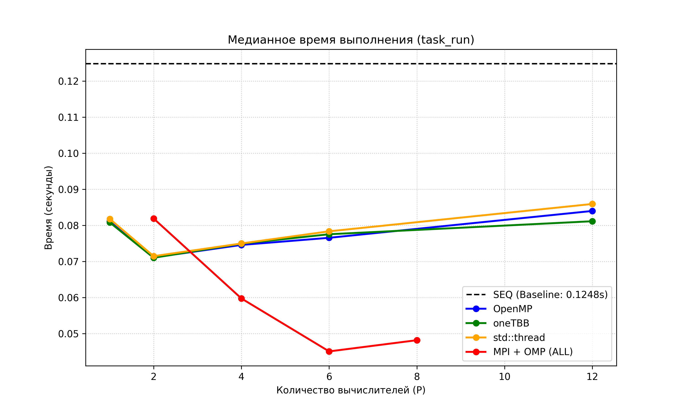
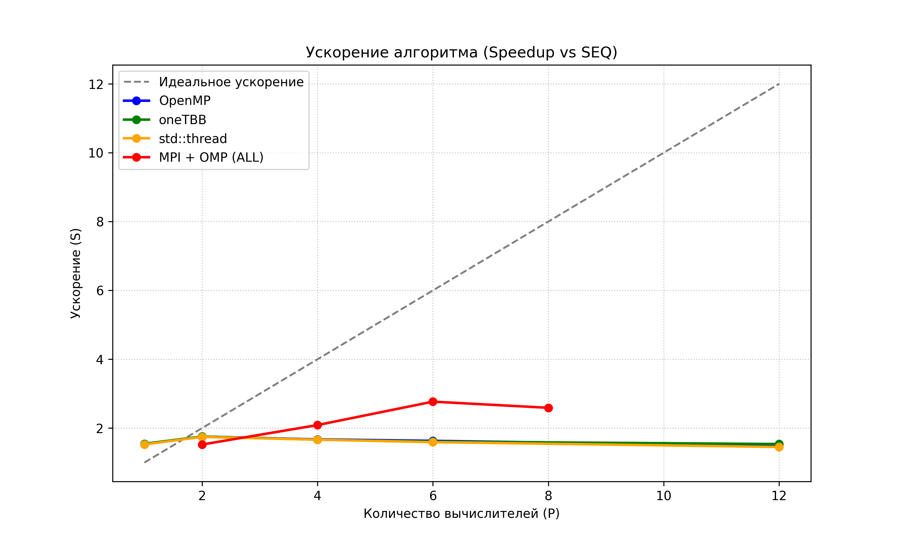
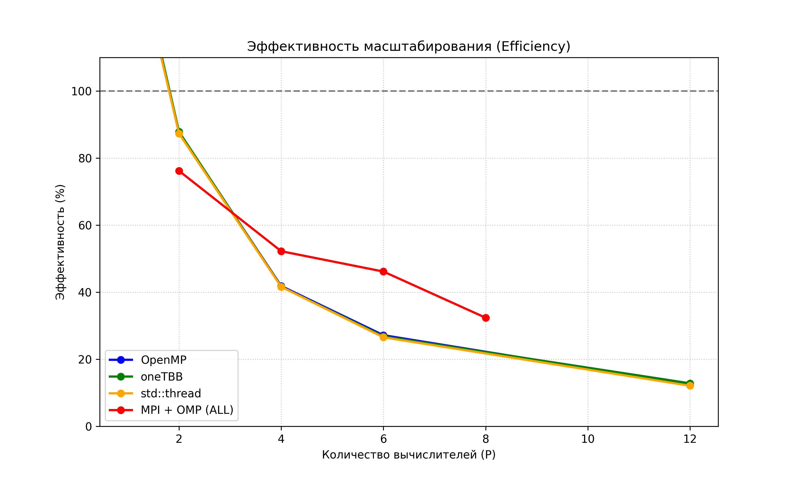

# Поразрядная сортировка для целых чисел с простым слиянием

- **Student:** Балдин Андрей Леонидович, 3823Б1ФИ3
- **Variant:** 17
- **Local reports:** `seq/report.md`, `omp/report.md`, `tbb/report.md`, `stl/report.md`, `all/report.md`

## 1. Введение

В данной работе исследуется эффективность различных парадигм параллельного программирования (OpenMP, oneTBB, STL-потоки
и гибридная модель MPI+OMP) на примере алгоритма поразрядной сортировки (LSD Radix Sort). Алгоритм отлично подходит для
сравнительного анализа, так как сочетает в себе идеально распараллеливаемую фазу (локальная побайтовая сортировка
независимых блоков) и фазу с жесткой зависимостью по данным (итеративное древовидное слияние).

## 2. Единая постановка задачи

- **Вход:** Неотсортированный массив 32-битных знаковых целых чисел `std::vector<int>`.
- **Выход:** Тот же массив, отсортированный по неубыванию.
- **Ограничения:** Алгоритм должен корректно обрабатывать отрицательные числа. Для этого на этапе обработки старшего
  байта применяется инверсия знакового бита операцией `XOR 128`.
- **Критерий корректности:** Строгое совпадение результирующего массива с результатом работы эталонной функции
  `std::ranges::sort`.

## 3. Единая методика эксперимента

**Окружение:**

- **CPU:** Intel Core i5-12400F, 6 ядер, 12 потоков
- **RAM:** 16 GB
- **OS:** Ubuntu 24.04.4 LTS
- **Compiler:** GCC 13.3.0
- **Build type:** Release (-O3)

- **Данные:** Для функциональных тестов генерируются массивы различных конфигураций (пустые, отсортированные,
  `INT_MAX/MIN`). Для тестов производительности используется вектор из $N = 10\,000\,000$ элементов, заполняемый
  псевдослучайными числами с помощью линейного генератора.
- **Расчет метрик:**
  - Базовое время ($T_1$) берется из медианного значения `task_run` последовательной (SEQ) версии.
  - Ускорение ($S$) считается по формуле $S = T_1 / T_p$, где $T_p$ — медианное время параллельной версии.
  - Эффективность ($E$) считается по формуле $E = (S / P) \times 100\%$.
  - Рабочая единица ($P$) для потоковых версий равна числу потоков. Для гибридной версии (ALL)
      $P = \text{ranks} \times \text{threads}$.
- **Агрегация:** Для каждой конфигурации выполнено 10 повторов. В качестве итогового результата в таблицу занесено
  медианное значение, что нивелирует влияние случайных выбросов ОС. Дополнительные меры стабилизации частоты (например,
  `cpupower governor performance`) не применялись, тестировалась реальная работа планировщика ОС.

## 4. Сводка корректности

Корректность всех backend-ов (`omp`, `tbb`, `stl`, `all`) проверялась сравнением с результатами `seq`. Функциональные
тесты запускались через общий фреймворк Google Test. Все технологии детерминированно прошли тесты на граничные случаи
(пустые массивы, реверсивные массивы, массивы из одного элемента). Ограничений применимости у разработанных реализаций
не выявлено.

## 5. Агрегированные результаты

| Backend | Mode     | Size | Ranks | Threads/Rank | Total Workers | Time (ms) | Speedup | Efficiency |
| ------- | -------- | ---- | ----- | ------------ | ------------- | --------- | ------- | ---------- |
| **SEQ** | task_run | 10M  | 1     | 1            | 1             | 124.81    | 1.00x   | 100.0%     |
| **OMP** | task_run | 10M  | 1     | 1            | 1             | 81.14     | 1.54x   | 153.8%     |
| **OMP** | task_run | 10M  | 1     | 2            | 2             | 71.11     | 1.76x   | 87.8%      |
| **OMP** | task_run | 10M  | 1     | 4            | 4             | 74.58     | 1.67x   | 41.8%      |
| **OMP** | task_run | 10M  | 1     | 6            | 6             | 76.56     | 1.63x   | 27.2%      |
| **OMP** | task_run | 10M  | 1     | 12           | 12            | 84.00     | 1.49x   | 12.4%      |
| **TBB** | task_run | 10M  | 1     | 1            | 1             | 80.82     | 1.54x   | 154.4%     |
| **TBB** | task_run | 10M  | 1     | 2            | 2             | 71.02     | 1.76x   | 87.9%      |
| **TBB** | task_run | 10M  | 1     | 4            | 4             | 74.93     | 1.67x   | 41.6%      |
| **TBB** | task_run | 10M  | 1     | 6            | 6             | 77.54     | 1.61x   | 26.8%      |
| **TBB** | task_run | 10M  | 1     | 12           | 12            | 81.15     | 1.54x   | 12.8%      |
| **STL** | task_run | 10M  | 1     | 1            | 1             | 81.77     | 1.53x   | 152.6%     |
| **STL** | task_run | 10M  | 1     | 2            | 2             | 71.47     | 1.75x   | 87.3%      |
| **STL** | task_run | 10M  | 1     | 4            | 4             | 74.99     | 1.66x   | 41.6%      |
| **STL** | task_run | 10M  | 1     | 6            | 6             | 78.35     | 1.59x   | 26.5%      |
| **STL** | task_run | 10M  | 1     | 12           | 12            | 85.93     | 1.45x   | 12.1%      |
| **ALL** | task_run | 10M  | 1     | 2            | 2             | 81.90     | 1.52x   | 76.2%      |
| **ALL** | task_run | 10M  | 2     | 2            | 4             | 59.75     | 2.09x   | 52.2%      |
| **ALL** | task_run | 10M  | 3     | 2            | 6             | 45.07     | 2.77x   | 46.2%      |
| **ALL** | task_run | 10M  | 4     | 2            | 8             | 48.18     | 2.59x   | 32.4%      |

Для наглядной оценки масштабируемости были построены графики медианного времени, ускорения ($S$) и эффективности ($E$) в
зависимости от общего числа задействованных вычислителей ($P$).







## 6. Интерпретация различий

Анализ полученных таблиц и графиков позволяет сделать ряд важных архитектурных выводов о поведении алгоритма в различных
средах исполнения.

1. **Влияние оптимизации памяти (Аномалия при $P=1$):** На графиках ускорения и эффективности видно, что даже при $P=1$
   потоковые версии (OMP, TBB, STL) обгоняют эталонный SEQ (ускорение > 1). Это связано с архитектурной оптимизацией
   параллельного кода: отказом от многократной динамической аллокации буфера `temp` внутри побайтового цикла (об этом
   можно более подробно прочитать в локальных отчётах). Это доказывает критическую зависимость алгоритма Radix Sort от
   скорости работы системного аллокатора ОС.

2. **Ограничения разделяемой памяти (OMP, TBB, STL):** Поведение чистых потоковых backend-ов практически идентично
   (линии на графиках сливаются). Они достигают пика производительности уже на $P=2$, после чего наблюдается стагнация и
   легкая деградация (рост времени выполнения при $P=4, 6, 12$). Это классическое проявление упора в пропускную
   способность шины памяти и закона Амдала: при дроблении массива на множество мелких частей резко возрастают накладные
   расходы на многоуровневое древовидное слияние, где на финальных этапах параллелизм сводится к минимуму.

3. **Эффективность распределенной памяти (ALL):** Гибридная версия (MPI+OMP) показала лучшее масштабирование, достигнув
   максимального ускорения почти в 3 раза при $P=6$. В отличие от потоков, которые делят общий массив в одной
   оперативной памяти, `MPI_Scatterv` физически выдает каждому процессу строго его порцию данных. Это уменьшает
   локальный рабочий набор данных для каждого ядра, повышая процент попаданий в L2/L3 кэши процессора.

4. **Аппаратные лимиты (Эффект $P=8$):** На графиках версии ALL отчетливо виден излом при переходе от $P=6$ к $P=8$.
   Данная аномалия строго обусловлена топологией тестового процессора (Intel Core i5-12400F), обладающего ровно 6
   физическими ядрами. При $P \le 6$ процессы равномерно утилизируют реальные ядра, а при $P=8$ в работу включается
   Hyper-Threading. Для memory-bound задач разделение ресурсов кэша одного ядра между двумя аппаратными потоками
   приводит к деградации производительности, что графики наглядно подтверждают.

## 7. Репродуцируемость

**Сборка проекта:**

```bash
cmake -S . -B build -D USE_FUNC_TESTS=ON -D USE_PERF_TESTS=ON -D CMAKE_BUILD_TYPE=Release
cmake --build build --parallel
```

**Функциональное тестирование:**

```bash
mpirun -n 4 ./build/bin/ppc_func_tests --gtest_filter="*baldin_a_radix_sort*"
```

**Бенчмаркинг:** Для исключения конкуренции за вычислительные ядра между потоками, запуск производился в рамках одного
MPI-процесса.

```bash
# Для потоковых технологий (SEQ, OMP, TBB, STL)
export PPC_NUM_THREADS=4
mpirun -n 1 ./build/bin/ppc_perf_tests --gtest_filter="*baldin_a_radix_sort_omp*"

# Для гибридной технологии (ALL)
export PPC_NUM_THREADS=2
mpirun -n 4 ./build/bin/ppc_perf_tests --gtest_filter="*baldin_a_radix_sort_all*"
```

## 8. Заключение

Наилучшую масштабируемость и минимальное абсолютное время показала гибридная версия (ALL), что подтверждает
целесообразность использования связки MPI + OpenMP для обработки больших массивов данных. Использование общей памяти
(OMP, TBB, STL) эффективно на малом числе потоков, но быстро упирается в архитектурные ограничения алгоритма слияния.
Дальнейшее улучшение возможно за счет реализации полностью параллельного слияния (Parallel Merge) вместо использования
стандартной `std::inplace_merge`.

## 9. Источники

1. [Документация курса "Параллельное программирование"](https://learning-process.github.io/parallel_programming_course/ru/index.html).
2. Лекции курса "Параллельное программирование для систем с общей памятью", Сысоев А.В.
3. [Спецификация OpenMP API](https://www.openmp.org/specifications/).
4. [Документация oneAPI Threading Building Blocks (oneTBB)](https://oneapi-src.github.io/oneTBB/).
5. [Стандарт MPI 3.1 (MPI Forum)](https://www.mpi-forum.org/docs/).

## 10. Приложение

Короткие листинги и подробности по каждой реализации можно посмотреть в локальных отчётах:

- `seq/report.md`
- `omp/report.md`
- `tbb/report.md`
- `stl/report.md`
- `all/report.md`
