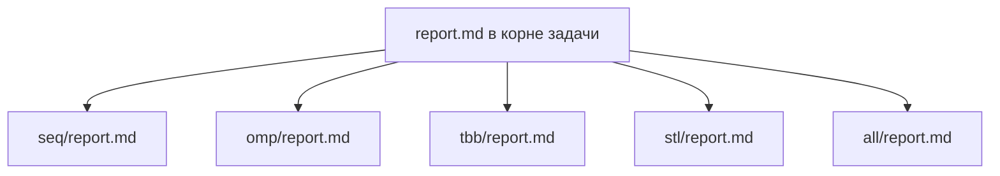
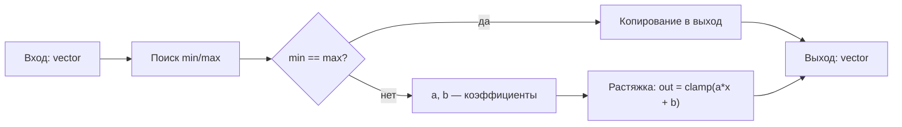

# Повышение контраста полутонового изображения посредством линейной растяжки гистограммы

- **Студент:** Батьков Филипп Владиславович, группа 3823Б1ПР3
- **Вариант:** 28
- **Каталог задачи:** `tasks/batkov_f_contrast_enh_lin_hist_stretch`
- **Локальные отчёты:** [seq/report.md](seq/report.md) · [omp/report.md](omp/report.md) · [tbb/report.md](tbb/report.md)
· [stl/report.md](stl/report.md) · [all/report.md](all/report.md)

Этот документ — корневой сводный отчёт. Он не дублирует подробные кодовые объяснения из локальных отчётов,
а собирает водном месте общую постановку, единую методику замеров, агрегированные результаты
и сравнение пяти реализаций (SEQ, OMP, TBB, STL, ALL).

---

## 1. Введение

Задача — повышение контраста полутонового изображения линейной растяжкой гистограммы.
По смыслу она удобна для сравнения моделей параллелизма: вычислительное ядро очень простое
(два линейных прохода по большому массиву байтов), поэтому различия между технологиями быстро становятся видны
на одном и том же кадре. Это позволяет честно зафиксировать, что в каждой технологии работает хорошо,
а что — мешает масштабироваться.

---

## 2. Единая постановка задачи

**Вход.** `std::vector<uint8_t>` — полутоновый кадр, пиксели идут подряд (строка за строкой).
Допустимы значения от 0 до 255 включительно. Пустой вектор — ошибка.

**Выход.** `std::vector<uint8_t>` той же длины. Контраст растянут на полный диапазон 0…255.

**Что нужно сделать.**

1. Найти по всему кадру минимальное `min_el` и максимальное `max_el` значение пикселя.
2. Если `min_el == max_el`, кадр однотонный — выход совпадает с входом.
3. Иначе по формуле `out = clamp(a*in + b, 0, 255)` каждый пиксель пересчитывается,
где `a = 255 / (max_el − min_el)`, `b = −a · min_el`.

**Ограничения и крайние случаи.** Пустой вход блокируется в `ValidationImpl`.
Однотонный кадр требует побайтового совпадения выхода с входом.
После растяжки минимум и максимум на выходе должны выйти к краям диапазона (на тестах — не хуже 1 и 254).

**Критерий корректности (общий).** Результат `RunImpl` сравнивается с эталоном SEQ.
Для функциональных тестов это либо побайтовое равенство (на однотонном кадре),
либо проверка `min_out ≤ 1` и `max_out ≥ 254` после растяжки.

---

## 3. Единая методика эксперимента

**Окружение замеров.**

| Компонент  | Значение               |
| ---------- | ---------------------- |
| Процессор  | Apple M2, 8 ядер       |
| ОЗУ        | 16 ГБ                  |
| ОС         | macOS 15.3.1           |
| Компилятор | g++, C++20 через CMake |
| Сборка     | Release                |
| Open MPI   | mpirun 5.0.8           |
| oneTBB     | 2022.3.0               |
| OpenMP     | libomp 21.1.5          |

**Переменные окружения.** `PPC_NUM_THREADS` задаёт число потоков для OMP/TBB/STL и потоков на процесс для ALL.
Runner экспортирует `OMP_NUM_THREADS` равным `PPC_NUM_THREADS`. `PPC_NUM_PROC` задаёт число MPI-процессов для ALL.
Лимиты времени задаются `PPC_TASK_MAX_TIME` и `PPC_PERF_MAX_TIME`.

**Откуда берутся данные.** Перф-тесты создают детерминированный квадратный кадр 25000×25000 пикселей
по формуле `value = 100 + ((row + col) % 50)` (см. `tests/performance/main.cpp`).
Этот же кадр используется всеми пятью реализациями, поэтому сравнение времени между ними честное.

**Размеры задач.** Функциональные тесты — кадры 100×100, 500×500, 1000×1000, 2000×2000 и 256×256 (однотонный сценарий).
Сравнение производительности — один общий кадр 25000×25000.

**Как считается speedup.** `speedup = T_seq / T_x`, где `T_seq = 0,76217 с` — время последовательной
версии на 25000×25000, `T_x` — время рассматриваемой реализации при заданной конфигурации.

**Как считается efficiency.**

- Для **OMP, TBB, STL**: `efficiency = speedup / threads · 100 %`.
- Для **ALL**: `efficiency = speedup / (P · T) · 100 %`, где `P` — число MPI-процессов, `T` — число потоков на процесс.
Это специально другая нормировка: гибридная версия использует две оси параллелизма,
и относить ускорение только к числу потоков было бы нечестно.

**Сколько повторов.** Каждое значение в таблицах — медиана по нескольким прогонам,
как их собирает PPC-runner в режимах `task` и `pipeline`.
Худшие значения отбрасываются автоматически логикой `BaseRunPerfTests`.

---

## 4. Сводка корректности

Все пять реализаций сравниваются с SEQ через единый `BatkovFRunFuncTestsThreads` в `tests/functional/main.cpp`.
На функциональных тестах ни одна из версий не выдаёт расхождения с критерием:
на однотонных кадрах побайтовое равенство, на слабоконтрастных — `min_out ≤ 1` и `max_out ≥ 254`.
Перф-тесты дополнительно подтверждают тот же критерий на детерминированном кадре 25000×25000.

**Ограничения по применимости.** Версия ALL предполагает запуск под `mpirun`;
без MPI-режима её тесты в системе курса могут пропускаться. У OMP, TBB и STL есть порог 100 000 пикселей:
ниже него внутренний `minmax` остаётся последовательным, чтобы не платить за параллельный запуск на коротком массиве.

---

## 5. Агрегированные результаты

### 5.1 Сводка по характерным конфигурациям

| Версия | Конфигурация           | Время, с | Ускорение к SEQ |
| ------ | ---------------------- | -------- | --------------- |
| SEQ    | 1 поток                | 0,762    | 1,00            |
| OMP    | 8 потоков              | 0,123    | 6,20            |
| TBB    | 8 потоков              | 0,065    | 11,73           |
| STL    | 8 потоков              | 0,051    | 14,94           |
| ALL    | 4 процесса × 8 потоков | 0,158    | 4,82            |

### 5.2 Полные таблицы

#### SEQ

| Реализация | Потоки | Время, с | Ускорение | Эффективность |
| ---------- | ------ | -------- | --------- | ------------- |
| SEQ        | 1      | 0,76217  | 1,00      | —             |

#### OMP

| Потоки | Время, с | Ускорение | Эффективность |
| ------ | -------- | --------- | ------------- |
| 1      | 0,537    | 1,42      | 142,0 %       |
| 2      | 0,264    | 2,89      | 144,4 %       |
| 4      | 0,15     | 5,08      | 127,0 %       |
| 6      | 0,135    | 5,65      | 94,1 %        |
| 8      | 0,123    | 6,20      | 77,5 %        |

#### TBB

| Потоки | Время, с | Ускорение | Эффективность |
| ------ | -------- | --------- | ------------- |
| 1      | 0,275    | 2,77      | 277,2 %       |
| 2      | 0,145    | 5,26      | 262,8 %       |
| 4      | 0,08     | 9,53      | 238,2 %       |
| 6      | 0,084    | 9,07      | 151,2 %       |
| 8      | 0,065    | 11,73     | 146,6 %       |

#### STL

| Потоки | Время, с | Ускорение | Эффективность |
| ------ | -------- | --------- | ------------- |
| 1      | 0,458    | 1,66      | 166,4 %       |
| 2      | 0,105    | 7,26      | 362,9 %       |
| 4      | 0,063    | 12,10     | 302,4 %       |
| 6      | 0,058    | 13,14     | 219,0 %       |
| 8      | 0,051    | 14,94     | 186,8 %       |

#### ALL

| Процессы | Потоки на процесс | P × T | Время, с | Ускорение | Эффективность |
| -------- | ----------------- | ----- | -------- | --------- | ------------- |
| 1        | 1                 | 1     | 0,639    | 1,19      | 119,4 %       |
| 2        | 2                 | 4     | 0,337    | 2,26      | 56,5 %        |
| 2        | 4                 | 8     | 0,189    | 4,03      | 50,4 %        |
| 2        | 6                 | 12    | 0,172    | 4,43      | 36,9 %        |
| 2        | 8                 | 16    | 0,165    | 4,62      | 28,9 %        |
| 4        | 4                 | 16    | 0,192    | 3,97      | 24,8 %        |
| 4        | 6                 | 24    | 0,176    | 4,33      | 18,0 %        |
| 4        | 8                 | 32    | 0,158    | 4,82      | 15,1 %        |

---

## 6. Интерпретация различий

**SEQ.** Эталон по смыслу и времени. Один поток, два прохода по массиву, формула в `double` без LUT.
Задаёт нижнюю планку для ускорения.

**OMP.** Простая директивная схема даёт устойчивый рост скорости с числом потоков —
около **6×** к baseline на 8 потоках. Эффективность падает после 4 потоков:
задача упирается в память, а двух последовательных параллельных регионов с неявным барьером посередине достаточно,
чтобы съесть часть полезного времени.
Основная цель при реализации данной версии была максимальная простота параллелизма,
с учетом хороших цифр производительности конечно же, чего удалось добиться.

**TBB.** Быстрая потоковая версия с результатом **11,73×** на 8 потоках.
Ускорение складывается из двух факторов: LUT даёт заметный выигрыш уже на одном потоке,
а `parallel_for` с крупным зерном `1 << 17` и `static_partitioner` хорошо распределяет работу между потоками.
На 8 потоках TBB показывает время **0,065 с**, но уступает STL, которая является самой быстрой версией.

**STL.** Самое малое время среди потоковых вариантов: **0,051 с** и **14,94×** к baseline на 8 потоках.
Возможно такая скорость связана с тем, что потоки создаются один раз. Сначала каждый поток ищет локальные `min/max`,
затем все потоки синхронизируются через `std::barrier`, после чего те же потоки выполняют растяжку своего диапазона.
За счёт этого убраны лишние расходы на второй запуск потоков. Также используется LUT,
поэтому пересчёт пикселей выполняется быстрее, чем прямое вычисление формулы для каждого значения.

**ALL.** На одной машине гибридная версия проигрывает чистым потоковым (**4,82×** в лучшем случае).
Это нормальное следствие коммуникационных и синхронизационных издержек:
`Scatterv` + два `Allreduce` + `Gatherv` + финальный `Bcast` вместе на M2 заметно дороже двух пробежек по 25000×25000
в одном процессе. Близкие цифры между разными `(P, T)` (например, `2 × 8 = 0,165` и `4 × 8 = 0,158`) показывают,
что физических ядер уже не хватает на все «единицы работы», и добавление процессов на той же машине не даёт линейного выигрыша.

---

## 7. Репродуцируемость

```bash
git submodule update --init --recursive --depth=1
cmake -S . -B build -DUSE_FUNC_TESTS=ON -DUSE_PERF_TESTS=ON -DCMAKE_BUILD_TYPE=Release
cmake --build build --parallel

export PPC_NUM_THREADS=4
scripts/run_tests.py --running-type=threads --counts 1 2 4

export PPC_NUM_PROC=2
export PPC_NUM_THREADS=4
scripts/run_tests.py --running-type=processes --counts 2 4

scripts/run_tests.py --running-type=performance
```

Runner подставляет `OMP_NUM_THREADS = PPC_NUM_THREADS`, под `mpirun` запускает гибридную версию ALL.
Лимиты времени задаются `PPC_TASK_MAX_TIME` и `PPC_PERF_MAX_TIME`.
Режимы **task** и **pipeline** для производительности задаются настройками PPC (`settings.json`)
и собираются автоматически в `MakeAllPerfTasks`.

---

## 8. Заключение

На описанной машине и кадре 25000×25000 лучшая по времени потоковая версия — **STL**: **0,051 с** и **14,94×** к baseline.
То есть STL даже быстрее TBB, которая показывает **0,065 с** и **11,73×** на 8 потоках.
Основная причина — в STL-версии потоки создаются один раз, а переход от поиска `min/max` к растяжке выполняется через `std::barrier`.

**OMP** на 8 потоках даёт **6,20×**. Это хороший результат для простой директивной реализации,
к тому же версия не использует LUT и имеет два отдельных параллельных участка.
**ALL** на одной 8-ядерной машине ограничен издержками MPI и достигает **4,82×** в конфигурации `4 × 8`.

В итоге STL-версия оказалась самой быстрой в данном наборе тестов. Она использует только стандартную библиотеку C++,
но за счёт LUT, ручного разбиения диапазонов и одного запуска потоков показывает лучший результат.

---

## 9. Источники

1. Гонсалес Р., Вудс Р. Цифровая обработка изображений.
2. [Спецификация OpenMP](https://www.openmp.org/specifications/).
3. [Документация oneTBB (UXL Foundation)](https://www.intel.com/content/www/us/en/docs/onetbb/developer-guide-api-reference/).
4. [MPI Forum](https://www.mpi-forum.org/) — `MPI_Bcast`, `MPI_Scatterv`, `MPI_Allreduce`, `MPI_Gatherv`.
5. [cppreference](https://en.cppreference.com/) — `std::thread`, `std::ranges::minmax_element`, `std::clamp`.

---

## 10. Приложение

### 10.1 Структура отчётов



### 10.2 Ход вычисления для всех версий



### 10.3 Типы задачи

`common/include/common.hpp` определяет `InType = std::vector<uint8_t>`, `OutType = std::vector<uint8_t>`,
`BaseTask = ppc::task::Task<InType, OutType>`. Все пять классов наследуются от `BaseTask`
и переопределяют четыре метода пайплайна: `ValidationImpl`, `PreProcessingImpl`, `RunImpl`, `PostProcessingImpl`.
