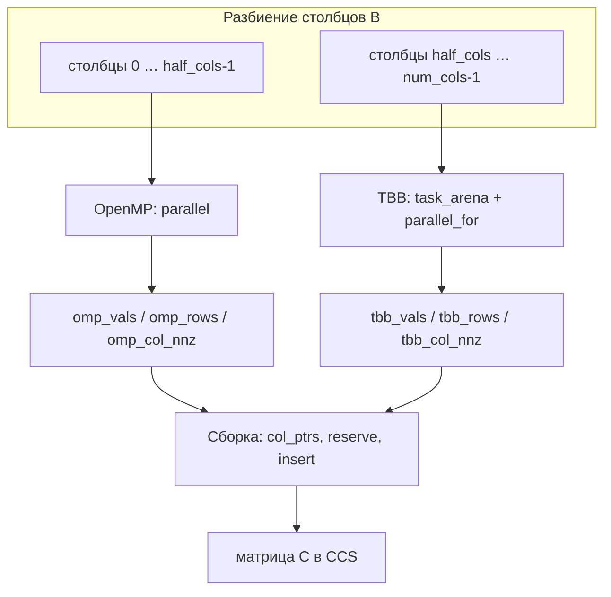

# ALL: Умножение разреженных матриц. Элементы комплексного типа. Формат хранения матрицы – столбцовый (CCS).

Обзор задачи, метрики и сборка: [../report.md](../report.md).

- Студент: Борунов Владислав Алексеевич
- Группа: 3823Б1ПР3
- Вариант: 7
- Задача: Умножение разреженных матриц. Элементы комплексного типа. Формат хранения матрицы – столбцовый (CCS).
- Технологии: OMP + TBB + STL

## 1. Назначение

BorunovVComplexCcsALL (TypeOfTask::kALL) - гибрид в одном процессе: первая половина столбцов B - OpenMP,
вторая - oneTBB; финальная сборка CCS - последовательные операции STL (std::vector, insert).

## 2. Распараллеливание

1. OMP-фаза (half_cols = num_cols / 2): #pragma omp parallel, внутри - разбиение столбцов [0, half_cols) по tid.
2. TBB-фаза (после завершения OMP): task_arena, parallel_for по tid для [half_cols, num_cols).
3. Сборка: FillColumnPointers для обеих половин, затем последовательный insert из OMP- и TBB-буферов.

Фазы OMP и TBB не перекрываются во времени - выполняются последовательно; параллелизм только внутри каждой фазы.

## 3. Синхронизация

| Этап      | Механизм                                                              |
|-----------|-----------------------------------------------------------------------|
| OMP       | неявный барьер при выходе из #pragma omp parallel                     |
| TBB       | завершение arena.execute / parallel_for                               |
| OMP - TBB | последовательный вызов в RunImpl (общие входы a, b только для чтения) |
| Сборка    | главный поток, без гонок с workers                                    |

Локальные acc, marker, touched на поток, запись nnz — в раздельные буферы:

| Подсистема | Буферы                          |
|------------|---------------------------------|
| OpenMP     | omp_vals, omp_rows, omp_col_nnz |
| TBB        | tbb_vals, tbb_rows, tbb_col_nnz |

## 4. Отличия от других реализаций

| Аспект         | ALL                           | OMP / TBB                 | STL                      |
|----------------|-------------------------------|---------------------------|--------------------------|
| Охват столбцов | две половины, два runtime     | все столбцы, один runtime | все столбцы, std::thread |
| Порядок фаз    | OMP, затем TBB                | -                         | -                        |
| workers        | PPC_NUM_THREADS для обеих фаз | то же                     | hardware_concurrency()   |

## 5. Конфигурация workers

workers = ppc::util::GetNumThreads() (PPC_NUM_THREADS) - общее для OMP и TBB частей внутри RunImpl.

## 6. Результаты (локальный прогон)

Baseline: SEQ task_run = 0.0408020800 с., SEQ pipeline = 0.0332925600 с.

### 6.1 task_run

| Workers | time, с      | speedup | efficiency |
|---------|--------------|---------|------------|
| 4       | 0.0522402600 | 0.78    | 19.5%      |
| 8       | 0.0425015200 | 0.96    | 12.0%      |
| 16      | 0.0551211200 | 0.74    | 4.6%       |

### 6.2 pipeline

| Workers | time, с      | speedup | efficiency |
|---------|--------------|---------|------------|
| 4       | 0.0355565400 | 0.94    | 23.4%      |
| 8       | 0.0239684200 | 1.39    | 17.4%      |
| 16      | 0.0345435400 | 0.96    | 6.0%       |

## 7. Наблюдения

- Последовательный запуск OMP и TBB увеличивает время относительно одной технологии на всех столбцах.
- При 8 workers, pipeline \(S = 1.39\) - близко к OMP (1.45), но ниже лучшего одиночного варианта.
- В task_run при 16 workers \(S = 0.74\) - накладные расходы двух runtime и merge.

## 8. Корректность

BorunovVComplexCcsALL включён в tests/functional/main.cpp (BorunovVRunFuncTestsThreads). Сравнение
с плотным эталоном, допуск 1e-6 по значениям - локально пройдено вместе с SEQ, OMP, TBB, STL.

## 9. Вывод

ALL демонстрирует совмещение OpenMP, TBB и STL-сборки в одном RunImpl. По таблицам perf наилучший
компромисс: pipeline, 8 workers (\(S = 1.39\)). Ускорение не достигает максимума чистого OMP из-за
последовательных фаз и двойных накладных расходов.
