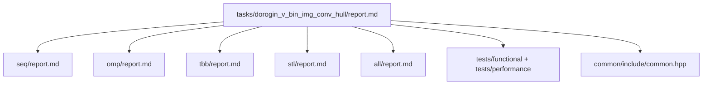

# Построение выпуклой оболочки для компонент бинарного изображения

- **Студент:** Дорогин Вадим Антонович, группа **3823Б1ПР3**  
- **Вариант:** № 30  
- **Локальные отчёты:** `seq/report.md`, `omp/report.md`, `tbb/report.md`, `stl/report.md`, `all/report.md`

---

## 1. Введение

Задача: по бинарному (пороговому) изображению найти связные компоненты переднего
плана и для каждой построить **выпуклую оболочку**.
Реализованы ветки **SEQ**, **OpenMP**, **oneTBB**, **`std::thread` (STL)** и гибрид **MPI + TBB (ALL)**
в одной папке `tasks/dorogin_v_bin_img_conv_hull`.
Подробности по технологиям - в локальных `report.md`; здесь - единая постановка,
методика и сводка результатов.

## 2. Единая постановка задачи

| Элемент | Описание |
| ------- | -------- |
| **Вход** | `BinaryImage`: `width`, `height`, `pixels` (`uint8_t`) |
| **Выход** | Тот же тип; поле **`convex_hulls`** - список оболочек |
| **Порог** | `pixel > 128` - 255, иначе 0 |
| **Компоненты** | 4-связность (DFS со стеком в SEQ/OMP/TBB/STL; BFS в ALL) |
| **Оболочка** | Monotonic chain; при `< 3` точках - копия компоненты |
| **Корректность** | **5** кейсов в `tests/functional/main.cpp`, сравнение с эталоном после нормализации вершин |
| **Ограничения** | `width, height > 0`, `pixels.size() == width * height` |

## 3. Единая методика эксперимента

### 3.1. Окружение

| Параметр | Значение |
| -------- | -------- |
| Процессор | Intel Core i5-10400F, 6 ядер / 12 потоков, 2.90 ГГц |
| ОС | Microsoft Windows, 64-bit (сборка 10.0.26200) |
| ОЗУ | 16 ГБ DDR4, 2666 МТ/с |
| Видеоадаптер | NVIDIA GeForce RTX 2060, 6 ГБ |
| Устройство | DESKTOP-JQ9KQ17 |
| Компилятор | согласно конфигурации CMake проекта PPC (Release) |
| Сборка | **Release** |

### 3.2. Переменные

- **`PPC_NUM_THREADS`** - потоки (дублируется в **`OMP_NUM_THREADS`** раннером).  
- **`PPC_NUM_PROC`** - MPI-процессы для ALL.  
- **`PPC_TASK_MAX_TIME`** - лимит func-теста (по умолчанию **1 с** на один запуск пайплайна).  
- **`PPC_PERF_MAX_TIME`** - лимит perf (по умолчанию **10 с**).

### 3.3. Вход производительности

- Файл: `tests/performance/main.cpp`.  
- Размер: **`kSize = 600`** - изображение **600×600** (360 000 пикселей).  
- Содержимое: две диагонали + дополнительные точки (`i % 17 == 0`).  
- Режимы каркаса: **`task_run`** и **`pipeline`**.

### 3.4. Метрики

- **`T_seq`** - время SEQ в `task_run` на описанном входе.  
- **`T_par`** - время параллельной ветки при `N = PPC_NUM_THREADS`.  
- **Ускорение:** `S = T_seq / T_par`.  
- **Эффективность:** `Eff = S / N`.  
- Для **ALL при P > 1:** дополнительно `S / (P · N)`.

### 3.5. Сборка

```bash
git submodule update --init --recursive --depth=1
cmake -S . -B build -D USE_FUNC_TESTS=ON -D USE_PERF_TESTS=ON -D CMAKE_BUILD_TYPE=Release
cmake --build build --parallel
```

## 4. Сводка корректности

- **5** функциональных сценариев: одна точка, две компоненты, вертикаль, прямоугольник, ромб (манхэттен).  
- Всего **25** инстансов gtest (5 кейсов × 5 технологий); ALL - под **`mpirun`**.  
- Func-тесты на малых изображениях укладываются в **1 с** на запуск (порог курса).

## 5. Агрегированные результаты

Замеры: **Release**, вход **600×600**, режим **`task_run`**, `T_seq = 0,000614` с (15.05.2026, DESKTOP-JQ9KQ17).

### 5.1. OMP, TBB, STL (`task_run`, 600×600)

| N | OpenMP: S | OpenMP: Eff | TBB: S | TBB: Eff | STL: S | STL: Eff |
| - | --------- | ----------- | ------ | -------- | ------ | -------- |
| 2 | 0,71      | 0,36        | 0,89   | 0,45     | 0,42   | 0,21     |
| 4 | 0,74      | 0,19        | 0,88   | 0,22     | 0,36   | 0,09     |
| 8 | 0,65      | 0,08        | 0,71   | 0,09     | 0,36   | 0,04     |

### 5.2. ALL (`task_run`, тот же вход)

| P | N | S vs SEQ | Eff |
| - | - | -------- | --- |
| 1 | 2 | 0,75     | 0,38|
| 1 | 4 | 0,76     | 0,19|
| 1 | 8 | 0,64     | 0,08|
| 2 | 2 | 0,57     | 0,14|
| 2 | 4 | 0,68     | 0,08|

### 5.3. Сводная таблица

| backend | mode     | size | workers | speedup vs seq | efficiency | notes                |
| ------- | ----     | ---- | ------- | -------------- | ---------- | -----                |
| seq     | task_run | 600² | 1       | 1,00           | 100%       | baseline             |
| omp     | task_run | 600² | N=2,4,8 | §5.1           | Eff=S/N    | parallel for ком- там|
| tbb     | task_run | 600² | N=2,4,8 | §5.1           | Eff=S/N    | `parallel_for`       |
| stl     | task_run | 600² | N=2,4,8 | §5.1           | Eff=S/N    | `std::thread`, чанки |
| all     | task_run | 600² | P×N     | §5.2           | см. §5.2   | TBB + `MPI_Bcast`    |

## 6. Интерпретация (качественно)

- **SEQ** быстрее всех параллельных веток на данном входе (`S < 1`): доминируют накладные
расходы при небольшом объёме параллельной работы.  
- **TBB** - наилучший среди OMP/TBB/ALL при `P=1` (макс. `S ≈ 0,89` при `N=2`).  
- **STL** - самый медленный (`S ≈ 0,36–0,42`) из‑за создания потоков на каждый `RunImpl`.  
- **OMP** и **ALL** (`P=1`) близки друг к другу; рост `N` до 8 не даёт выигрыша.  
- Параллелится только построение оболочек; `FindComponents` последовательный - при
диагоналях на **600×600** мало крупных компонент.

## 7. Репродуцируемость

**Потоковые backend-ы:**

```bash
export PPC_NUM_THREADS=4
export PPC_NUM_PROC=1
export OMP_NUM_THREADS=4
scripts/run_tests.py --running-type=threads
```

**MPI / ALL:**

```bash
export PPC_NUM_THREADS=4
export PPC_NUM_PROC=2
export OMP_NUM_THREADS=4
scripts/run_tests.py --running-type=processes
```

**Производительность:**

```bash
export PPC_NUM_THREADS=4
export PPC_NUM_PROC=1
scripts/run_tests.py --running-type=performance
```

**Фильтр одной задачи (пример):**

```bash
./build/bin/ppc_perf_tests \
  '--gtest_filter=*dorogin_v_bin_img_conv_hull*seq*task_run*' \
  --gtest_brief=1
```

## 8. Заключение

Реализованы пять backend-ов одной задачи; все **25** func-тестов пройдены.
На **600×600** (`task_run`) ускорение относительно SEQ **не достигнуто** (`S < 1`);
наиболее близок к эталону **TBB**. Результаты привязаны к
сборке **Release** и указанному в §3.1 железу.

## 9. Источники

1. Материалы курса «Параллельное программирование»,
   [ppc-2026-threads](https://github.com/learning-process/ppc-2026-threads).
2. Кормен Т. Х. и др., *Алгоритмы* (обход, сортировки).
3. [OpenMP](https://www.openmp.org/),
   [oneTBB](https://www.intel.com/content/www/us/en/developer/tools/oneapi/onetbb.html),
   [MPI](https://www.mpi-forum.org/).
4. [cppreference.com](https://en.cppreference.com/).

## 10. Приложение: структура отчётов


