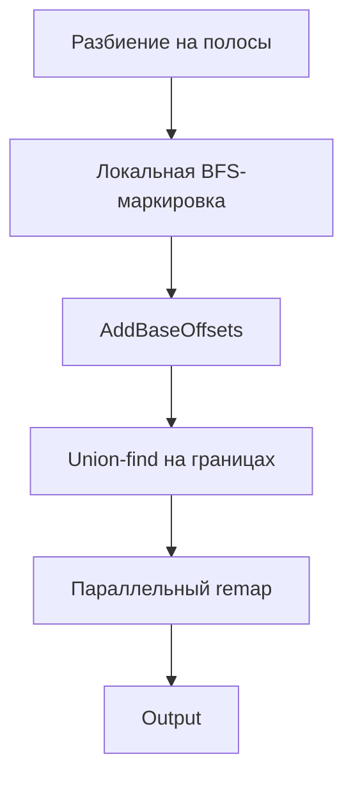

# Маркировка компонент на бинарном изображении

- Student: Гайворонский Максим Витальевич, group 3823Б1ПР1
- Variant: 1
- Local reports: `seq/report.md`, `omp/report.md`, `tbb/report.md`, `stl/report.md`, `all/report.md`

## 1. Введение

Задача — найти и промаркировать 4-связные компоненты объектов на бинарном изображении. Реализованы версии
SEQ, OMP, STL, TBB и ALL. Последовательный BFS — эталон корректности; параллельные версии используют
strip-декомпозицию с union-find на границах полос.

## 2. Единая постановка задачи

| Поле      | Описание                                                   |
| --------- | ---------------------------------------------------------- |
| Вход      | `[rows, cols, pixel₀, …]`                                  |
| Объект    | `0`                                                        |
| Фон       | `1`                                                        |
| Выход     | тот же размер; фон = `0`, компоненты — положительные метки |
| Связность | 4-соседняя                                                 |

## 3. Единая методика эксперимента

| Параметр    | Значение                                               |
| ----------- | ------------------------------------------------------ |
| CPU         | Apple M4, 10 ядер                                      |
| ОС          | macOS 15.5                                             |
| Компилятор  | Apple Clang 17.0.0, Release                            |
| Perf-вход   | **2000×2000**, чётные строки — объект                  |
| Повторы     | медиана по 3 сериям локальных прогонов                 |
| Speedup     | `T_seq / T_backend` при том же числе потоков и размере |
| Efficiency  | `speedup / threads × 100%` (для ALL: `1p × N threads`) |
| Режимы perf | `task_run` и `pipeline`                                |
| Переменные  | `PPC_NUM_THREADS`, `PPC_NUM_PROC`                      |

## 4. Сводка корректности

| Backend   | Func-тесты   | Примечание                          |
| --------- | ------------ | ----------------------------------- |
| SEQ       | 5/5          | эталон                              |
| OMP       | 5/5          | см. `omp/report.md`                 |
| STL       | 5/5          | см. `stl/report.md`                 |
| TBB       | 5/5          | см. `tbb/report.md`                 |
| ALL       | CI / mpirun  | локально skipped; perf-тест пройден |

## 5. Агрегированные результаты

### 5.1 task_run, 2000×2000 (медиана 3 серий)

| Backend   | 1 поток      | 2 потока     | 4 потока     | Speedup (4t)   |
| --------- | ------------ | ------------ | ------------ | -------------- |
| SEQ       | 0.002901     | 0.002711     | 0.002683     | 1.00           |
| OMP       | 0.002615     | 0.001753     | 0.001388     | 1.93           |
| STL       | 0.002580     | 0.001905     | 0.001024     | 2.62           |
| TBB       | 0.003130     | 0.001872     | 0.001132     | 2.37           |
| **ALL**   | **0.002640** | **0.001846** | **0.001021** | **2.63**       |

### 5.2 pipeline, 4 потока, 2000×2000

| Backend   | Время, с     | Speedup vs SEQ   |
| --------- | ------------ | ---------------- |
| SEQ       | 0.007558     | 1.00             |
| OMP       | 0.003381     | 2.24             |
| STL       | 0.003651     | 2.07             |
| TBB       | 0.003782     | 2.00             |
| **ALL**   | **0.003799** | **1.99**         |

## 6. Интерпретация различий

- **SEQ** — baseline BFS, ~2.68 ms (`task_run` при 4 потоках); см. `seq/report.md`.
- **OMP** — OpenMP `parallel` + `parallel for schedule(static)`; speedup ~1.9×; лучший `pipeline` (~2.2×).
- **STL** — ручные `std::thread`; лучший `task_run` (~2.6×).
- **TBB** — `task_arena` + `parallel_for`; ~2.4×.
- **ALL** — thread-based реализация с типом `kALL`, без MPI на одном процессе; ~2.6×, близко к STL.
  MPI-overhead отсутствует, поэтому ALL не проигрывает на локальном входе.

## 7. Репродуцируемость

```bash
cmake -S . -B build -DUSE_FUNC_TESTS=ON -DUSE_PERF_TESTS=ON -DCMAKE_BUILD_TYPE=Release \
  -DOpenMP_C_LIB_NAMES=omp -DOpenMP_CXX_LIB_NAMES=omp \
  -DOpenMP_omp_LIBRARY=/opt/homebrew/opt/libomp/lib/libomp.dylib \
  -DOpenMP_C_FLAGS="-Xpreprocessor -fopenmp -I/opt/homebrew/opt/libomp/include" \
  -DOpenMP_CXX_FLAGS="-Xpreprocessor -fopenmp -I/opt/homebrew/opt/libomp/include"
cmake --build build -j$(sysctl -n hw.ncpu)

PPC_NUM_THREADS=4 ./build/bin/ppc_perf_tests \
  --gtest_filter='RunModeTests/GaivoronskiyMMarkingPerfTests.RunPerfModes/task_run_*'
```

## 8. Заключение

На 2000×2000 все оптимизированные backend-ы (OMP, STL, TBB, ALL) устойчиво быстрее SEQ (baseline — `seq/report.md`).
Лучший `task_run`: **STL** (~2.6×). ALL и STL близки по времени, поскольку используют одинаковое thread-based
ядро. OMP лидирует по `pipeline`. Для полной func-проверки ALL нужен запуск в CI под `mpirun`.

## 9. Источники

1. Документация курса «Параллельное программирование».
2. OpenMP 5.x, oneTBB, `std::thread`, MPI Forum (для ALL-инфраструктуры).
3. Методическое руководство по отчётам.

## 10. Приложение



Локальные отчёты: `seq/report.md`, `omp/report.md`, `stl/report.md`, `tbb/report.md`, `all/report.md`.
