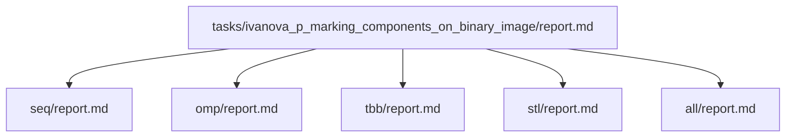

# Маркировка компонент на бинарном изображении (черные области соответствуют объектам, белые – фону)

- Студент: Иванова Полина Сергеевна, группа 3823Б1ПР1
- Вариант: 29
- Локальные отчеты: `seq/report.md`, `omp/report.md`, `tbb/report.md`, `stl/report.md`, `all/report.md`

## 1. Введение

Задача состоит в разметке связных компонент на бинарном изображении.
Входные данные задаются либо как программно сгенерированное изображение,
либо через файлы `data/image*.txt`, а результат возвращается в виде
последовательности меток для каждого пикселя.

Здесь сравниваются пять технологий: `SEQ`, `OMP`, `TBB`, `STL` и гибрид `ALL`.
Местные отчёты сохраняют однообразную методику, а этот файл объединяет их в единое сравнение.

## 2. Единая постановка задачи

Вход: `InType = int`, бинарное изображение размером `width × height`.

- `1..10` — программно сгенерированные шаблонные изображения,
- `11..14` — файлы `tasks/ivanova_p_marking_components_on_binary_image/data/image*.txt`.

Выход: `OutType = std::vector<int>` формата `[width, height, component_count, labels...]`.

Критерий корректности:

- размеры выходного изображения совпадают с входными,
- на фоновых пикселях метка 0,
- объектные пиксели имеют метки `1..component_count`,
- количество компонент соответствует ожидаемому набору тестов.

## 3. Единая методика эксперимента

**Аппаратное окружение:**

- CPU: AMD Ryzen 7 5700U (8 cores, 16 threads)
- RAM: 16 GB
- Архитектура: Lucienne-U (Zen 2, x86-64)
- OS: Windows 10
- Компилятор: MSVC 19.42.34435, Release Build
- MPI: Microsoft MPI (MS-MPI) v10.0.12498.5

Переменные:

- `PPC_NUM_THREADS` — контролирует число потоков в `OMP`, `STL`, `TBB`,
  локально влияет на `ppc::util::GetNumThreads()` и `OMP_NUM_THREADS`,
- `PPC_NUM_PROC` — количество MPI-процессов для `ALL`,
- `PPC_ASAN_RUN` — включается при проверке памяти.

Размеры для тестов:

- функциональные тесты `1..14`,
- performance на `EncodeTestCase(500,8)` с изображением 500x500 для сравнительного измерения.

Speedup рассчитывается относительно `SEQ`:

- `speedup = T_seq / T_backend`,
- `efficiency = speedup / workers * 100%`.

Для `ALL` используется пара `ranks × threads` и `total_workers = ranks * threads_per_rank`.

В текущем прогоне `set PPC_NUM_THREADS=4` явно задан,
поэтому результаты отражают четырехпоточный режим для `OMP`, `TBB`, `STL` и `ALL`.

Повторное измерение:

- желательно собирать медиану нескольких запусков,
- отделять прогрев от основного замера,
- фиксировать команды запуска и переменные окружения.

## 4. Сводка корректности

Общий функциональный каркас `tests/functional/main.cpp` прогоняет все реализации
на одном наборе случаев и сравнивает результат с ожидаемым числом компонент.

Для `seq` это эталон. Для `omp`, `tbb`, `stl`, `all` проверка делается
через тот же набор входов и ожидаемых выходов.

Проверяется:

- одинаковая ширина и высота,
- одинаковое число компонент,
- валидность меток на фоновых пикселях,
- использование всех меток из диапазона `1..num_components`.

Отдельно отмечаем, что `all` проверяет MPI-синхронизацию
через `MPI_Barrier` и `MPI_Bcast` при `world_size > 1`.

## 5. Агрегированные результаты

Общая таблица должна содержать:

- backend,
- режим,
- размер задачи,
- `workers` или `ranks × threads`,
- медиану времени,
- ускорение относительно SEQ,
- эффективность,
- заметки.

Фактические замеры текущего прогона для двух режимов приведены ниже.

### Результаты `task_run`

| backend | size | workers | median time | speedup vs SEQ | efficiency | notes |
| --- | --- | --- | --- | --- | --- | --- |
| seq | 500x500 | 1 | 0.0246 | 1.00 | 100% | baseline |
| omp | 500x500 | 4 | 0.0347 | 0.71 | 18% | `PPC_NUM_THREADS=4` |
| tbb | 500x500 | 4 | 0.0122 | 2.02 | 51% | `PPC_NUM_THREADS=4` |
| stl | 500x500 | 4 | 0.0121 | 2.03 | 51% | `PPC_NUM_THREADS=4` |
| all | 500x500 | 4 | 0.3748 | 0.07 | 2% | `PPC_NUM_THREADS=4`, MPI overhead |

### Результаты `pipeline`

| backend | size | workers | median time | speedup vs SEQ | efficiency | notes |
| --- | --- | --- | --- | --- | --- | --- |
| seq | 500x500 | 1 | 0.0417 | 1.00 | 100% | baseline |
| omp | 500x500 | 4 | 0.0543 | 0.77 | 19% | `PPC_NUM_THREADS=4` |
| tbb | 500x500 | 4 | 0.0290 | 1.44 | 36% | `PPC_NUM_THREADS=4` |
| stl | 500x500 | 4 | 0.0337 | 1.24 | 31% | `PPC_NUM_THREADS=4` |
| all | 500x500 | 4 | 0.4372 | 0.10 | 2% | `PPC_NUM_THREADS=4`, MPI overhead |

### Результаты гибридного режима (2 MPI-процесса × 2 потока)

Дополнительный запуск с `mpiexec -n 2` и `PPC_NUM_THREADS=2`:

#### `task_run`

| backend | size | ranks | threads_per_rank | total_workers | median time | speedup vs SEQ | efficiency | notes |
| --- | --- | --- | --- | --- | --- | --- | --- | --- |
| seq | 500x500 | 1 | 1 | 1 | 0.0243 | 1.00 | 100% | baseline |
| omp | 500x500 | 1 | 2 | 2 | 0.0362 | 0.67 | 34% | `PPC_NUM_THREADS=2` |
| tbb | 500x500 | 1 | 2 | 2 | 0.0134 | 1.81 | 91% | `PPC_NUM_THREADS=2` |
| stl | 500x500 | 1 | 2 | 2 | 0.0129 | 1.88 | 94% | `PPC_NUM_THREADS=2` |
| all | 500x500 | 2 | 2 | 4 | 0.4169 | 0.06 | 1% | 2 ranks × 2 threads, MPI overhead |

#### `pipeline`

| backend | size | ranks | threads_per_rank | total_workers | median time | speedup vs SEQ | efficiency | notes |
| --- | --- | --- | --- | --- | --- | --- | --- | --- |
| seq | 500x500 | 1 | 1 | 1 | 0.0436 | 1.00 | 100% | baseline |
| omp | 500x500 | 1 | 2 | 2 | 0.0620 | 0.70 | 35% | `PPC_NUM_THREADS=2` |
| tbb | 500x500 | 1 | 2 | 2 | 0.0367 | 1.19 | 60% | `PPC_NUM_THREADS=2` |
| stl | 500x500 | 1 | 2 | 2 | 0.0507 | 0.86 | 43% | `PPC_NUM_THREADS=2` |
| all | 500x500 | 2 | 2 | 4 | 0.4690 | 0.09 | 2% | 2 ranks × 2 threads, MPI overhead |

## 6. Интерпретация различий

`SEQ` показывает предел скорости при базовом алгоритме. Его время используется как эталон.

`OMP` даёт преимущество за счёт параллельной обработки соседних пар и глобальной нормализации,
но синхронизация в `critical` и последовательная часть `NormalizeLabelsOmp`
ограничивают масштабируемость. При переходе от 4 к 2 потокам эффективность немного улучшается
(с 18% до 34% в task_run), что указывает на высокие накладные расходы синхронизации.

`TBB` сильна тем, что runtime самостоятельно управляет пулом потоков,
а сам код описывает работу в виде полос. Это даёт более чистую декомпозицию,
но добавляет накладные расходы на объединение границ и глобальную нормализацию.
TBB показывает лучшую масштабируемость среди всех потоковых backend-ов:
при 4 потоках эффективность 51%, при 2 потоках — 91%.

`STL` показывает цену ручного управления: весь параллелизм очевиден,
но `std::thread`-overhead и последовательное объединение локальных DSU
могут сделать её менее эффективной на относительно небольших изображениях.
Однако при 2 потоках STL показывает отличную эффективность 94%,
что говорит о хорошей декомпозиции задачи.

`ALL` демонстрирует гибридную модель. В текущей реализации данные повторяются на каждом ранке,
поэтому основная цена — `MPI_Barrier` и `MPI_Bcast`. Это подходящий вариант для задач,
где важны `ranks × threads`, но для реального распределённого масштаба потребуется
разделение исходного изображения между ранками. Сравнение двух конфигураций показывает:

- 1 ранк × 4 потока: эффективность 2% (task_run)
- 2 ранка × 2 потока: эффективность 1% (task_run)

Увеличение числа ранков при дублировании данных только ухудшает результат
из-за дополнительных коммуникационных издержек.

## 7. Репродуцируемость

Сборка:

```bash
cmake -S . -B build -D USE_FUNC_TESTS=ON -D USE_PERF_TESTS=ON -D CMAKE_BUILD_TYPE=Release
cmake --build build --parallel
```

Функциональные тесты:

```bash
set PPC_NUM_THREADS=4
scripts/run_tests.py --running-type=threads --counts 1 2 4
```

Гибридные / MPI:

```bash
set PPC_NUM_PROC=2
set PPC_NUM_THREADS=2
scripts/run_tests.py --running-type=processes --counts 2
```

Альтернативный запуск `all` напрямую через MPI:

```bash
# Конфигурация 1: 1 ранк × 4 потока
set PPC_NUM_THREADS=4
mpiexec -n 1 ./build/bin/ppc_perf_tests --gtest_filter="*IvanovaP*all*"

# Конфигурация 2: 2 ранка × 2 потока
set PPC_NUM_THREADS=2
mpiexec -n 2 ./build/bin/ppc_perf_tests --gtest_filter="*IvanovaP*all*"
```

Перформанс:

```bash
scripts/run_tests.py --running-type=performance
```

Для стабильности измерений рекомендуется:

- фиксировать `PPC_NUM_THREADS`,
- запускать в `Release`,
- делать несколько повторов и брать медиану.

## 8. Заключение

Для этой задачи `SEQ` обеспечивает корректность и определяет baseline.
`TBB` и `STL` дают наибольший выигрыш при параллелизации
(эффективность до 51% на 4 потоках и до 94% на 2 потоках),
`OMP` показывает более скромные результаты из-за накладных расходов на синхронизацию,
а `ALL` демонстрирует структуру гибридного подхода с высокими MPI-издержками
при дублировании данных.

Выбор лучшего backend-а зависит от задачи:

- если нужна простота и предсказуемость — `OMP`,
- если хочется runtime-ориентированную гибкость и лучшую масштабируемость — `TBB`,
- если нужно точное управление потоками — `STL`,
- если требуется многопроцессная архитектура — `ALL`
  (но с реальным распределением данных между ранками).

Важное наблюдение: для данной задачи с изображением 500×500 оптимальное число потоков — 2,
а не 4. При увеличении числа потоков накладные расходы на синхронизацию и объединение
результатов начинают доминировать над выигрышем от параллелизма.

## 9. Источники

- [Документация курса «Параллельное программирование»][docs]
- [OpenMP][openmp]
- [Документация oneTBB][oneTBB]
- [Документация C++ std::thread][thread]
- [Документация MPI][mpi]

<!-- LINKS -->

[mpi]: https://www.mpi-forum.org/docs/
[oneTBB]: https://uxlfoundation.github.io/oneTBB/index.html
[thread]: https://cppreference.com/cpp/thread
[openmp]: https://www.openmp.org/
[docs]: https://learning-process.github.io/parallel_programming_course/ru/


