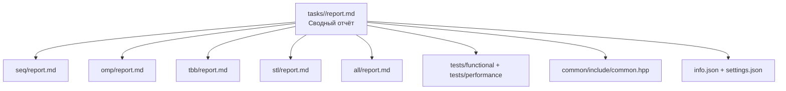

# Умножение разреженных матриц. Элементы типа double. Формат хранения матрицы – столбцовый (CCS)

- Student: Капанова Софья Максимовна, group 3823Б1ПМоп3
- Variant: 5
- Local reports: seq/report.md, omp/report.md, tbb/report.md, stl/report.md, all/report.md

## 1. Введение

Задача — умножение двух разреженных матриц A и B с элементами типа double, хранящихся в формате CCS (Column Compressed Storage). Эта задача хорошо подходит для сравнения различных моделей параллелизма, поскольку сочетает нерегулярный доступ к памяти (индексы строк во внутреннем цикле непредсказуемы) с неравномерной вычислительной нагрузкой на итерациях внешнего цикла (столбцы B содержат разное количество ненулевых элементов). Это позволяет увидеть сильные и слабые стороны разных подходов: статического и динамического планирования, ручного и автоматического управления потоками, потокового и гибридного параллелизма для балансировки нагрузки между потоками и для эффективного использования кэша

## 2. Единая постановка задачи

**Входные данные (`InType`):**

- Пара матриц `A` и `B` в формате `CCSMatrix`.
- Структура `CCSMatrix`:
  - `rows`, `cols`: Количество строк и столбцов
  - `nnz`: Количество ненулевых элементов
  - `col_ptrs`: Массив индексов в `values` и `row_indices`, указывающих на начало данных для каждого столбца. Размер `cols + 1`.
  - `row_indices`: Массив строчных индексов для каждого элемента. Размер `nnz`.
  - `values`: Массив значений элементов. Размер `nnz`.

**Выходные данные (`OutType`):**

- Результирующая матрица `C = A * B` в формате `CCSMatrix`.

**Ограничения и крайние случаи:**

1. **Совместимость размерностей:**
   - `A.cols` должно быть равно `B.rows`. Несовместимые матрицы отбрасываются на этапе валидации.
2. **Ненулевые размерности:**
   - `A.rows > 0`, `A.cols > 0`, `B.rows > 0`, `B.cols > 0`. Матрицы с нулевой размерностью отбрасываются на этапе валидации.
3. **Корректность CCS-структуры:**
   - Для обеих матриц проверяется целостность формата: размер `col_ptrs` равен `cols + 1`, `col_ptrs[0] == 0`, `col_ptrs[cols] == nnz`, размеры `values` и `row_indices` равны `nnz`. Нарушения отбрасываются на этапе валидации.
4. **Полностью нулевые матрицы:**
   - `nnz == 0` допустимо для любой из матриц. Результат — нулевая матрица `C` с корректными размерностями. Проверяется вычислительным тестом.
5. **Прямоугольные матрицы:**
   - `A` и `B` могут быть неквадратными. `C` будет иметь размер `A.rows × B.cols`. Проверяется вычислительным тестом.

## 3. Единая методика эксперимента

**Окружение:**

- **CPU:** Apple M1 (8 ядер: 4 производительных Firestorm + 4 энергоэффективных Icestorm, 8 потоков)
- **RAM:** 8 GB
- **OS:** macOS 26.1, arm64
- **Компилятор:** Apple clang 17.0.0
- **CMake build type:** Release

**Переменные окружения:**

- `PPC_NUM_THREADS` или `OMP_NUM_THREADS` — число потоков для OMP, STL, TBB.
- `PPC_NUM_PROC` + `PPC_NUM_THREADS` — число процессов и потоков на процесс для ALL.

**Повторы:** для каждой конфигурации выполнено 4 запуска, в таблице приведено медианное время. Расхождение между запусками не превышало 5%, что свидетельствует о стабильности измерений.

**Данные:** генерируются случайно в `tests/performance/main.cpp`: квадратные матрицы `10000×10000`, плотность `0.5%` (≈500 000 ненулевых элементов на матрицу).

**Расчёт метрик:**

- **Время:** время запуска task_run
- **Ускорение (Speedup):** `T_seq / T_backend` (отношение времени последовательной реализации к времени сравниваемой реализации), где `T_seq = 0.506 с`
- **Эффективность (Efficiency):** `Speedup / workers × 100%`.
- **Workers:**
  число потоков для OMP, TBB, STL;
  `ranks × threads_per_rank` для ALL.

## 4. Сводка корректности

Все пять backend-ов проверены на одних и тех же пяти функциональных тестах. Результат каждой версии поэлементно сравнивается с эталоном (expected_result_) с допуском `1e-10`.

Использованные функциональные тесты:

1. Малые матрицы 2x2 (Test 1): Базовый случай с диагональными матрицами.
2. Матрицы 3x3 со случайной структурой (Test 2 & 3).
3. Прямоугольные матрицы 2x3 и 3x2 (Test 4): Проверка корректности при A.cols != A.rows.
4. (Test 5): Проверка крайнего случая, когда матрица A полностью нулевая. Ожидаемый результат — нулевая матрица.
Все тесты проходят успешно. Сравнение результатов происходит с допуском eps = 1e-10.

**Проверяется в тестах:**

- `rows`, `cols` — точное совпадение размерностей.
- `nnz` — точное совпадение количества ненулевых элементов.
- `col_ptrs` — полное поэлементное совпадение массива указателей.
- `row_indices` — полное поэлементное совпадение строчных индексов.
- `values` — поэлементное сравнение с допуском `1e-10`.

**Характерные примеры:**

**Пример 1. Диагональные матрицы 2×2 (Test 1)**

Матрица A:
rows=2, cols=2, nnz=2
col_ptrs = [0, 1, 2]
row_indices = [0, 1]
values = [2.0, 3.0]

Матрица B:
rows=2, cols=2, nnz=2
col_ptrs = [0, 1, 2]
row_indices = [0, 1]
values = [4.0, 5.0]

Ожидаемый результат C = A × B:
rows=2, cols=2, nnz=2
col_ptrs = [0, 1, 2]
row_indices = [0, 1]
values = [8.0, 15.0] // 2.0*4.0=8.0, 3.0*5.0=15.0

**Пример 2. Прямоугольные матрицы (Test 4)**

Матрица A (2×3):
col_ptrs = [0, 2, 3, 5]
row_indices = [0, 1, 1, 0, 1]
values = [1.0, 4.0, 2.0, 3.0, 5.0]

Матрица B (3×2):
col_ptrs = [0, 2, 5]
row_indices = [0, 2, 1, 2, 1]
values = [6.0, 8.0, 7.0, 9.0, 10.0]

Ожидаемый результат C = A × B (2×2):
col_ptrs = [0, 2, 4]
row_indices = [0, 1, 0, 1]
values = [30.0, 64.0, 27.0, 79.0]

**Результаты проверки:**

- SEQ, OMP, TBB, STL, ALL — все тесты пройдены.
- Для OMP, STL, TBB проверено при 1, 2, 4, 8 потоках — результат стабилен.
- Для ALL проверено при `PPC_NUM_PROC=2 PPC_NUM_THREADS=2` — результат совпадает с SEQ и одинаков на всех процессах.

Ограничений применимости не выявлено — все backend-ы выдают корректный результат.

## 5. Агрегированные результаты

**Общая таблица (Release, task_run, 4 запуска, медианное время):**

| Backend | Mode | Size  | Ranks | Thr/rank | Workers | Время (с) | Ускорение | Эффективность | Примечание               |
|---------|------|-------|-------|----------|---------|-----------|-----------|---------------|--------------------------|
| SEQ     | task | 10000 | —     | —        | 1       | 0.506     | 1.00      | 100%          | baseline, плотность 0.5% |
| OMP     | task | 10000 | —     | 2        | 2       | 0.320     | 1.58      | 79%           |                          |
| OMP     | task | 10000 | —     | 4        | 4       | 0.189     | 2.68      | 67%           |                          |
| OMP     | task | 10000 | —     | 8        | 8       | 0.149     | 3.40      | 42%           |                          |
| STL     | task | 10000 | —     | 2        | 2       | 0.157     | 3.22      | 161%          | суперлинейное ускорение  |
| STL     | task | 10000 | —     | 4        | 4       | 0.159     | 3.18      | 80%           | плато*                    |
| STL     | task | 10000 | —     | 8        | 8       | 0.135     | 3.75      | 47%           |                          |
| TBB     | task | 10000 | —     | 2        | 2       | 0.315     | 1.61      | 80%           |                          |
| TBB     | task | 10000 | —     | 4        | 4       | 0.176     | 2.88      | 72%           |                          |
| TBB     | task | 10000 | —     | 8        | 8       | 0.127     | 3.98      | 50%           |                          |
| ALL     | task | 10000 | 1     | 4        | 4       | 1.562     | 0.32      | 8%            | без MPI                  |
| ALL     | task | 10000 | 2     | 2        | 4       | 2.040     | 0.25      | 6%            |                          |
| ALL     | task | 10000 | 2     | 4        | 8       | 1.980     | 0.26      | 3%            |                          |
| ALL     | task | 10000 | 4     | 2        | 8       | 2.282     | 0.22      | 3%            |                          |

*время перестало уменьшаться при добавлении потоков, то есть «вышло на плато»

**Нормировка эффективности для ALL:** по `total_workers = ranks × threads_per_rank`.

**Время в режиме pipeline (Release):**

- SEQ: 0.545 с
- OMP (2/4/8): 0.349 / 0.186 / 0.151 с
- STL (2/4/8): 0.163 / 0.142 / 0.151 с
- TBB (2/4/8): 0.323 / 0.175 / 0.138 с
- ALL (1p×4t / 2p×2t / 2p×4t / 4p×2t): 1.734 / 2.071 / 1.934 / 2.264 с

**Лидеры по ускорению:**

- 2 workers: STL — 3.22×
- 4 workers: STL — 3.18×
- 8 workers: TBB — 3.98×

**ALL:** все конфигурации медленнее SEQ (ускорение < 1).

## 6. Интерпретация различий

**Анализ результатов:**

**SEQ (0.506 с) — baseline.** последовательный алгоритм: внешний цикл по столбцам `B`, средний по элементам столбца, внутренний по столбцу `A`. Результат накапливается в `accum`, изменённые строки сортируются, ненулевые значения упаковываются в CCS. Узкое место — нерегулярный доступ к `accum[i]` во внутреннем цикле.

**OMP (3.40× на 8 потоках).** `#pragma omp parallel for schedule(dynamic) default(none)` по столбцам `B`. Каждый поток пишет в свои массивы `thread_accum[tid]`, `thread_col_rows[tid][j]`, `thread_col_vals[tid][j]`. После параллельного региона — `MergeThreadResults`. `reduction` не используется (результат — структура CCS, не скаляр).`schedule(dynamic)` балансирует неравномерную загрузку столбцов. Эффективность падает с 79% до 42% из-за последовательного слияния `MergeThreadResults` и кэш-промахов.

**STL (3.75× на 8 потоках).** столбцы делятся на равные непрерывные блоки: `chunk = (cols + num_threads - 1) / num_threads`. Каждый поток выполняет `WorkerTask` с собственным `ThreadLocalData`. Потоки создаются все, затем `join` всех. `mutex`/`atomic` не нужны — диапазоны не пересекаются. Суперлинейное ускорение на 2 потоках (3.22×, 161%) за счёт лучшего попадания в кэш при статическом разбиении. При 4 и 8 потоках масштабируемость слабая (0.157 → 0.159 → 0.135 с) — упирается в такие ограничения как память и последовательное слияние.

**TBB (3.98× на 8 потоках) — абсолютный лидер.** `tbb::parallel_for` с `blocked_range<size_t>(0, cols, 256)`. `grainsize = 256`. `auto_partitioner` по умолчанию. Локальные данные через `enumerable_thread_specific<ThreadLocalBuffers>`, доступ через `tls_data.local()`. Слияние: `MergeColumnSizes` + `MergeResults`.
 `auto_partitioner` с `grainsize = 256` даёт наилучший баланс. Единственный backend, заметно ускоряющийся при переходе 4 → 8 потоков (0.176 → 0.127 с).

**ALL (0.32× — медленнее SEQ).** MPI: `ComputeBalancedRanges` на rank 0 (оценка стоимости столбцов через OpenMP `parallel for reduction`), `MPI_Bcast` диапазонов, `MPI_Gatherv` результатов на rank 0, `MPI_Bcast` итоговой матрицы. Внутри процесса: `#pragma omp parallel for schedule(guided, 32)`, слияние через `#pragma omp critical`.Накладные расходы MPI-коммуникаций и `#pragma omp critical` превышают выигрыш. Лучшая конфигурация (1p×4t) в 3 раза медленнее SEQ. Гибридная схема неоправдана на одном компьютере.

## 7. Репродуцируемость

**Сборка:**

```
cmake -S . -B build -DCMAKE_BUILD_TYPE=Release \
  -DCMAKE_C_COMPILER=/usr/bin/clang \
  -DCMAKE_CXX_COMPILER=/usr/bin/clang++ \
  -DENABLE_TBB=ON \
  -DOpenMP_CXX_FLAGS="-Xpreprocessor -fopenmp -I${OMP_PREFIX}/include" \
  -DOpenMP_CXX_LIB_NAMES="omp" \
  -DOpenMP_omp_LIBRARY="${OMP_PREFIX}/lib/libomp.dylib" \
  -DOpenMP_C_FLAGS="-Xpreprocessor -fopenmp -I${OMP_PREFIX}/include" \
  -DOpenMP_C_LIB_NAMES="omp" \
  -DBUILD_TESTS=ON
cmake --build build
```

**Команды запуска функциональных тестов**
./build/bin/ppc_func_tests --gtest_filter="*kapanova*seq*"
./build/bin/ppc_func_tests --gtest_filter="*kapanova*omp*"
./build/bin/ppc_func_tests --gtest_filter="*kapanova*stl*"
./build/bin/ppc_func_tests --gtest_filter="*kapanova*tbb*"
export PPC_NUM_THREADS=<N> && mpirun -np <N> ./build/bin/ppc_func_tests --gtest_filter="*kapanova*all*"

**Команды запуска тестов производительности:**
export PPC_NUM_THREADS=1
./build/bin/ppc_perf_tests --gtest_filter="*kapanova*seq*"

export OMP_NUM_THREADS=2 && ./build/bin/ppc_perf_tests --gtest_filter="*kapanova*omp*"
export OMP_NUM_THREADS=4 && ./build/bin/ppc_perf_tests --gtest_filter="*kapanova*omp*"
export OMP_NUM_THREADS=8 && ./build/bin/ppc_perf_tests --gtest_filter="*kapanova*omp*"

export PPC_NUM_THREADS=2 && ./build/bin/ppc_perf_tests --gtest_filter="*kapanova*stl*"
export PPC_NUM_THREADS=4 && ./build/bin/ppc_perf_tests --gtest_filter="*kapanova*stl*"
export PPC_NUM_THREADS=8 && ./build/bin/ppc_perf_tests --gtest_filter="*kapanova*stl*"

export PPC_NUM_THREADS=2 && ./build/bin/ppc_perf_tests --gtest_filter="*kapanova*tbb*"
export PPC_NUM_THREADS=4 && ./build/bin/ppc_perf_tests --gtest_filter="*kapanova*tbb*"
export PPC_NUM_THREADS=8 && ./build/bin/ppc_perf_tests --gtest_filter="*kapanova*tbb*"

export PPC_NUM_PROC=1 PPC_NUM_THREADS=4 && ./build/bin/ppc_perf_tests --gtest_filter="*kapanova*all*"
export PPC_NUM_PROC=2 PPC_NUM_THREADS=2 && mpirun -np 2 ./build/bin/ppc_perf_tests --gtest_filter="*kapanova*all*"
export PPC_NUM_PROC=2 PPC_NUM_THREADS=4 && mpirun -np 2 ./build/bin/ppc_perf_tests --gtest_filter="*kapanova*all*"
export PPC_NUM_PROC=4 PPC_NUM_THREADS=2 && mpirun -np 4 ./build/bin/ppc_perf_tests --gtest_filter="*kapanova*all*"

Дополнительные меры стабилизации (отключение частотного скейлинга, фиксация governor в performance, привязка процесса к ядру, уменьшение фоновой нагрузки) не применялись.

## 8. Заключение

Лучшей версией для данной задачи на Apple M1 является TBB — максимальное ускорение 3.98× на 8 потоках, хорошая масштабируемость, минимальные накладные расходы. STL показывает лучший результат на 2 потоках (3.22×), но плохо масштабируется при увеличении числа потоков. OMP уступает STL и TBB, но проще в реализации. ALL (MPI + OpenMP) не дал выигрыша — на одном компьютере гибридная схема неоправдана.

**Ограничения сравнения:**
Для каждой конфигурации выполнено только 4 запуска, в таблице приведено медианное время.
Дополнительные меры стабилизации (отключение частотного скейлинга, фиксация governor в performance, привязка процесса к ядру, уменьшение фоновой нагрузки) не применялись, поэтому результаты могут включать влияние системных процессов и динамического изменения частоты.
Результаты привязаны к архитектуре Apple M1.

**Возможные улучшения:**
Исследовать влияние размера задачи и плотности на масштабируемость.
Оптимизировать слияние результатов в OMP и TBB (параллельная сборка).
Для ALL: заменить #pragma omp critical на lock-free слияние, отказаться от BroadcastResult в пользу MPI_Reduce.
Провести замеры на серверном x86-64 процессоре с большим числом ядер.

## 9. Источники

1. Лекция кафедры ВВСП о хранении разреженных матриц в формате презентации: <https://hpc-education.unn.ru/files/courses/optimization/2_3_SparseDS_Lect.pdf>
2. Документация к технологии OpenMP: <https://www.openmp.org/wp-content/uploads/OpenMP-RefGuide-6.0-OMP60SC24-web.pdf>
3. Документация по библиотеке Intel OneTBB: <https://www.intel.com/content/www/us/en/docs/onetbb/get-started-guide/2023-0.html>
4. Документация в формате официального веб-сайта к технологии MPI: <https://www.mpich.org>

## 10. Приложение

### Структура проекта

Ключевые фрагменты кода каждой из технологий приведены в локальных отчётах.



### Рабочий процесс


