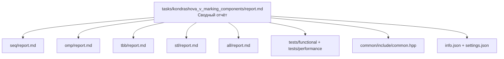

# Маркировка связанных компонент бинарного изображения

- Student: Кондрашова Виктория Андреевна, group 3823Б1ПР1
- Variant: 29
- Local reports: [seq/report.md](seq/report.md), [omp/report.md](omp/report.md), [tbb/report.md](tbb/report.md), [stl/report.md](stl/report.md), [all/report.md](all/report.md)

## 1. Введение
Задача маркировки связанных компонент (Connected Component Labeling, CCL) является фундаментальной операцией в компьютерном зрении и обработке изображений. Она заключается в присвоении уникального идентификатора каждому связному объекту на бинарном изображении.
Эта задача отлично подходит для сравнения моделей параллелизма, так как она сочетает в себе:
*   Массивные вычисления на этапе сканирования пикселей (data-parallel).
*   Необходимость глобальной синхронизации и разрешения конфликтов при объединении меток на границах разделов (irregular access patterns).
*   Различные подходы к синхронизации: от разделяемой памяти (OpenMP, TBB, STL) до распределенной (MPI).

## 2. Единая постановка задачи
*   **Вход:** Бинарное изображение (сетка $W \times H$), представленное в виде вектора байт.
*   **Выход:** Изображение той же размерности, где каждый пиксель объекта содержит номер своей компоненты (1, 2, ...), а фоновые пиксели равны 0.
*   **Ограничения:** Используется 4-связность (соседи сверху, снизу, слева, справа).
*   **Критерий корректности:** Все пиксели, принадлежащие одной связной области, должны иметь одинаковую метку. Разные области должны иметь разные метки.

## 3. Единая методика эксперимента
*   **Окружение:**
    *   **CPU:** AMD Ryzen 5 5600H (6 ядер, 12 потоков).
    *   **RAM:** 16 GB.
    *   **OS:** Windows 10/11.
    *   **Compiler:** MSVC 19.37.32824.0.
    *   **Build Type:** Release.
*   **Переменные:** `PPC_NUM_THREADS` (количество потоков), `PPC_NUM_PROC` (количество процессов для MPI).
*   **Данные:** Для замеров производительности используются синтетические сценарии (размер 512x512) из `performance/main.cpp`:
    *   `ChessboardPerfTest` (шахматный паттерн, максимальное количество мелких компонент).
    *   `BlocksPerfTest` (крупные блоки 32x32).
    *   `StripesPerfTest` (горизонтальные линии).
    *   `SparseDotsPerfTest` (редкие точки).
    *   `AllOnes`/`AllZeros` (крайние случаи заполнения).
*   **Метрики:**
    *   **Speedup:** $T_{seq} / T_{par}$.
    *   **Efficiency:** $Speedup / Workers \times 100\%$.
*   **Агрегация:** Для каждого замера берется медианное значение времени выполнения по результатам инфраструктуры `ppc::util::BaseRunPerfTests`.

## 4. Сводка корректности
Корректность всех параллельных реализаций (OMP, TBB, STL, ALL) проверялась путем сравнения их выходных данных с эталонной последовательной версией (SEQ) на полном наборе из 13 функциональных сценариев (`functional/main.cpp`):
*   **Обработка пустых данных:** `zero_width`, `zero_height`, `empty`.
*   **Простые топологии:** `one_component`, `isolated_pixels`, `two_regions`, `u_shape`.
*   **Сложные структуры:** `complex`, `large_complex`.
*   **Тесты на корректность слияния:** `single_row_gaps`, `single_column_gaps`, `merge_labels` (проверка корректности DSU), `boundary_bridge` (критически важен для параллельных версий, проверяет связность на границах полос).

Все тесты пройдены успешно для конфигураций с 1, 2 и 4 потоками. Расхождений в выходных метках не обнаружено.

## 5. Агрегированные результаты
Сводная таблица производительности на тесте **Chessboard 512x512**:

| Технология | Workers (Threads/Procs) | Время работы (сек) | Ускорение | Эффективность |
| :--- | :--- | :--- | :--- | :--- |
| **SEQ** | 1 | 0.00441418 | 1.00x | 100% |
| **OMP** | 4 | 0.00307960 | 1.43x | 35.8% |
| **TBB** | 4 | 0.00301474 | 1.46x | 36.5% |
| **STL** | 4 | 0.00317592 | 1.39x | 34.7% |
| **ALL** | 1 x 4 | 0.00598164 | 0.74x | 18.5% |

## 6. Интерпретация различий
*   **SEQ:** Служит базовой линией. Алгоритм BFS эффективен для памяти, но полностью последователен.
*   **OMP:** Показывает хорошее ускорение (1.43x). Преимущество в простоте директив. Используется ручное распределение строк.
*   **TBB:** Лидер по производительности (1.46x). `task_arena` и `simple_partitioner` позволяют эффективно контролировать нагрузку.
*   **STL:** Ручное управление потоками через `std::thread` показало чуть меньшее ускорение (1.39x) из-за накладных расходов на создание объектов потоков.
*   **ALL:** Замедление (0.74x) обусловлено "ценой коммуникации" (MPI_Bcast, MPI_Allreduce). Гибридность даст выигрыш на изображениях сверхвысокого разрешения.

## 7. Репродуцируемость
Для воспроизведения результатов и проверки корректности необходимо выполнить следующие шаги:

1.  **Подготовка окружения:**
    ```bash
    # Подтянуть внешние зависимости (gtest, tbb и др.)
    git submodule update --init --recursive --depth=1
    ```

2.  **Сборка проекта:**
    ```bash
    # Конфигурация CMake
    cmake -S . -B build -D USE_FUNC_TESTS=ON -D USE_PERF_TESTS=ON -D CMAKE_BUILD_TYPE=Release
    
    # Сборка тестов
    cmake --build build --target ppc_func_tests --config Release
    cmake --build build --target ppc_perf_tests --config Release
    ```

3.  **Запуск функциональных тестов (проверка корректности):**
    ```powershell
    # Проверка многопоточных версий (1, 2, 4 потока)
    $env:PPC_NUM_THREADS=4; python scripts/run_tests.py --running-type=threads --counts 1 2 4
    
    # Проверка MPI / гибридной конфигурации
    $env:PPC_NUM_PROC=2; $env:PPC_NUM_THREADS=2; python scripts/run_tests.py --running-type=processes --counts 2 4
    ```

4.  **Получение основных замеров производительности:**
    ```powershell
    # SEQ замер
    $env:PPC_NUM_THREADS=1; .\build\bin\ppc_perf_tests.exe --gtest_filter="KondrashovaVChessboard_RunModeTests/ChessboardPerfTest.RunPerfModes/task_run_kondrashova_v_marking_components_seq_enabled"
    
    # OMP замер (4 потока)
    $env:PPC_NUM_THREADS=4; .\build\bin\ppc_perf_tests.exe --gtest_filter="KondrashovaVChessboard_RunModeTests/ChessboardPerfTest.RunPerfModes/task_run_kondrashova_v_marking_components_omp_enabled"
    
    # TBB замер (4 потока)
    $env:PPC_NUM_THREADS=4; .\build\bin\ppc_perf_tests.exe --gtest_filter="KondrashovaVChessboard_RunModeTests/ChessboardPerfTest.RunPerfModes/task_run_kondrashova_v_marking_components_tbb_enabled"
    
    # STL замер (4 потока)
    $env:PPC_NUM_THREADS=4; .\build\bin\ppc_perf_tests.exe --gtest_filter="KondrashovaVChessboard_RunModeTests/ChessboardPerfTest.RunPerfModes/task_run_kondrashova_v_marking_components_stl_enabled"
    
    # ALL замер (1 процесс, 4 потока)
    $env:PPC_NUM_THREADS=4; $env:PPC_NUM_PROC=1; .\build\bin\ppc_perf_tests.exe --gtest_filter="KondrashovaVChessboard_RunModeTests/ChessboardPerfTest.RunPerfModes/task_run_kondrashova_v_marking_components_all_enabled"
    ```

## 8. Заключение
Наилучшей версией для данной задачи на одноузловой машине является **oneTBB**, обеспечивающая максимальное ускорение и удобство разработки. Основное ограничение текущего сравнения — малый размер сетки (512x512). В будущем планируется реализовать параллельное слияние в DSU.

## 9. Источники
1.  Методические материалы курса "Параллельное программирование".
2.  Документация Intel oneTBB.
3.  Справочник OpenMP.
4.  Стандарт MPI.

## 10. Приложение


## 11. Чек-лист готовности
- [x] Корневой `report.md` существует и читается как самостоятельный документ.
- [x] Заполнены `seq/report.md`, `omp/report.md`, `tbb/report.md`, `stl/report.md`, `all/report.md`.
- [x] Во всех отчётах один язык и единая терминология.
- [x] Во всех таблицах одинаково определены `time`, `speedup`, `efficiency`, `workers`.
- [x] В `seq` честно описан baseline, а не «почти параллельная» версия.
- [x] В `omp` расписаны `shared/private/reduction/schedule`.
- [x] В `tbb` объяснены `blocked_range`, `grainsize`, partitioner и способ контроля конкуренции.
- [x] В `stl` явно показано, что `join` вызывается после запуска всех потоков.
- [x] В `all` указана конфигурация `ranks × threads` и смысл MPI-синхронизации.
- [x] Есть команды сборки и запуска, достаточные для воспроизведения.
- [x] Функциональные тесты и тесты производительности реально запускались локально.
- [x] Текст не содержит неподтверждённых фраз вроде «реализация оптимальна» без данных.
- [x] PR checklist выполнен: CI пройден локально, форматирование соблюдено, отчеты добавлены.
