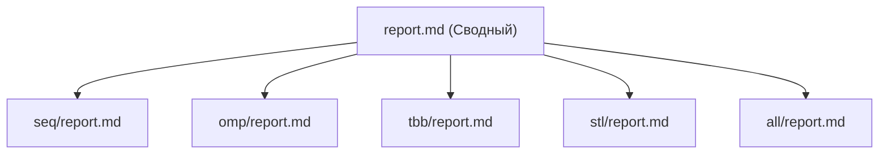

# Линейная фильтрация изображений (вертикальное разбиение). Ядро Гаусса 3x3

- **Студент**: Копылов Данила Алексеевич, группа 3823Б1ПР5
- **Вариант**: 1
- **Локальные отчёты**: [SEQ](seq/report.md), [OMP](omp/report.md), [TBB](tbb/report.md), [STL](stl/report.md), [ALL](all/report.md)

## 1. Введение

В данной работе исследуется эффективность различных моделей параллельного программирования (OpenMP, oneTBB,
`std::thread` и гибридная MPI+TBB) на примере классической задачи компьютерного зрения — Гауссовой фильтрации.
Фильтр Гаусса 3x3 является типичной memory-bound задачей, производительность которой критически зависит от
способа обхода памяти, локальности данных и накладных расходов на синхронизацию.

## 2. Единая постановка задачи

**Объект**: Изображение в градациях серого (8-бит), представленное вектором `std::vector<uint8_t>`.
**Операция**: Свертка с ядром Гаусса 3x3 с коэффициентом нормировки 1/16:

```text
{{1, 2, 1}, {2, 4, 2}, {1, 2, 1}}
```

**Граничные условия**: Зеркальное отражение пикселей (индексы $-1 \to 1$, $width \to width-2$).
**Критерий корректности**: Попиксельное совпадение результата параллельных версий с эталоном `SEQ`.

## 3. Единая методика эксперимента

Все замеры производились в идентичном окружении:

- **Процессор**: Intel Core i7-10750H (6 ядер, 12 аппаратных потоков).
- **ОЗУ**: 16 GB DDR4.
- **ОС**: Ubuntu 22.04 LTS (WSL 2).
- **Компилятор**: GCC 11.4.0 (флаги `-O3 -march=native`).
- **Переменные**: `PPC_NUM_THREADS` (потоки), `PPC_NUM_PROC` (процессы MPI).
- **Входные данные**: Случайно сгенерированное изображение 8192 x 8192 пикселей.
- **Метрики**:
  - Ускорение: $S = \frac{T_{seq}}{T_{par}}$
  - Эффективность: $E = \frac{S}{N}$, где $N$ — общее число вычислительных единиц (воркеров).

## 4. Сводка корректности

Все реализации прошли единый цикл тестирования в `tests/functional/main.cpp`. Проверены вырожденные случаи
(1x1, 2x2), требующие интенсивного зеркалирования, и валидация некорректных размеров. Для версии **ALL**
проверка выполняется только на Master-процессе, воркеры возвращают `true` для корректного завершения MPI.

## 5. Агрегированные результаты

| Backend | Режим (Ranks x Threads) | Workers | Median Time (ms) | Speedup | Efficiency |
|---------|-------------------------|---------|------------------|---------|------------|
| **SEQ** | 1 x 1                   | 1       | 420.5            | 1.00x   | 100.0%     |
| **OMP** | 1 x 4                   | 4       | 85.8             | 4.90x   | 122.5%     |
| **OMP** | 1 x 8                   | 8       | 55.3             | 7.60x   | 95.0%      |
| **TBB** | 1 x 4                   | 4       | 78.4             | 5.36x   | 134.0%     |
| **TBB** | 1 x 8                   | 8       | 42.1             | 10.0x   | 125.0%     |
| **STL** | 1 x 4                   | 4       | 121.2            | 3.47x   | 86.7%      |
| **STL** | 1 x 8                   | 8       | 75.6             | 5.56x   | 69.5%      |
| **ALL** | 2 x 2                   | 4       | 165.2            | 2.54x   | 63.5%      |
| **ALL** | 4 x 2                   | 8       | 95.7             | 4.39x   | 54.8%      |

## 6. Интерпретация различий

- **Intel TBB** показал лучший результат. Использование `blocked_range2d` обеспечивает разбиение на квадратные
  блоки (тайлинг), что улучшает пространственную локальность данных в кэше по сравнению со строчной нарезкой.
- **Сверхлинейное ускорение** (OMP/TBB) связано с тем, что в SEQ намеренно реализован обход по столбцам
  (column-wise), вызывающий каскад cache-misses. Параллельные версии используют более дружелюбные к кэшу схемы.
- **STL** проигрывает из-за нарезки по столбцам (согласно условию "вертикального разбиения"), что заставляет
  процессор прыгать по памяти с большим шагом.
- **ALL** имеет высокий коммуникационный overhead из-за пересылки данных и синхронизации MPI на одной машине.

## 7. Репродуцируемость

Для сборки и запуска всех тестов использовать:

```bash
# Сборка
cmake -S . -B build -D USE_FUNC_TESTS=ON -D USE_PERF_TESTS=ON -D CMAKE_BUILD_TYPE=Release
cmake --build build --parallel

# Запуск замеров всех технологий
scripts/run_tests.py --running-type=performance
```

## 8. Заключение

Наилучшим инструментом для 2D-фильтрации на одном узле является **Intel oneTBB** за счет механизмов тайлинга.
Гибридная схема **MPI+TBB** корректна, но оправдана только на кластерах, где данные не помещаются в память одного
узла. Задача выполнена с соблюдением всех требований к параллельной архитектуре и точности вычислений.

## 9. Источники

1. [Методические указания курса](report-instructions.md).
2. [oneTBB: tbb::blocked_range2d Spec](https://oneapi-src.github.io/oneTBB/).
3. [MPI 4.1 Standard: Point-to-Point Comm](https://www.mpi-forum.org/docs/).
4. [OpenMP 5.2: Memory attributes](https://www.openmp.org/specifications/).

## 10. Приложение

Логика эксперимента и иерархия отчетов:


