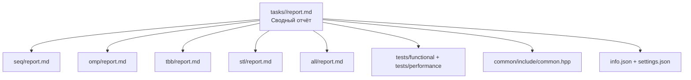

# Методическое руководство по отчётам к задачам параллельного программирования

## Резюме

Документация курса требует, чтобы итоговый отчёт лежал в `tasks/<фамилия>_<инициал>_<краткое>/report.md`, был воспроизводимым и содержал окружение, команды запуска и способ получения входных данных. В примерной задаче `tasks/example_threads` из репозитория на GitHub при этом видны не только общие части задачи, но и пять технологических каталогов — `all`, `omp`, `seq`, `stl`, `tbb` — каждый со своими `include`, `src` и `report.md`, а также общий корневой `report.md`, `common`, `tests`, `info.json` и `settings.json`. Из этого естественно следует удобная учебная схема: пять локальных технологических отчётов плюс один сводный отчёт на уровень выше.

Функциональные тесты в примере собраны в общий набор для всех backend-ов, а тесты производительности используют единый каркас курса (`BaseRunPerfTests`, `MakeAllPerfTasks`). Поэтому студентам выгодно писать отчёты по одной методике: сначала фиксируется корректный последовательный эталон, затем отдельно документируется каждая реализация, а уже после этого в корневом отчёте строится честное сравнение технологий на одном и том же наборе входов и одном и том же окружении.

По структуре кода `example_threads` видно, что это прежде всего инфраструктурный образец, а не образец идеального ускорения: вычислительное ядро в `seq`, `omp`, `stl`, `tbb` почти одинаково, а backend-специфичные фрагменты в основном демонстрируют API, тип задачи и базовые точки синхронизации. Следовательно, сильный учебный отчёт не должен ограничиваться пересказом файла `ops_*.cpp`; он обязан объяснить выбор декомпозиции, синхронизации, методику бенчмаркинга, критерии корректности и границы применимости полученного ускорения. Это уже методическое усиление примера, а не буквальное копирование его кода.

## Нормативная основа и структура примера

Для такой методички разумно опираться только на первичные и официальные источники: русскоязычную документацию курса, репозиторий-пример, спецификацию OpenMP, документацию oneTBB от UXL Foundation, документы MPI Forum, официальную справку Microsoft по `std::thread`, документацию LLVM по санитайзерам и рекомендации Google по уменьшению вариативности измерений. Для курсового отчёта это принципиально: студент должен показывать, что понимает нормативную базу технологии, а не пересказывает случайный блог или готовый ответ из интернета.

Структурно пример задачи и курс задают следующий минимальный каркас, который имеет смысл сохранить и в студенческой работе. Формально курс требует корневой `report.md`; локальные `seq/report.md`, `omp/report.md`, `tbb/report.md`, `stl/report.md`, `all/report.md` в этом руководстве предлагаются как педагогическое разбиение материала, которое уже поддержано структурой `example_threads`.

```text
tasks/<task_name>/
  report.md                      # обязательный корневой сводный отчёт
  info.json                      # сведения о студенте
  settings.json                  # включённые технологии
  common/
    include/common.hpp           # InType, OutType, TestType, BaseTask
  seq/
    include/ops_seq.hpp
    src/ops_seq.cpp
    report.md                    # локальный отчёт по SEQ
  omp/
    include/ops_omp.hpp
    src/ops_omp.cpp
    report.md                    # локальный отчёт по OMP
  tbb/
    include/ops_tbb.hpp
    src/ops_tbb.cpp
    report.md                    # локальный отчёт по TBB
  stl/
    include/ops_stl.hpp
    src/ops_stl.cpp
    report.md                    # локальный отчёт по std::thread
  all/
    include/ops_all.hpp
    src/ops_all.cpp
    report.md                    # локальный отчёт по гибридной версии
  tests/
    functional/main.cpp
    performance/main.cpp
  data/                          # опционально, если нужны ресурсы
  img/                           # рекомендуется этой методикой для графиков
```

В `common/include/common.hpp` задаются базовые типы задачи, а в технологических каталогах определяются классы-наследники `BaseTask`, которые должны вернуть свой `TypeOfTask` и переопределить `ValidationImpl`, `PreProcessingImpl`, `RunImpl`, `PostProcessingImpl`. Это значит, что в любом хорошем отчёте по реализации надо отдельно объяснить не только основное вычисление, но и входную валидацию, подготовку данных, собственно запуск и постобработку результата.

Отдельно важно понимать роль общих тестов. В примере `tests/functional/main.cpp` загружает ресурс через `GetAbsoluteTaskPath`, строит единый набор параметров и прогоняет все реализации в единой схеме, а `tests/performance/main.cpp` формирует набор задач производительности через общий каркас. Следовательно, отчёт обязан описывать корректность и производительность не как два разрозненных сюжета, а как два следствия общей тестовой инфраструктуры проекта.

Гибридный каталог `all` в примере нужно трактовать именно как гибридную версию: в его коде видны `MPI_Comm_rank`, ветвление по рангу, `MPI_Barrier`, а также участки с OpenMP, `std::thread` и oneTBB. Поэтому отчёт для `all` не может быть просто «ещё одним отчётом о потоках»; он обязан объяснять одновременно процессный и внутрипроцессный уровни параллелизма.

## Единая методика написания технологических отчётов

Каждый локальный отчёт следует писать не в конце, а сразу после завершения очередной реализации и серии замеров. Документация курса требует воспроизводимости, единообразия языка и внятного оформления, а runner и переменные окружения уже задают стандартный способ локального запуска. Практически это означает, что студенту нужно пройти один и тот же конвейер для каждой технологии и зафиксировать его в тексте.

Пошаговый рабочий процесс для студента должен выглядеть так.

1. Сначала сформулировать постановку задачи и ограничения на входные данные в терминах предметной задачи, а не структуры кода.
2. Затем довести до полной корректности последовательную версию и сделать её эталоном для сравнения результатов.
3. После этого описать инварианты и крайние случаи, по которым будет проверяться backend.
4. Реализовать конкретную технологию и явно зафиксировать, где проходит граница распараллеливания.
5. Запустить функциональные тесты и описать не только факт «всё прошло», но и что именно проверялось.
6. Запустить тесты производительности в тех режимах, которые ожидает инфраструктура курса, и не смешивать функциональные тесты и замеры производительности в одной таблице.
7. Выполнить серию повторов, отделить прогрев от основного измерения и записать не только лучшее число, но и устойчивую агрегированную оценку.
8. При нестабильных или странных результатах снять профиль и упомянуть это в отчёте.
9. Заполнить локальный `report.md` именно для данного backend-а.
10. Перенести только итоговые выводы и агрегированные таблицы в корневой сводный отчёт.

Для листингов нужно принять жёсткие соглашения. В отчёт включается не «весь файл», а короткий фрагмент, без которого невозможно понять идею реализации: обычно 10–30 строк. Перед листингом указывается путь к файлу и его роль, а после него обязательно даётся пояснение в прозе: что делает код, почему он корректен, где находится критическая секция или точка синхронизации, и какое место этот фрагмент занимает в общей схеме алгоритма. Такой подход напрямую соответствует критериям курса, где оцениваются полнота, качество текста и качество оформления, а кодовые фрагменты в приложении разрешены как вспомогательный материал, а не как замена объяснения.

Общая методика измерения производительности должна быть единой для всех пяти технологий. В отчёте обязательно фиксируются модель CPU, число ядер и аппаратных потоков, ОС, компилятор, тип сборки, значения `PPC_NUM_THREADS` и `PPC_NUM_PROC`, источник входных данных и сами команды запуска. Runner курса использует `PPC_NUM_THREADS` и экспортирует его также как `OMP_NUM_THREADS`; для тестов производительности предусмотрен отдельный режим `--running-type=performance`, а ограничения времени задаются переменными окружения `PPC_TASK_MAX_TIME` и `PPC_PERF_MAX_TIME`. Для стабильности замеров полезны прогрев, повторные запуски и уменьшение внешнего шума; официальные рекомендации по бенчмаркингу отдельно советуют убирать скейлинг частоты, закреплять процесс за ядром и минимизировать фоновые помехи.

Практическое правило для текста отчёта такое: в таблицах результатов нужно приводить не одиночное число, а как минимум размер задачи, число рабочих единиц, медиану или среднее по серии, а также ускорение и эффективность относительно последовательной версии. Для `seq` рабочая единица — это `1`; для `omp`, `tbb`, `stl` — обычно число потоков; для `all` — либо общее число работников, либо пара `ranks × threads`, причём это должно быть выбрано и описано единообразно во всех таблицах сводного отчёта. Такое единообразие важнее «красивых» чисел: без него сравнение backends становится методически неверным.

Корректность следует подтверждать отдельно от ускорения. Курс прямо рекомендует детерминированные тесты, покрытие крайних случаев и наличие ровно двух стилей тестов производительности — `task` и `pipeline`. Следовательно, в отчёте по каждой технологии должны быть минимум три слоя доказательств: сравнение с эталоном `seq`, набор функциональных тестов на граничные значения и отдельный комментарий, что оба режима производительности действительно запускались и не выходили за лимиты.

Для отладки и профилирования в таких отчётах полезно придерживаться следующего распределения ролей инструментов. AddressSanitizer уместен для ошибок памяти вроде выхода за границы и use-after-free; ThreadSanitizer и Helgrind нужны, когда есть подозрение на гонку; Callgrind помогает показать граф вызовов и счётчики инструкций; Massif — потребление кучи; `perf stat` даёт счётчики производительности, а `perf record`/`perf report` — профилирование по функциям; `gprof` подходит как базовый профилировщик времени выполнения. Важно отдельно писать, чем был получен каждый график или вывод, иначе профилировочная часть будет выглядеть как неподтверждённое мнение.

## Сравнительные таблицы

Ниже сведены требования курса, структура `example_threads` и предлагаемая двухуровневая схема отчётности. Таблица не заменяет шаблоны дальше по тексту; она нужна как быстрая карта того, что обязано появиться в каждом файле.

| Файл отчёта | Роль | Обязательные ядра содержания | Что обязательно уникально именно здесь |
|---|---|---|---|
| `seq/report.md` | эталонная база | контекст, постановка, последовательный алгоритм, детали реализации, корректность, базовые замеры, выводы | сложность, инварианты, эталонные ответы, baseline на `p=1` |
| `omp/report.md` | отчёт по OpenMP | все ядра + схема распараллеливания | `shared/private`, `reduction`, `schedule`, неявные/явные барьеры, число потоков |
| `tbb/report.md` | отчёт по oneTBB | все ядра + схема распараллеливания | `parallel_for`/иной примитив, `blocked_range`, `grainsize`, partitioner, ограничение конкуренции |
| `stl/report.md` | отчёт по `std::thread` | все ядра + схема распараллеливания | ручное разбиение диапазонов, локальные буферы, `join`, `atomic`/`mutex`, карта поток → блок данных |
| `all/report.md` | гибридный отчёт | все ядра + схема распараллеливания | роли rank-ов, MPI-коммуникации, внутрипроцессные потоки, `ranks × threads`, синхронизация между уровнями |
| `report.md` в корне | обязательный сводный отчёт | общая постановка, единая методика, агрегированные результаты, сравнение, выводы | честное сравнение технологий, интерпретация различий, синтез локальных отчётов |

Официальная шкала курса для семестра потоков распределяет отчётные баллы между технологиями как `seq = 1`, `omp = 2`, `tbb = 2`, `stl = 2`, `all = 3`; отдельно курс оценивает полноту, качество текста и качество оформления отчёта в общей 10-балльной шкале отчётных баллов. Для учебной самопроверки ниже разумно использовать более детальную «внутреннюю» шкалу в 10 баллов на каждый локальный `report.md`, а потом уже переводить её в итоговую преподавательскую оценку.

| Файл | Официальный вес в курсе | Рекомендуемая рабочая шкала для самопроверки | Как интерпретировать |
|---|---:|---:|---|
| `seq/report.md` | 1 | 10 | малый официальный вес не означает, что отчёт можно сделать формальным: от него зависит честность всех сравнений |
| `omp/report.md` | 2 | 10 | повышенный вес, потому что здесь уже оценивается не только реализация, но и ускорение |
| `tbb/report.md` | 2 | 10 | тот же уровень строгости, что и для OMP, но с другим акцентом на runtime и разбиение |
| `stl/report.md` | 2 | 10 | ручное управление потоками требует особенно тщательного описания корректности |
| `all/report.md` | 3 | 10 | самый строгий локальный отчёт, поскольку он гибридный и методически наиболее сложный |
| корневой `report.md` | обязателен для зачёта R-части | 10 + статус «согласован/несогласован» | отсутствие или слабость корневого отчёта делает локальные файлы бессвязным набором заметок |

Следующая таблица — это уже предсдаточный чек-лист. Она опирается на требования к структуре задачи, PR checklist и типовые ошибки из документации курса; именно её стоит использовать как финальную таблицу контроля перед отправкой на ревью.

| Проверка | Что должно существовать | Где это видно |
|---|---|---|
| Имя задачи и ветки совпадают | `<фамилия>_<инициал>_<краткое>` | имя каталога, имя ветки, PR |
| Корневой `report.md` существует | да | `tasks/<task>/report.md` |
| Все пять локальных `report.md` существуют | `seq`, `omp`, `tbb`, `stl`, `all` | соответствующие директории |
| `info.json` заполнен | ФИО, группа, номер задания | `info.json` |
| `settings.json` включает нужные технологии | технологии не отключены | `settings.json` |
| Функциональные тесты проходят | детерминированно и без зависаний | локальный запуск, CI |
| Тесты производительности проходят | оба режима, укладываются в лимиты | локальный запуск, CI |
| В отчётах есть команды запуска | сборка, тесты, замеры | разделы про окружение |
| Графики и рисунки имеют подписи и относительные пути | да | Markdown корневого и локальных отчётов |
| В корневом отчёте есть агрегированная сравнительная таблица | да | `report.md` в корне |
| В отчётах нет неподтверждённых заявлений | каждое сильное утверждение связано с таблицей, тестом или профилем | текст отчёта |

## Шаблоны пяти технологических отчётов

Ниже приведены пять копируемых шаблонов. Все они строятся вокруг одного и того же ядра, но у каждого backend-а есть свой обязательный «технический фокус». Главное правило: локальный отчёт объясняет именно данную реализацию, а не весь проект сразу; сравнительный анализ переносится в корневой `report.md`. Формально курс требует корневой отчёт, а локальные файлы в этом руководстве предлагаются как удобный методический слой поверх уже существующей структуры примера.

**Шаблон для `seq/report.md`.**  
Это не «служебный» файл и не короткая отписка. Последовательный отчёт должен стать эталоном смысла задачи: именно здесь студент обязан строго и полно определить вход, выход, ограничения, алгоритм, сложность, инварианты и способ получения эталонного результата. Если `seq` описан слабо, то все ускорения в последующих разделах теряют методический смысл. В примере именно последовательная реализация даёт базовый pipeline `ValidationImpl → PreProcessingImpl → RunImpl → PostProcessingImpl`, а остальные версии надстраиваются над тем же каркасом.

В `seq/report.md` обязательно нужно написать: что считается корректным результатом; какие границы допустимы для `InType`; какие крайние случаи блокируются в `ValidationImpl`; какая асимптотика у базового алгоритма; какая структура данных является главной; почему именно это решение выбрано как baseline для ускорения. В разделе результатов здесь достаточно одной строки по `p=1`, но недостаточно написать просто число времени: нужно объяснить, что именно это число станет знаменателем для ускорения в остальных отчётах. Самопроверка по внутренней шкале: постановка и ограничения — 2, алгоритм и сложность — 3, корректность — 2, baseline-замеры — 2, оформление — 1.

Минимальный иллюстративный листинг в таком отчёте обычно выглядит так:

```cpp
// File: seq/src/ops_seq.cpp
OutType SolveSeq(const InType& in) {
  OutType result = 0;
  for (int i = 0; i < in; ++i) {
    // базовое вычисление
  }
  return result;
}
```

Копируемый каркас:

```markdown
# <Полное название задачи> — SEQ
- Student: <ФИО>
- Technology: SEQ
- Variant: <N>

## 1. Контекст
Кратко: что решается и зачем нужна последовательная версия.

## 2. Постановка задачи
Входные данные, выходные данные, ограничения, крайние случаи.

## 3. Базовый алгоритм
Пошаговое описание.
Асимптотика по времени: O(...)
Асимптотика по памяти: O(...)
Инварианты и критерий корректности.

## 4. Детали реализации
Файлы: seq/include/ops_seq.hpp, seq/src/ops_seq.cpp
Что делают ValidationImpl, PreProcessingImpl, RunImpl, PostProcessingImpl.
Какие исключительные и граничные случаи обработаны.

## 5. Проверка корректности
Как сравнивается результат.
Какие функциональные тесты использованы.
2–3 характерных примера входа и ожидаемого выхода.

## 6. Экспериментальная среда
CPU, RAM, OS, compiler, CMake build type.
Команда запуска.
Размеры задач.

## 7. Результаты
Таблица с baseline-временем для p=1.
Короткий комментарий о самом дорогом фрагменте.

## 8. Выводы
Почему именно эта версия используется как эталон для ускорения.
```

**Шаблон для `omp/report.md`.**  
Этот отчёт должен документировать не просто факт использования OpenMP, а полную схему распараллеливания: какую область кода распараллелили, какие переменные являются `shared`, какие `private`, почему понадобился `reduction`, какой `schedule` выбран и почему он подходит данной нагрузке. Спецификация OpenMP отдельно устанавливает, что `OMP_NUM_THREADS` задаёт число потоков, `default(none)` требует явного описания атрибутов переменных, `schedule` разбивает итерации на chunks, а в конце `parallel region` существует неявный барьер. Все эти решения нужно не только показать в коде, но и расшифровать в прозе отчёта.

Типовые ошибки для OMP-отчёта выглядят так: автор вставляет одну директиву `#pragma omp ...` и больше ничего не объясняет; не пишет, откуда берётся число потоков; не фиксирует выбранный `schedule`; не доказывает отсутствие гонки на аккумуляторе; не объясняет, почему барьер в конце области безопасен или, наоборот, почему он мешает масштабируемости. Самопроверка: схема распараллеливания — 2, область данных и синхронизация — 3, корректность — 2, измерения и интерпретация — 2, оформление — 1.

Минимальный иллюстративный листинг:

```cpp
// File: omp/src/ops_omp.cpp
#pragma omp parallel for default(none) shared(a, n) reduction(+ : sum) schedule(static)
for (int i = 0; i < n; ++i) {
  sum += a[i];
}
```

После такого листинга в отчёте обязательно расшифровывается каждая часть директивы: почему `default(none)`, почему `sum` идёт в `reduction`, почему выбран именно `static`, и в каких размерах задачи этот выбор оказался удачным или неудачным.

Копируемый каркас:

```markdown
# <Полное название задачи> — OMP
- Student: <ФИО>
- Technology: OMP
- Variant: <N>

## 1. Контекст
Что именно переносится из SEQ в OpenMP и почему.

## 2. Постановка задачи
Краткая постановка, ссылка на seq/report.md как на baseline.

## 3. Базовый алгоритм
Очень коротко: что делает последовательная версия.

## 4. Схема распараллеливания
Какая область кода параллелится.
Какие переменные shared/private.
Где нужен reduction / atomic / critical.
Какой schedule выбран и почему.
Есть ли неявные или явные барьеры.

## 5. Детали реализации
Файлы: omp/include/ops_omp.hpp, omp/src/ops_omp.cpp
Какие участки были изменены относительно SEQ.
Какие риски гонок были устранены.

## 6. Проверка корректности
Сравнение с SEQ.
Набор тестов и характерные случаи.

## 7. Экспериментальная среда
PPC_NUM_THREADS / OMP_NUM_THREADS, build type, compiler.
Команды запуска.

## 8. Результаты
Таблица: threads, time, speedup, efficiency.
Комментарий о масштабируемости и узких местах.

## 9. Выводы
Когда OpenMP дал выигрыш и чем этот выигрыш ограничен.
```

**Шаблон для `tbb/report.md`.**  
В отчёте по oneTBB нужно объяснить не «потоки вообще», а именно задачно-ориентированную схему: какой примитив выбран (`parallel_for`, `parallel_reduce`, `task_group` и т.п.), как устроен диапазон работы, как выбран `grainsize`, какой partitioner использован или оставлен по умолчанию, и каким образом контролировалась фактическая конкуренция. Документация oneTBB отдельно подчёркивает роль `blocked_range`, важность grain size и то, что `global_control::max_allowed_parallelism` ограничивает число worker-потоков, а не просто «ставит число потоков». Поэтому TBB-отчёт обязан быть особенно точным в терминологии.

На практике слабый TBB-отчёт почти всегда ломается в одном из трёх мест: автор не объясняет разбиение диапазона; не обсуждает размер grain size и влияние слишком мелких чанков на overhead; или пишет, что «число потоков равно N», не уточняя, чем именно и на каком уровне runtime это ограничивалось. Если в реализации обсуждается ложное разделение кэша или аллокация под многопоточную нагрузку, это тоже нужно написать отдельно: oneTBB прямо документирует `cache_aligned_allocator` и `scalable_allocator` как инструменты, связанные с false sharing и узкими местами масштабируемости. Самопроверка: декомпозиция задач — 3, grainsize/partitioner/concurrency control — 3, корректность — 2, измерения — 1, оформление — 1.

Минимальный иллюстративный листинг:

```cpp
// File: tbb/src/ops_tbb.cpp
oneapi::tbb::parallel_for(
    oneapi::tbb::blocked_range<int>(0, n, G),
    [&](const oneapi::tbb::blocked_range<int>& r) {
      for (int i = r.begin(); i != r.end(); ++i) {
        Foo(i);
      }
    });
```

Копируемый каркас:

```markdown
# <Полное название задачи> — TBB
- Student: <ФИО>
- Technology: TBB
- Variant: <N>

## 1. Контекст
Почему для этой задачи выбрана TBB-версия.

## 2. Постановка задачи
Краткая постановка. Ссылка на SEQ как на baseline.

## 3. Базовый алгоритм
Что делает последовательная версия.

## 4. Схема распараллеливания
Какой примитив выбран: parallel_for / parallel_reduce / task_group.
Как определяется диапазон работы.
Какой grainsize используется и почему.
Какой partitioner используется.
Как ограничивалась конкуренция.

## 5. Детали реализации
Файлы: tbb/include/ops_tbb.hpp, tbb/src/ops_tbb.cpp
Локальные аккумуляторы, объединение результатов, работа с памятью.

## 6. Проверка корректности
Сравнение с SEQ.
Тесты на границы и произвольные размеры.

## 7. Экспериментальная среда
Build type, compiler, размер задач, способ ограничения конкуренции.
Команды запуска.

## 8. Результаты
Таблица: workers, time, speedup, efficiency.
Комментарий о balancing и overhead.

## 9. Выводы
Когда TBB удобнее и когда overhead мешает.
```

**Шаблон для `stl/report.md`.**  
Отчёт по `std::thread` должен быть самым «инженерным» из всех локальных файлов. Здесь студент обязан показать ручное разбиение данных по потокам, стратегию работы с локальными результатами, порядок `create → work → join`, а также все места, где требуется защита записи. Официальная документация по `std::thread` подчёркивает, что объект `thread`, созданный с callable, действительно запускает новый поток выполнения; а правила потокобезопасности стандартной библиотеки отдельно требуют защищать запись в один и тот же объект из разных потоков. Важно, что пример `example_threads/stl/src/ops_stl.cpp` демонстрирует типичный антипример: `join()` выполняется внутри цикла создания потоков, что фактически сериализует работу. В учебном отчёте такую ошибку надо либо явно избежать, либо честно признать и объяснить, почему ускорения не получилось.

Следовательно, сильный `stl/report.md` обязательно описывает: формулу разбиения диапазона на поддиапазоны; структуру локальных буферов или локальных сумм; способ объединения результата; наличие `atomic`, `mutex`, `condition_variable` или полное отсутствие синхронизации при работе только с независимыми диапазонами; а также точное место вызова `join`. Самопроверка: разбиение данных — 3, синхронизация и потокобезопасность — 3, корректность — 2, замеры — 1, оформление — 1.

Минимальный иллюстративный листинг:

```cpp
// File: stl/src/ops_stl.cpp
std::vector<std::thread> threads;
std::vector<OutType> local(num_threads, 0);

for (int t = 0; t < num_threads; ++t) {
  threads.emplace_back([&, t] {
    for (int i = begin[t]; i < end[t]; ++i) {
      local[t] += Work(i);
    }
  });
}

for (auto& th : threads) {
  th.join();
}
```

Копируемый каркас:

```markdown
# <Полное название задачи> — STL
- Student: <ФИО>
- Technology: STL
- Variant: <N>

## 1. Контекст
Зачем нужна ручная thread-based версия.

## 2. Постановка задачи
Краткая постановка. SEQ считается эталоном.

## 3. Базовый алгоритм
Что делает последовательная версия.

## 4. Схема распараллеливания
Как данные делятся на диапазоны.
Что делает каждый поток.
Где хранятся локальные результаты.
Как и когда выполняется join.
Какая синхронизация используется и почему.

## 5. Детали реализации
Файлы: stl/include/ops_stl.hpp, stl/src/ops_stl.cpp
Карта поток -> диапазон.
Схема объединения локальных результатов.

## 6. Проверка корректности
Сравнение с SEQ.
Крайние случаи.
Проверка на отсутствие гонок.

## 7. Экспериментальная среда
Число потоков, build type, compiler, команды запуска.

## 8. Результаты
Таблица: threads, time, speedup, efficiency.
Комментарий о накладных расходах create/join.

## 9. Выводы
Что показала ручная реализация потоков.
```

**Шаблон для `all/report.md`.**  
Это самый важный локальный отчёт, и именно здесь студент обязан показать зрелое понимание иерархического параллелизма. В гибридной версии надо отдельно описывать межпроцессный уровень и внутрипроцессный уровень: роли rank-ов, коммуникатор, распределение данных между процессами, затем — распараллеливание внутри rank-а, применение OpenMP/TBB/`std::thread`, точки объединения и барьеры. Документы MPI фиксируют, что `MPI_Comm_rank` возвращает ранг процесса в коммуникаторе, а `MPI_Barrier` блокирует вызвавший процесс до тех пор, пока в барьер не войдут все участники. Поэтому эти вызовы нельзя описывать формулой «просто синхронизация»; нужно написать, зачем и где именно она нужна в логике алгоритма.

Пример `all/src/ops_all.cpp` особенно полезен как индикатор того, что гибридный отчёт нельзя делать поверхностным: в нём видны ветвление по rank, отдельный OpenMP-фрагмент, отдельный `std::thread`-фрагмент, отдельный TBB-фрагмент и общий `MPI_Barrier`. Значит, в хорошем `all/report.md` нужно зафиксировать не только абсолютное время, но и конфигурацию вида `ranks × threads`, а также объяснить, относительно чего считается эффективность: по общему числу работников, по числу потоков внутри процесса или по иной нормировке. Если это не сделать, сравнение `all` с чистыми backend-ами станет методически некорректным. Самопроверка: межпроцессная схема — 2, внутрипроцессная схема — 2, синхронизация и обмены — 2, корректность — 2, гибридные метрики и интерпретация — 1, оформление — 1.

Минимальный иллюстративный листинг:

```cpp
// File: all/src/ops_all.cpp
int rank = -1;
MPI_Comm_rank(MPI_COMM_WORLD, &rank);

if (rank == 0) {
  // распределение или управляющая логика
}

#pragma omp parallel
{
  // внутрипроцессная работа
}

MPI_Barrier(MPI_COMM_WORLD);
```

Копируемый каркас:

```markdown
# <Полное название задачи> — ALL
- Student: <ФИО>
- Technology: ALL
- Variant: <N>

## 1. Контекст
Почему требуется гибридная версия.

## 2. Постановка задачи
Краткая постановка. Ссылка на root report и SEQ baseline.

## 3. Базовый алгоритм
Очень кратко о последовательной логике.

## 4. Межпроцессная схема
Какие роли у rank-ов.
Как распределяются данные.
Какие MPI-вызовы используются и зачем.

## 5. Внутрипроцессная схема
Какая thread-technology используется внутри rank-а.
Как делится работа между потоками.
Как объединяются локальные результаты.

## 6. Детали реализации
Файлы: all/include/ops_all.hpp, all/src/ops_all.cpp
Где стоят MPI_Barrier / Reduce / Broadcast / Gather (если есть).
Где находятся потенциальные узкие места.

## 7. Проверка корректности
Сравнение с SEQ и с чистыми backend-ами.
Тесты на малых и средних размерах.
Проверка на согласованность результата между rank-ами.

## 8. Экспериментальная среда
PPC_NUM_PROC, PPC_NUM_THREADS, build type, compiler, команды запуска.
Как задаётся конфигурация ranks × threads.

## 9. Результаты
Таблица: ranks, threads_per_rank, total_workers, time, speedup, efficiency.
Комментарий о цене коммуникации и синхронизации.

## 10. Выводы
Когда гибридная схема оправдана, а когда нет.
```

## Шаблон сводного отчёта верхнего уровня

Корневой `tasks/<task>/report.md` формально обязателен для получения отчётных баллов и именно он должен пережить проверку в Pull Request. Поэтому сводный отчёт не должен быть шестым «локальным» отчётом: его задача — связать пять backend-отчётов в одну доказательную историю. Здесь пишется общая постановка, единая методика, агрегированные таблицы, интерпретация различий и итоговый вывод о пригодности каждой технологии именно для данной задачи.

Главное методическое правило для корневого отчёта — не дублировать подробные кодовые объяснения из `seq/report.md`, `omp/report.md` и других подотчётов. Вместо этого нужно вынести на верхний уровень только то, что действительно требует сравнения: общий baseline, единое окружение, одинаковый набор размеров задач, общую формулу нормировки ускорения и эффективности, различия в характере overhead, а также осторожную интерпретацию того, почему один backend оказался сильнее другого. Если OMP и TBB показали близкие цифры, не надо писать «они одинаковы»; надо объяснить, что это может быть следствием близкой grain-структуры работы, памяти или ограничений самого алгоритма. Если `all` проигрывает на малых размерах, это не «провал технологии», а типичное следствие коммуникационных и синхронизационных издержек.

Сводная таблица результатов в корневом отчёте должна быть единой по формату. Рекомендуемый минимум по колонкам: `backend`, `mode`, `size`, `workers` или `ranks × threads`, `median time`, `speedup vs seq`, `efficiency`, `notes`. Для `all` полезно иметь две формы представления одновременно: отдельные колонки `ranks`, `threads_per_rank`, `total_workers` и отдельную текстовую заметку о том, какую именно нормировку использовали в эффективности. Самопроверка корневого отчёта: единая методика и согласованность — 3, агрегированные результаты — 2, честность и полнота интерпретации — 3, выводы — 1, оформление — 1.

Копируемый каркас корневого файла:

```markdown
# <Полное название задачи>
- Student: <ФИО>, group <Группа>
- Variant: <N>
- Local reports: seq/report.md, omp/report.md, tbb/report.md, stl/report.md, all/report.md

## 1. Введение
Кратко: что за задача, почему она подходит для сравнения разных моделей параллелизма.

## 2. Единая постановка задачи
Вход, выход, ограничения, критерий корректности.

## 3. Единая методика эксперимента
Окружение: CPU, RAM, OS, compiler, build type.
Переменные окружения.
Как генерируются или читаются данные.
Какие размеры задач сравниваются.
Как считается speedup.
Как считается efficiency.
Сколько повторов выполнено и как агрегировались результаты.

## 4. Сводка корректности
Как все backend-ы сравнивались с SEQ.
Какие функциональные тесты использовались.
Есть ли ограничения применимости отдельных backend-ов.

## 5. Агрегированные результаты
Одна общая таблица по всем backend-ам.
При необходимости — отдельные таблицы для task и pipeline.
Графики ускорения и эффективности с относительными путями.

## 6. Интерпретация различий
SEQ — что показывает baseline.
OMP — сильные и слабые стороны именно на этой задаче.
TBB — роль grain size и runtime.
STL — цена ручного управления потоками.
ALL — цена коммуникации и выигрыш гибридности.

## 7. Репродуцируемость
Команды сборки.
Команды запуска тестов.
Команды получения основных замеров.

## 8. Заключение
Какую версию можно считать лучшей и при каких условиях.
Какие ограничения у сравнения.
Что можно было бы улучшить дальше.

## 9. Источники
Официальная документация курса, технологии, инструменты.

## 10. Приложение
Короткие листинги, дополнительные графики, поясняющие диаграммы.
```

К корневому отчёту предъявляется ещё одно важное требование: он должен быть согласован с локальными файлами. Если в `omp/report.md` написано, что использовался `schedule(static)`, а в root-файле утверждается обратное; если в `stl/report.md` указаны 8 потоков, а в корневой таблице — 4; если в `all/report.md` эффективность считалась по `ranks × threads`, а в root — только по числу потоков, то преподаватель увидит не шесть документов, а один методический конфликт. Поэтому перед сдачей надо вычитывать корневой отчёт как документ согласования, а не как «общее введение».

## Приложение с командами, чек-листами и диаграммами

Ниже приведён набор команд, который согласуется с документацией курса и при этом даёт студенту достаточно материала для воспроизводимого отчёта. Базовая схема — CMake для сборки, `scripts/run_tests.py` для функциональных и перф-тестов, переменные окружения `PPC_NUM_THREADS` и `PPC_NUM_PROC` для управления конфигурацией исполнения. При работе с санитайзерами runner требует `PPC_ASAN_RUN=1`, а лимиты времени задаются отдельно.

```bash
# Подтянуть внешние зависимости
git submodule update --init --recursive --depth=1

# Базовая release-сборка
cmake -S . -B build \
  -D USE_FUNC_TESTS=ON \
  -D USE_PERF_TESTS=ON \
  -D CMAKE_BUILD_TYPE=Release
cmake --build build --parallel

# Функциональные тесты для потоковых backend-ов
export PPC_NUM_THREADS=4
scripts/run_tests.py --running-type=threads --counts 1 2 4

# MPI / гибридные конфигурации
export PPC_NUM_PROC=2
scripts/run_tests.py --running-type=processes --counts 2 4

# Перформанс
scripts/run_tests.py --running-type=performance
```

Для отладки корректности и проблем памяти удобно держать второй, отдельный набор команд. Их не надо включать в каждый отчёт целиком, но в разделе про debugging/profiling полезно указать, какой из инструментов вы действительно запускали и какой вывод он дал. AddressSanitizer выявляет типичные ошибки памяти; ThreadSanitizer и Helgrind — гонки; Callgrind и `perf record/report` помогают находить hotspots; Massif показывает кучу; `gprof` пригоден как простой классический профилировщик.

```bash
# Сборка с ASan
cmake -S . -B build-asan \
  -D ENABLE_ADDRESS_SANITIZER=ON \
  -D CMAKE_BUILD_TYPE=RelWithDebInfo
cmake --build build-asan --parallel
export PPC_ASAN_RUN=1
scripts/run_tests.py --running-type=threads --counts 1 2 4

# Пример отдельной TSan-сборки (если разрешено окружением проекта)
cmake -S . -B build-tsan \
  -D CMAKE_BUILD_TYPE=RelWithDebInfo \
  -D CMAKE_CXX_FLAGS="-fsanitize=thread -fno-omit-frame-pointer -g"
cmake --build build-tsan --parallel

# perf: агрегированные счётчики
perf stat -d --repeat 5 ./build/bin/ppc_perf_tests --gtest_filter="<ваш_фильтр>"

# perf: профиль вызовов
perf record -g ./build/bin/ppc_perf_tests --gtest_filter="<ваш_фильтр>"
perf report

# gprof
cmake -S . -B build-gprof \
  -D CMAKE_BUILD_TYPE=RelWithDebInfo \
  -D CMAKE_CXX_FLAGS="-pg" \
  -D CMAKE_EXE_LINKER_FLAGS="-pg"
cmake --build build-gprof --parallel
./build-gprof/bin/ppc_perf_tests --gtest_filter="<ваш_фильтр>"
gprof ./build-gprof/bin/ppc_perf_tests gmon.out > gprof.txt

# Valgrind
valgrind --tool=callgrind ./build/bin/ppc_perf_tests --gtest_filter="<ваш_фильтр>"
valgrind --tool=massif ./build/bin/ppc_perf_tests --gtest_filter="<ваш_фильтр>"
valgrind --tool=helgrind ./build/bin/ppc_func_tests --gtest_filter="<ваш_фильтр>"
```

Для повышения воспроизводимости измерений разумно прямо писать в отчёте, использовались ли дополнительные меры стабилизации. Официальные рекомендации по бенчмаркингу советуют отключать частотный скейлинг, по возможности фиксировать governor в `performance`, закреплять процесс за ядром и понижать влияние фоновых задач. Если студент этого не делал, лучше написать об этом честно, чем создавать иллюзию «лабораторной чистоты».

```bash
# Дополнительная стабилизация на Linux
sudo cpupower frequency-set --governor performance
cpupower frequency-info -o proc
taskset -c 0 ./build/bin/ppc_perf_tests --gtest_filter="<ваш_фильтр>"
```

Ниже — две mermaid-диаграммы, которые можно копировать в локальные или корневой отчёт. Если ваша площадка не рендерит `mermaid`, экспортируйте их в `.svg` или `.png` и подключите по относительному пути, что соответствует правилам курса о корректной работе с рисунками и путями.




Минимальные примеры хорошего текста, которые студент может буквально брать как модель формулировки, должны выглядеть так.

```text
Пример абзаца про корректность:
«Корректность версии OMP проверялась сравнением с SEQ для всех функциональных тестов,
включая минимальные размеры, граничные размеры и несколько средних случаев.
Расхождения в выходных данных не наблюдались; дополнительно была проверена
устойчивость результата при числе потоков 1, 2 и 4».

Пример абзаца про производительность:
«На размере N=..., переход от 1 к 4 потокам уменьшил медианное время с ... до ...,
что соответствует ускорению ... и эффективности ...%. Дальнейший рост числа потоков
не дал линейного выигрыша из-за ...».

Пример абзаца про ограничения:
«Полученные числа нельзя механически переносить на другие машины, поскольку замеры
выполнялись на ..., а поведение backend-а чувствительно к ...».
```

Финальный чек-лист, который студенту стоит буквально проставлять перед отправкой, лучше держать прямо в конце локальной ветки работы или в черновике root-report-а.

- [ ] Корневой `report.md` существует и читается как самостоятельный документ.
- [ ] Заполнены `seq/report.md`, `omp/report.md`, `tbb/report.md`, `stl/report.md`, `all/report.md`.
- [ ] Во всех отчётах один язык и единая терминология.
- [ ] Во всех таблицах одинаково определены `time`, `speedup`, `efficiency`, `workers`.
- [ ] В `seq` честно описан baseline, а не «почти параллельная» версия.
- [ ] В `omp` расписаны `shared/private/reduction/schedule`.
- [ ] В `tbb` объяснены `blocked_range`, `grainsize`, partitioner и способ контроля конкуренции.
- [ ] В `stl` явно показано, что `join` вызывается после запуска всех потоков, если требуется реальный параллелизм.
- [ ] В `all` указана конфигурация `ranks × threads` и смысл MPI-синхронизации.
- [ ] Есть команды сборки и запуска, достаточные для воспроизведения.
- [ ] Функциональные тесты и тесты производительности реально запускались локально.
- [ ] Если использовались графики, указаны относительные пути и подписи.
- [ ] Текст не содержит неподтверждённых фраз вроде «реализация оптимальна» без таблицы или профиля.
- [ ] PR checklist выполнен: CI зелёный, `clang-format`/`clang-tidy`/тесты пройдены, `report.md` добавлен.
