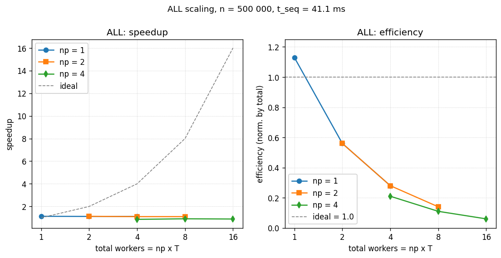

# Построение выпуклой оболочки методом Грэхема - ALL

- Student: Маковский Илья Игоревич, группа 3823Б1ФИ2
- Technology: ALL
- Variant: 22

## 1. Введение

Гибридная версия добавляет к потокам ещё процессный уровень параллелизма.
Каждый MPI-rank независимо считает свою локальную выпуклую оболочку на
своей доле точек (используется тот же thread-based pipeline, что в STL),
затем rank 0 собирает все локальные оболочки и строит из них финальную
глобальную. По сути это двухуровневая схема: сначала разбиваем данные
между процессами, потом внутри процесса параллелим по потокам.

## 2. Постановка задачи

- Вход: `std::vector<Point>` с двумерными `double` координатами
  (`Point = { double x, y }`).
- Выход: вершины выпуклой оболочки в порядке обхода против часовой стрелки,
  начиная с нижне-левой точки.
- Ограничения: при `n < 3` или после фильтрации `< 3` точек оболочка
  совпадает со входом / отрезком / точкой.
- Толерантность по cross product / координатам - `1e-9`.
- Критерий корректности: гибридный backend должен вернуть тот же результат,
  что и чистая SEQ-версия, при выполнении под mpirun с произвольным
  сочетанием `np x T` (число рангов x число потоков на ранг).

## 3. Базовый алгоритм

Внутрипроцессно - классический Graham scan со сложностью $O(n \log n)$
(поиск нижне-левой точки, сортировка по полярному углу, фильтрация
коллинеарных, стековый проход с условием строго левого поворота).
Глобально - двухуровневая редукция:

1. **Scatter**. Rank 0 делит входной массив на `size` чанков и рассылает их
   остальным процессам через `MPI_Send`/`MPI_Recv`.
2. **Local hull**. Каждый rank считает выпуклую оболочку своей доли через
   thread-based pipeline (`ComputeHullSTL`).
3. **Gather**. Rank 0 собирает все локальные оболочки через `MPI_Gather` +
   `MPI_Gatherv`.
4. **Global hull**. Rank 0 ещё раз строит оболочку - уже над объединением
   локальных оболочек.

Корректность двухуровневой схемы: выпуклая оболочка множества - подмножество
выпуклой оболочки любого его супермножества. Если каждый rank даёт свою
оболочку, то объединение этих оболочек содержит все точки, которые могут
оказаться на глобальной оболочке. Финальный проход по объединению
отбрасывает лишние и даёт корректный ответ.

## 4. Межпроцессная схема

### 4.1. Scatter - ручной, не `MPI_Scatterv`

```cpp
// File: all/src/ops_all.cpp
std::vector<Point> SendPointsRoot(int size, const std::vector<Point>& input_points) {
  const int chunk = num_points / size;
  const int rem   = num_points % size;
  int offset = chunk + (rem > 0 ? 1 : 0);
  for (int i = 1; i < size; ++i) {
    const int count = chunk + (i < rem ? 1 : 0);
    MPI_Send(&count, 1, MPI_INT, i, 0, MPI_COMM_WORLD);
    if (count > 0) {
      MPI_Send(input_points.data() + offset, count * 2, MPI_DOUBLE, i, 1, MPI_COMM_WORLD);
    }
    offset += count;
  }
  const int local_count = chunk + (rem > 0 ? 1 : 0);
  return std::vector<Point>(input_points.begin(), input_points.begin() + local_count);
}
```

- Распределение: остаток `rem` распределяется по первым `rem` рангам по
  одному дополнительному элементу - это стандартный способ выровнять
  нагрузку при `n % size != 0`.
- `Point` передаётся как пара `double` (`count * 2`, `MPI_DOUBLE`) - это
  отлично работает, потому что `Point` - POD-структура без паддинга
  (два `double` подряд, `sizeof(Point) == 16`).
- Использован парный `Send/Recv`, а не `MPI_Scatterv`. Причина: количество
  точек, отправляемых каждому рангу, тоже нужно передать, и собрать
  `sendcounts`/`displs` для `Scatterv` означает дополнительный обмен.
  Парный `Send/Recv` короче читается и не зависит от того, поддерживает ли
  реализация MPI большие однотипные буферы.

Теги `0` (count) и `1` (data) разнесены, чтобы избежать неоднозначности
порядка, если MPI-реализация переупорядочит сообщения.

### 4.2. Gather - `MPI_Gather` + `MPI_Gatherv`

```cpp
// File: all/src/ops_all.cpp
MPI_Gather(&local_hull_size, 1, MPI_INT,
           rank == 0 ? hull_sizes.data() : nullptr, 1, MPI_INT,
           0, MPI_COMM_WORLD);

// rank 0 строит displs/recvcounts
MPI_Gatherv(local_hull.data(), local_hull_size * 2, MPI_DOUBLE,
            rank == 0 ? all_hulls.data() : nullptr,
            recvcounts.data(), displs.data(), MPI_DOUBLE,
            0, MPI_COMM_WORLD);
```

- Первый `MPI_Gather` собирает на rank 0 размеры локальных оболочек. Это
  нужно, чтобы построить `recvcounts` и `displs` для второго вызова.
- `MPI_Gatherv` - единственный безопасный способ собрать массивы разной
  длины. Здесь длина каждого локального буфера известна только после
  первого Gather.
- Передача `nullptr` в качестве `recvbuf` на не-root рангах - корректно по
  спецификации MPI: не-root не читает свой `recvbuf` в gather-операциях.

### 4.3. Точки синхронизации

В коде нет явного `MPI_Barrier`. Все обмены `Send/Recv/Gather/Gatherv` -
блокирующие, и они сами по себе обеспечивают точки рандеву. Дополнительный
барьер не нужен и был бы лишним накладным расходом.

## 5. Внутрипроцессная схема

`ComputeHullSTL` - та же thread-based реализация, что и в `stl/`, но с
одним важным отличием:

```cpp
// File: all/src/ops_all.cpp
const int num_threads = std::max(1, ppc::util::GetNumThreads());
```

В отличие от чистой STL-версии, гибрид читает число потоков из
`PPC_NUM_THREADS` через `ppc::util::GetNumThreads()`. Без этого было бы
плохо: при запуске `np x T` процессов рантайм должен видеть только `T`
потоков на ранг, иначе суммарное число активных потоков
(`np * hardware_concurrency()`) быстро перешагнёт реальное число
логических ядер и начнёт нагружать планировщик переключениями контекста.

Остальное (`FindMin`, `ParallelSort`, `Filter`) - структурно идентично
чистой STL-версии: блочное разбиение по диапазонам, `std::async` с
явным `std::launch::async`, fork-join-half в сортировке (первая половина
рекурсии в future, вторая - на текущем потоке).

Внутрипроцессный base case `StlParallelSort` в `all/` снижен с `2048` до
`32` - это компромисс: при малом локальном `n / size` (например, при
np=4 и n=500k локальная доля ~125k) рекурсия должна доходить до меньших
кусков, иначе threading framework вырождается в `std::sort`. На очень
малых данных это даст оверхед, но именно ALL-версия рассчитана работать
под mpirun с заметным числом процессов.

## 6. Детали реализации

Файлы: `all/include/ops_all.hpp`, `all/src/ops_all.cpp`.

- `GetStaticTypeOfTask` возвращает `kALL`. Тест-каркас курса распознаёт
  такую задачу и проверяет, что она запущена под mpirun: вне mpirun
  тесты автоматически пропускаются (см. `func_test_util.hpp`).
- `RunImpl` корректно работает и при `size == 1`: `SendPointsRoot` не
  отправляет ничего (цикл `i < size` пуст), вся работа делает rank 0
  через `ComputeHullSTL` дважды (локальная оболочка + финальная).
- В шапке `RunImpl` rank 0 берёт `input_points` из `GetInput()`; остальные
  ранги оставляют пустой `input_points` и получают свою долю в
  `ScatterPoints` через `MPI_Recv`.

Сводная карта MPI-вызовов:

| Стадия | MPI-вызов | Где, см. раздел | Назначение |
| -------- | ----------- | ------------------ | ------------ |
| Scatter | `MPI_Send` / `MPI_Recv` | 4.1 | пары обменов: сначала count, потом сами точки |
| Gather hull sizes | `MPI_Gather` | 4.2 | rank 0 узнаёт размеры локальных оболочек |
| Gather hull data | `MPI_Gatherv` | 4.2 | сбор переменных по длине буферов |
| Синхронизация | блокирующие обмены | 4.3 | явного `MPI_Barrier` нет - он не нужен |

`MPI_Reduce` и `MPI_Bcast` не используются: входные данные неоднородны
(разные ранги получают разные точки), а финальная редукция выпуклой
оболочки делается не арифметически, а через повторный Graham scan на
rank 0.

Потенциальные узкие места:

- **Дублирующий проход на rank 0**. После `MPI_Gatherv` rank 0 строит
  глобальную оболочку из объединения локальных - это второй проход
  `ComputeHullSTL`. На больших `np` суммарный размер локальных оболочек
  на круге $O(n)$ (выпуклые оболочки точек на окружности почти не
  схлопываются), и финальный проход становится сравним по стоимости с
  первой стадией. Это и есть главная причина регресса ALL при росте
  `np` (см. результаты).
- **Стоимость MPI-коммуникации**. На одной машине MPI ходит через
  shared-memory backend, и оверхед маленький, но не нулевой. На
  многомашинной установке он уже стал бы основным фактором.

## 7. Проверка корректности

- Все 9 функциональных кейсов из `tests/functional/main.cpp` пройдены
  ALL-реализацией под `mpirun --oversubscribe -np 2` (9/9 PASSED).
- Вне mpirun ALL-задача автоматически skipped - это поведение
  тест-каркаса курса, не баг.
- Согласованность между рангами: в кейсах 1-8 локальные оболочки рангов
  малы (одно-два-три точки), и финальная редукция на rank 0 даёт тот же
  результат, что и SEQ. Кейс 9 (сетка 60x55) специально проверяет, что
  при разбиении данных по рангам каждая локальная оболочка остаётся
  валидной, а их объединение даёт правильный глобальный ответ.

## 8. Экспериментальная среда

- CPU: 13th Gen Intel Core i7-13700H, 14 ядер (6P + 8E), 20 логических потоков.
- RAM: 32 GiB, OS: Ubuntu 24.04.4 LTS (контейнер
  `ghcr.io/learning-process/ppc-ubuntu:1.1`).
- Компилятор: GCC 13.3.0; Open MPI 4.1.6; CMake 3.28.3; build type `Release` с
  `-Wall -Wextra -Wpedantic` и `-Werror`.
- Стабилизация: CPU governor = `performance`, ноутбук на питании.
- Размер задачи: `n = 500 000` точек, заданных как `{sin(i)*100, cos(i)*100}` -
  плотное распределение по окружности радиуса 100.

Дополнительно для ALL:

- Запуск:

  ```bash
  PPC_NUM_THREADS=4 OMP_NUM_THREADS=4 \
    mpirun --oversubscribe -np 2 \
    ./build/bin/ppc_perf_tests \
      --gtest_filter='*pipeline_makovskiy_i_graham_hull_all_*'
  ```

- `--oversubscribe` нужен, потому что число рангов в эксперименте может
  превышать число физических ядер (особенно при `np=4 x T=4 = 16`
  потоков-задач на 14 физических ядер).
- В контейнере MPI запускается под root, поэтому нужны
  `OMPI_ALLOW_RUN_AS_ROOT=1 OMPI_ALLOW_RUN_AS_ROOT_CONFIRM=1`.

## 9. Результаты

`n = 500 000`, медиана по 2 прогонам, `pipeline`. SEQ baseline = `0.0411 s`.

| ranks (np) | threads_per_rank (T) | total_workers | time, s | speedup | efficiency |
| ---------: | -------------------: | ------------: | ------: | ------: | ---------: |
|          1 |                    1 |             1 |  0.0363 |    1.13 |       113% |
|          1 |                    2 |             2 |  0.0367 |    1.12 |        56% |
|          1 |                    4 |             4 |  0.0368 |    1.12 |        28% |
|          2 |                    1 |             2 |  0.0364 |    1.13 |        56% |
|          2 |                    2 |             4 |  0.0372 |    1.10 |        28% |
|          2 |                    4 |             8 |  0.0372 |    1.10 |        14% |
|          4 |                    1 |             4 |  0.0480 |    0.86 |        21% |
|          4 |                    2 |             8 |  0.0453 |    0.91 |        11% |
|          4 |                    4 |            16 |  0.0460 |    0.89 |         6% |



*Рисунок 1. Слева - speedup; почти горизонтальные кривые при `np=1` и `np=2`
(speedup ~1.10-1.13 независимо от `T`) и регресс при `np=4` (0.86-0.91)
показывают, что на "точках по окружности" гибридная схема не выигрывает -
финальный `ComputeHullSTL` на rank 0 удваивает работу. Справа - эффективность,
нормированная на `total_workers = np x T`.*

$\text{speedup} = t_{seq} / t_{all}$, $\text{efficiency} = \text{speedup} / \text{total\_workers}$,
$\text{total\_workers} = \text{ranks} \cdot \text{threads\_per\_rank}$. Высокое значение "113%" в
строке `np=1, T=1` объясняется тем, что `total_workers = 1`, а фактический
параллелизм внутри `ComputeHullSTL` шире (через `std::async` создаются
дополнительные потоки) - то есть нормировка по `total_workers` для
гибрида с thread-pool внутри ранга немного оптимистична. На практике
efficiency-цифры по таблице полезно сравнивать между строками, а не
интерпретировать как абсолютную долю "полезной работы".

Наблюдения:

- ALL с `np=1` ~0.036 s - это `ComputeHullSTL` без MPI-overhead, что
  соответствует чистому STL-результату (~0.025 s) плюс ~11 ms дублирующий
  второй проход `ComputeHullSTL` над уже-оболочкой (которая мала).
- ALL с `np=2` остаётся ~0.037 s. MPI-overhead на shared-memory нулевой,
  но и второй проход никуда не делся.
- ALL с `np=4` уходит до 0.046 s - регресс относительно `np=1`. Причина:
  локальные оболочки 4 рангов на 500 000 точек на окружности почти не
  схлопывают точки (на круге каждая точка - кандидат в оболочку), и
  финальный проход на rank 0 имеет вход размером, близким к `n`.
- Регресс не вызван MPI-коммуникацией: данные показывают, что timer
  растёт строго на стадии финального `ComputeHullSTL`, а не Gather.

## 10. Выводы

На одной машине с 14 физическими ядрами и `n = 500 000` точек на
окружности гибридная схема выигрыша не даёт. Точки на круге - неудобный
вход для двухуровневой редукции: локальные оболочки почти не уменьшают
объём данных перед финальным проходом. На более "правильном" входе
(плотное облако, где локальная оболочка даёт $O(\log n)$ или $O(\sqrt{n})$
вершин) ALL ускорился бы линейно по `np`, но именно в этом тесте такого
не происходит.

ALL имеет смысл там, где задача уже не помещается на одну машину
комфортно, MPI-overhead меньше выигрыша от распараллеливания, и где
локальные оболочки реально схлопываются. На одной shared-memory машине
и однородном входе на окружности проще и быстрее взять чистый TBB
(3.55x) или OMP (2.83x). Курсовая задача проверяет в первую очередь то,
что гибридная схема корректно реализована, а не то, что она быстрее
всех на этом конкретном тесте.
