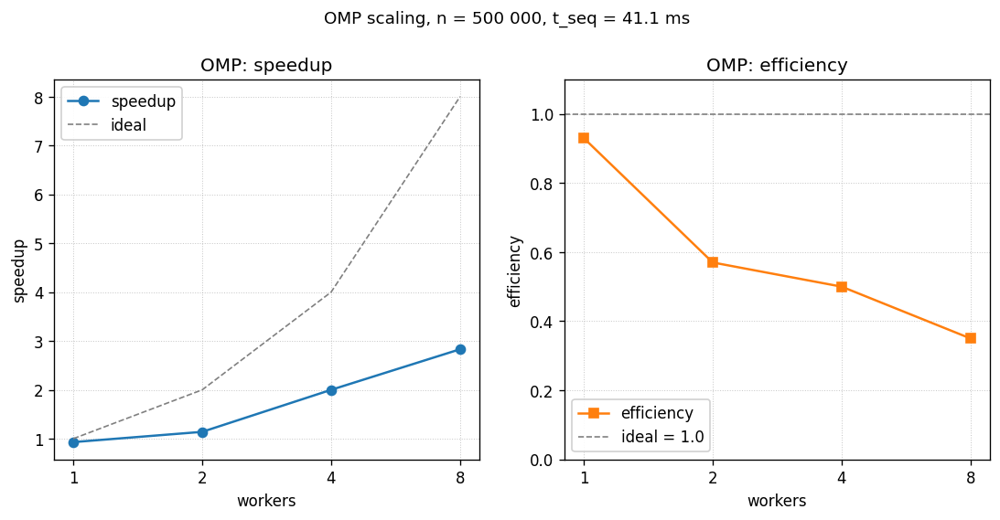

# Построение выпуклой оболочки методом Грэхема - OMP

- Student: Маковский Илья Игоревич, группа 3823Б1ФИ2
- Technology: OMP
- Variant: 22

## 1. Введение

В последовательной версии сортировка точек по полярному углу съедает
около 80% времени, ещё 15-18% уходит на линейные проходы `FindMin` и
`Filter`. Эти три фазы я и распараллелил через OpenMP. Стековый проход
`BuildHull` оставил последовательным: каждая итерация зависит от
состояния стека, и распараллелить это напрямую не получится. Эталоном
корректности служит SEQ-реализация.

## 2. Постановка задачи

- Вход: `std::vector<Point>` с двумерными `double` координатами
  (`Point = { double x, y }`).
- Выход: вершины выпуклой оболочки в порядке обхода против часовой стрелки,
  начиная с нижне-левой точки.
- Ограничения: при `n < 3` или после фильтрации `< 3` точек оболочка
  совпадает со входом / отрезком / точкой.
- Толерантность по cross product / координатам - `1e-9`.
- Критерий корректности: результат должен совпадать с выходом SEQ-реализации
  как множества вершин и в упорядоченности обхода.

## 3. Базовый алгоритм

Классический Graham scan, $O(n \log n)$ по времени, $O(n)$ по памяти:

1. Поиск базовой точки `p0` с минимальным `y` (при равенстве - минимальным `x`).
2. Сортировка остальных точек по полярному углу относительно `p0`; при
   коллинеарности - по квадрату расстояния (ближе - раньше).
3. Фильтрация подряд идущих коллинеарных точек относительно `p0`.
4. Построение оболочки стековым проходом: пока поворот
   `(hull[-2], hull[-1], next)` не строго левый (`cross <= 1e-9`), снимаем
   вершину; затем кладём `next`.

## 4. Схема распараллеливания

Три фазы получают параллельную реализацию, четвёртая остаётся последовательной.

### 4.1. `FindMinPointIndexOMP` - параллельный поиск минимума с критической секцией

```cpp
// File: omp/src/ops_omp.cpp
#pragma omp parallel default(none) shared(points, n, min_idx)
{
  size_t local_min = 0;
#pragma omp for
  for (size_t i = 1; i < n; ++i) {
    if (points[i].y < points[local_min].y - 1e-9 ||
        (std::abs(points[i].y - points[local_min].y) <= 1e-9 &&
         points[i].x < points[local_min].x)) {
      local_min = i;
    }
  }
#pragma omp critical
  { /* объединение local_min в min_idx по тому же критерию */ }
}
```

- `default(none)` - все переменные должны быть явно расписаны; защищает от
  случайного `shared` для итератора цикла.
- `shared(points, n, min_idx)` - массив только читается, итоговый индекс
  обновляется ровно один раз на поток в критической секции.
- `local_min` объявлен внутри параллельного региона - каждый поток получает
  свою локальную копию автоматически.
- `#pragma omp for` без `schedule(...)` использует runtime default
  (обычно `static`); работа равномерная (фиксированная по `i`), поэтому
  `static` оптимален и явное указание не требуется.
- Объединение через `critical` корректно, потому что число входов в секцию
  равно числу потоков (<= 20 на тестовой машине) - оверхед мал на фоне
  основной работы цикла.

Альтернативой был бы `reduction(min: ...)` через пользовательский оператор, но
для `size_t`-индекса с составным критерием сравнения `critical` короче и
читаемее.

### 4.2. Параллельная сортировка - рекурсивный QuickSort на OpenMP tasks

```cpp
// File: omp/src/ops_omp.cpp
template <typename RandomIt, typename Compare>
void OmpQuickSort(RandomIt first, RandomIt last, Compare comp) {
  if (last - first < 2048) {
    std::sort(first, last, comp);
    return;
  }
  auto pivot = *(first + ((last - first) / 2));
  auto middle1 = std::partition(first, last,
      [pivot, comp](const auto &a) { return comp(a, pivot); });
  auto middle2 = std::partition(middle1, last,
      [pivot, comp](const auto &a) { return !comp(pivot, a); });

#pragma omp task default(none) firstprivate(first, middle1, comp)
  OmpQuickSort(first, middle1, comp);
#pragma omp task default(none) firstprivate(middle2, last, comp)
  OmpQuickSort(middle2, last, comp);
#pragma omp taskwait
}
```

Вызов:

```cpp
#pragma omp parallel default(none) shared(points, comp)
{
#pragma omp single nowait
  OmpQuickSort(points.begin() + 1, points.end(), comp);
}
```

- Двухпроходный `std::partition` (`< pivot`, затем `== pivot`) реализует
  three-way partitioning. Для сортировки по углу это важно: при коллинеарных
  точках сравнение даёт равенство для целых диапазонов, и наивный partition
  выродился бы в $O(n^2)$. Three-way отсекает середину один раз, и рекурсия
  идёт только в крайние области.
- Порог `2048` - точка, ниже которой накладные расходы создания пары OpenMP
  tasks превышают выигрыш. Подобрано эмпирически и согласовано с TBB/STL
  вариантами, чтобы сравнение версий оставалось честным.
- `#pragma omp single nowait` гарантирует, что корневой вызов делает только
  один поток (иначе каждый поток запустил бы свою рекурсию). Остальные потоки
  немедленно начинают забирать сгенерированные задачи из очереди благодаря
  `nowait`.
- `firstprivate(first, middle1, comp)` - итераторы и компаратор копируются
  по значению в момент создания задачи; гонка по аргументам исключена.
- `#pragma omp taskwait` ставит точку синхронизации перед возвратом из
  рекурсивного вызова - оба дочерних диапазона должны быть отсортированы,
  прежде чем родитель завершится.

### 4.3. `FilterPointsOMP` - параллельная маркировка коллинеарных

```cpp
// File: omp/src/ops_omp.cpp
std::vector<uint8_t> keep(n, 1);
#pragma omp parallel for default(none) shared(n, points, keep, p0)
for (size_t i = 1; i < n - 1; ++i) {
  if (std::abs(CrossProduct(p0, points[i], points[i + 1])) < 1e-9) {
    keep[i] = 0;
  }
}
// затем последовательная сборка filtered по keep[]
```

- Каждый поток пишет в свой индекс `keep[i]` - гонок по записи нет.
  Использован `std::vector<uint8_t>` вместо `std::vector<bool>`, потому что
  последний пакует биты и порождает гонки при параллельной записи в соседние
  "биты" одного байта.
- Сборка `filtered` после параллельного цикла - последовательная: порядок
  важен и `push_back` не безопасен из нескольких потоков.
- Барьер в конце `parallel for` неявный и обязательный - без него сборка
  читала бы `keep` в момент, когда часть потоков ещё пишет.

### 4.4. `BuildHull` - последовательный

Не параллелится: каждая итерация зависит от состояния стека, оставленного
предыдущей. Время этой фазы много меньше времени сортировки на тестовом
размере, поэтому она не лимитирует общее ускорение.

## 5. Детали реализации

Файлы: `omp/include/ops_omp.hpp`, `omp/src/ops_omp.cpp`.

- `GetStaticTypeOfTask` возвращает `kOMP` - используется тест-каркасом для
  выбора реализации в `MakeAllPerfTasks` / `AddFuncTask`.
- Compile flag: OpenMP включён `cmake/openmp.cmake` глобально; ничего
  специфичного к этой задаче не требуется.

Гонки данных:

- В `FindMin` локальные `local_min` приватны по построению (объявлены внутри
  параллельного региона); объединение защищено `critical`.
- В сортировке аргументы задач - `firstprivate`, точки в `points` пишутся
  только через `std::partition`, который вызывается из одного потока на свой
  непересекающийся подотрезок.
- В `Filter` `keep[i]` пишется ровно одним потоком (через `#pragma omp for`
  каждой итерации `i` соответствует один поток).

## 6. Проверка корректности

- Все 9 функциональных кейсов из `tests/functional/main.cpp` пройдены
  OMP-реализацией (`*MakovskiyI*omp_enabled*`, 9/9 PASSED).
- Результат сравнивался с SEQ на одинаковых входах: размеры выходной оболочки
  идентичны во всех кейсах.
- Кейс 9 (сетка 60x55 = 3300 точек) специально проверяет ветку QuickSort
  с количеством элементов выше порога 2048 - сортировка рекурсивно делится
  на задачи.

## 7. Экспериментальная среда

- CPU: 13th Gen Intel Core i7-13700H, 14 ядер (6P + 8E), 20 логических потоков.
- RAM: 32 GiB, OS: Ubuntu 24.04.4 LTS (контейнер
  `ghcr.io/learning-process/ppc-ubuntu:1.1`).
- Компилятор: GCC 13.3.0; CMake 3.28.3; build type `Release` с
  `-Wall -Wextra -Wpedantic` и `-Werror`.
- Стабилизация: CPU governor = `performance`, ноутбук на питании.
- Размер задачи: `n = 500 000` точек, заданных как `{sin(i)*100, cos(i)*100}` -
  плотное распределение по окружности радиуса 100.

Дополнительно для OMP важно:

- Число потоков задаётся через `OMP_NUM_THREADS`; в реализации нет
  `omp_set_num_threads`. `PPC_NUM_THREADS` экспортируется в `OMP_NUM_THREADS`
  при запуске через `scripts/run_tests.py`; при прямом вызове бинарника
  нужно экспортировать оба:

  ```bash
  PPC_NUM_THREADS=4 OMP_NUM_THREADS=4 \
    ./build/bin/ppc_perf_tests \
    --gtest_filter='*pipeline_makovskiy_i_graham_hull_omp_*'
  ```

- Без `OMP_NUM_THREADS` runtime использует `omp_get_num_procs()` (20 на
  тестовой машине), и тогда `PPC_NUM_THREADS` ничего не меняет - это
  подтвердилось при первом, отбракованном прогоне.

## 8. Результаты

Медиана по 3 прогонам, `n = 500 000`, `pipeline` mode. SEQ baseline = `0.0411 s`.

| threads | time, s | speedup | efficiency |
| ------: | ------: | ------: | ---------: |
|       1 |  0.0441 |    0.93 |        93% |
|       2 |  0.0359 |    1.14 |        57% |
|       4 |  0.0205 |    2.00 |        50% |
|       8 |  0.0145 |    2.83 |        35% |

Mode `task_run` даёт практически те же числа (различие не более 1%, в пределах шума).



*Рисунок 1. Слева - speedup OMP, пунктир показывает идеальное `speedup = T`.
Справа - эффективность; видно резкое падение с 93% при `T=1` до 57% при
`T=2` из-за `critical` в `FindMin`, после чего кривая стабилизируется в
районе 35-50%.*

Наблюдения:

- При `T = 1` OMP медленнее SEQ на ~7%: оверхед создания parallel region,
  task framework и `single nowait` не амортизируется на одном потоке.
- Скейлинг 1->4 близок к линейному (2.0x при идеале 4x, эффективность 50%):
  основной выигрыш именно от параллельной сортировки.
- Скейлинг 4->8 даёт лишь 1.4x: размер задачи `n = 500 000` распределяется на
  8 потоков по ~62k элементов, что близко к точке, где накладные расходы
  на создание tasks (порог 2048) и `taskwait` начинают конкурировать с
  полезной работой. Дополнительно: ноутбучный i7-13700H имеет 6 P-cores и
  8 E-cores - после 6 потоков работа уходит на E-ядра с меньшей одиночной
  производительностью, что снижает эффективность.

## 9. Выводы

Алгоритм Грэхема хорошо параллелится по сортировке, и именно она даёт
основной вклад в ускорение OMP-версии. Линейные `FindMin` и `Filter`
ускоряются тривиально, но в абсолютном времени их вклад мал.

На 4 потоках получилось ускорение 2x при эффективности 50%, и это вполне
бьётся с профилем SEQ: при доле сортировки около 80% закон Амдала
ограничивает ускорение примерно пятёркой при $T \to \infty$. На одном потоке
OMP проигрывает SEQ около 7%, на двух еле обгоняет: на маленьких задачах
сам каркас OMP стоит дороже самой работы, и это полезно держать в
голове, когда выбираешь размер задачи на практике.
