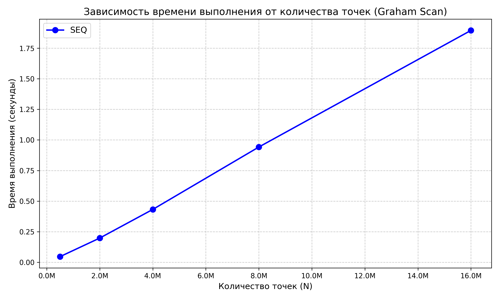

# Построение выпуклой оболочки – проход Грэхема

- Студент: Маковский Илья Игоревич, группа 3823Б1ФИ2
- Технология: SEQ
- Вариант: 22

## 1. Введение

Построение выпуклой оболочки (Convex Hull) — классическая и фундаментальная задача вычислительной
геометрии, имеющая широкое применение в компьютерном зрении, распознавании образов,
геоинформационных системах и коллизиях в физических движках.

Алгоритм обхода Грэхема (Graham Scan) является одним из наиболее известных и эффективных методов
решения этой задачи с асимптотической сложностью $O(N \log N)$. Цель данной лабораторной работы —
реализовать алгоритм Грэхема в строгом соответствии с требованиями к качеству кода, а затем
(в следующих задачах) исследовать возможности его ускорения с помощью технологий параллельного
программирования с общей памятью (OpenMP, TBB, `std::thread`).

## 2. Постановка задачи

**Формальная постановка:** Задано множество точек $P = \{p_1, p_2, \dots, p_n\}$ на двумерной
плоскости. Требуется найти минимаковый выпуклый многоугольник, содержащий все точки множества $P$.
Результатом работы должно быть упорядоченное (обычно против часовой стрелки) подмножество точек,
являющихся вершинами этого многоугольника.

**Формат входных и выходных данных:**

- **Вход:** Массив (вектор) структур `Point`, содержащих координаты `x` и `y` типа `double`.
- **Выход:** Вектор точек `Point`, образующих выпуклую оболочку.

**Ограничения и краевые случаи:**

- Если количество входных точек меньше 3, выпуклой оболочкой является само входное множество.
- Алгоритм должен корректно обрабатывать коллинеарные точки (лежащие на одной прямой). Из
  нескольких коллинеарных точек в оболочку должна входить только самая удалённая.
- Алгоритм должен быть устойчив к вычислительным погрешностям при работе с числами с
  плавающей точкой (используется погрешность $\varepsilon = 10^{-9}$).

## 3. Базовый алгоритм (последовательный)

Базовый последовательный алгоритм Грэхема разбит на следующие логические этапы:

1. **Поиск стартовой точки (Pivot):** Из всего множества точек выбирается самая нижняя (с
   минимальной координатой $Y$). Если таких точек несколько, выбирается самая левая из них (с
   минимальной координатой $X$). Эта точка $P_0$ гарантированно принадлежит выпуклой оболочке.
2. **Сортировка по полярному углу:** Оставшиеся точки сортируются относительно вектора,
   исходящего из $P_0$. Мерилом угла служит векторное произведение (Cross Product). Если векторное
   произведение равно нулю, точки сортируются по квадрату расстояния от $P_0$.
3. **Фильтрация:** Оставляется только самая дальняя точка на каждом луче, исходящем из $P_0$.
4. **Построение оболочки (сканирование):** В стек помещаются первые три точки. Для каждой
   последующей точки проверяется направление поворота: пока две верхние точки стека и текущая точка
   не образуют "левый поворот", верхняя точка удаляется из стека. После этого текущая точка
   добавляется в стек.

## 4. Схема распараллеливания

Алгоритм Грэхема имеет как хорошо распараллеливаемые участки, так и строго последовательные.
В рамках многопоточной парадигмы (с общей памятью) предполагается следующая декомпозиция:

1. **Поиск стартовой точки (Pivot):** Представляет собой операцию поиска минимума. Легко
   распараллеливается с использованием параллельной редукции (Reduction). Каждый поток находит
   локальный минимум в своем блоке данных, после чего локальные минимумы сравниваются.
2. **Вычисление углов и расстояний / Сортировка:** Это самая ресурсоемкая часть алгоритма —
   $O(N \log N)$. Распараллеливается путем применения параллельной сортировки (например,
   `tbb::parallel_sort` или написания собственной реализации параллельного Merge Sort/Quick Sort).
3. **Обход Грэхема (Сканирование):** Проход по отсортированному массиву с использованием стека
   имеет строгую зависимость по данным (состояние стека зависит от предыдущих итераций) и
   выполняется последовательно за $O(N)$. Так как сортировка занимает доминирующее время, выполнение
   этой части в одном потоке не станет критическим "бутылочным горлышком" (согласно закону Амдала).

## 5. Детали реализации

Код построен на базе единого интерфейса `ppc::task::Task`:

- `ValidationImpl`: Проверяет корректность входных данных (вынесено базовое `return true`, так
  как алгоритм может работать с любыми координатами).
- `PreProcessingImpl` и `PostProcessingImpl`: Выполняют минимальную инициализацию и передачу
  результата из внутреннего вектора в выходные данные.
- `RunImpl`: Содержит основную логику алгоритма. Для улучшения читаемости и соблюдения лимитов
  когнитивной сложности логика разбита на вспомогательные функции, скрытые в анонимном пространстве
  имен: `CrossProduct`, `DistSq`, `FindMinPointIndex`, `FilterPoints`, `BuildHull`.

**Особенности работы с памятью:**
Используется `std::vector<Point>`. Для оптимизации памяти фильтрация точек вынесена в отдельную
фазу, что позволяет уменьшить размер вектора перед этапом построения стека оболочки. Сравнение
вещественных чисел производится безопасно с учетом машинного эпсилона (`1e-9`).

## 6. Экспериментальная установка

**Окружение и аппаратное обеспечение:**

- **CPU:** 13th Gen Intel(R) Core(TM) i7-13700H (20 логических ядер)
- **RAM:** 8 GB (выделено для Docker-контейнера)
- **OS:** Ubuntu 24.04.2 LTS (внутри Docker-контейнера)

**Инструментарий и сборка:**

- **Компилятор:** GCC 14.2.0 (g++)
- **MPI-реализация:** Open MPI 4.1.6
- **Тип сборки:** `Release` (конфигурация через CMake: `-D CMAKE_BUILD_TYPE=Release`)
- **Окружение исполнения:** тесты запускались через стандартный вспомогательный скрипт
  `scripts/run_tests.py`.

**Параметры запуска и генерация данных:**

- Тесты производительности (`--running-type=performance`) запускались для базовой последовательной
  реализации (SEQ) с использованием 1 потока.
- В качестве входных данных использовались детерминированно сгенерированные множества точек на
  плоскости (с применением математических функций синуса и косинуса, чтобы равномерно распределить
  точки и избежать влияния случайного генератора на время выполнения).
- Замеры производительности проводились для массивов следующих размеров: 500 000, 2 000 000,
  4 000 000, 8 000 000 и 16 000 000 точек.

## 7. Результаты и обсуждение

### 7.1 Корректность

Корректность алгоритма проверялась с использованием функциональных тестов (GTest). Были покрыты
следующие краевые случаи:

1. Квадрат с внутренней точкой (ожидается удаление внутренней).
2. Треугольник (минимально возможная оболочка).
3. Коллинеарные точки, лежащие на гранях оболочки.
4. Вырожденные случаи (пустой массив, две точки, точки на одной диагональной/вертикальной прямой).
5. Отрицательные координаты.

Функциональные тесты успешно пройдены, утечек памяти (при запуске с Address Sanitizer) не обнаружено.

### 7.2 Производительность

В таблице ниже представлены усредненные результаты времени выполнения (`task_run`)
последовательной версии алгоритма (SEQ) для различных размеров входного массива.

| Режим | Потоки | Число точек ($N$) | Время, с | Ускорение | Эффективность |
|-------|--------|-------------------|----------|-----------|---------------|
| SEQ   | 1      | 500 000           | 0.046    | 1.00      | N/A           |
| SEQ   | 1      | 2 000 000         | 0.198    | 1.00      | N/A           |
| SEQ   | 1      | 4 000 000         | 0.432    | 1.00      | N/A           |
| SEQ   | 1      | 8 000 000         | 0.942    | 1.00      | N/A           |
| SEQ   | 1      | 16 000 000        | 1.895    | 1.00      | N/A           |

*(Примечание: колонки "Ускорение" и "Эффективность" будут заполнены по мере реализации
параллельных версий алгоритма).*

**График масштабируемости базового алгоритма:**

Анализ времени выполнения подтверждает асимптотическую сложность алгоритма $O(N \log N)$.
При увеличении входного массива ровно в 2 раза, время работы увеличивается немного больше,
чем в 2 раза, что полностью соответствует логарифмическому множителю на ресурсоемком
этапе сортировки углов.

## 8. Выводы

В ходе выполнения лабораторной работы была успешно реализована и протестирована
последовательная версия алгоритма Грэхема для построения выпуклой оболочки. Код соответствует
стандартам качества, детерминирован и
безопасен с точки зрения работы с памятью.

Основным узким местом алгоритма ожидаемо является этап сортировки точек по полярному углу.
В дальнейшем, применение технологий параллельного программирования (OpenMP, TBB) на этапах
поиска минимума и параллельной сортировки позволит существенно сократить общее время выполнения
алгоритма. Проход по отсортированному массиву со стеком останется последовательным, однако его
влияние на итоговое время пренебрежимо мало по сравнению с фазой сортировки.

## 9. Источники

1. Parallel Programming Course - [https://learning-process.github.io/parallel_programming_course/ru/](https://learning-process.github.io/parallel_programming_course/ru/)
2. Parallel Programming 2025-2026 Video-Records - [https://disk.yandex.ru/d/NvHFyhOJCQU65w](https://disk.yandex.ru/d/NvHFyhOJCQU65w)
3. Graham scan - Wikipedia - [https://en.wikipedia.org/wiki/Graham_scan](https://en.wikipedia.org/wiki/Graham_scan)
4. C++ reference (cppreference.com) — [https://en.cppreference.com/w/cpp/algorithm](https://en.cppreference.com/w/cpp/algorithm)
