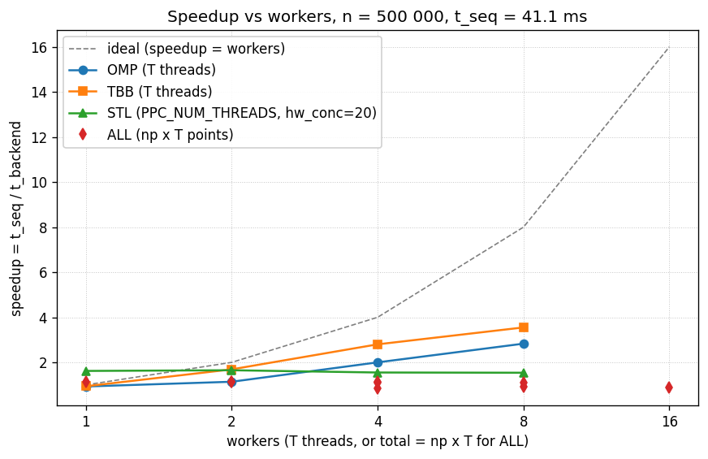
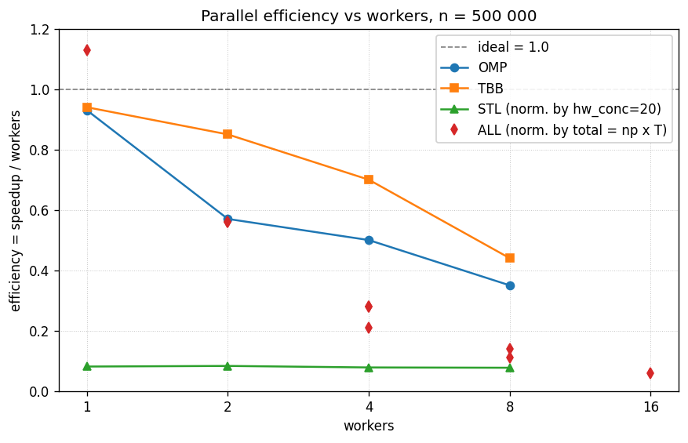

# Построение выпуклой оболочки методом Грэхема

- Student: Маковский Илья Игоревич, группа 3823Б1ФИ2
- Variant: 22
- Local reports: [seq/report.md](seq/report.md), [omp/report.md](omp/report.md),
  [tbb/report.md](tbb/report.md), [stl/report.md](stl/report.md),
  [all/report.md](all/report.md)

## 1. Введение

Выпуклая оболочка методом Грэхема - классическая задача вычислительной
геометрии со сложностью $O(n \log n)$. В этой работе она реализована в пяти
вариантах (SEQ, OMP, TBB, STL, ALL) и сравнена на одинаковом наборе
размеров задачи и одном и том же окружении. Задача подходит для сравнения
моделей параллелизма потому, что ~80% её времени приходится на сортировку -
структурно хорошо параллелящуюся операцию - а ~19% на линейные проходы
с разной природой синхронизации (редукция в `FindMin`, независимая
запись в `Filter`); оставшийся ~1% - последовательный стековый проход
`BuildHull`.

## 2. Единая постановка задачи

- Вход: `std::vector<Point>` с двумерными `double` координатами (`Point =
  { double x, y }`).
- Выход: вершины выпуклой оболочки в порядке обхода против часовой стрелки,
  начиная с нижне-левой точки.
- Граничные случаи: при `n < 3` или после фильтрации `< 3` точек оболочка
  совпадает со входом / отрезком / точкой.
- Толерантность по cross product / координатам - `1e-9`.
- **Критерий корректности**: результат каждой параллельной реализации
  должен совпадать с выходом SEQ как множества вершин и в
  упорядоченности обхода. Это проверяется единым тест-каркасом курса
  (см. раздел 4).

Используется классический Graham scan со сложностью $O(n \log n)$:
поиск нижне-левой точки `p0`, сортировка остальных по полярному углу
относительно `p0`, фильтрация подряд идущих коллинеарных, и стековый
проход с условием строго левого поворота. Выбор алгоритма обусловлен
тем, что доминирующая стадия (сортировка) хорошо параллелится, а
линейные `FindMin` и `Filter` имеют разную природу синхронизации,
что делает задачу удобной для сравнения моделей параллелизма.

## 3. Единая методика эксперимента

- **Hardware/OS**: 13th Gen Intel Core i7-13700H (14 ядер: 6P + 8E, 20
  логических потоков), 32 GiB RAM, Ubuntu 24.04.4 LTS, контейнер
  `ghcr.io/learning-process/ppc-ubuntu:1.1`.
- **Toolchain**: GCC 13.3.0, Open MPI 4.1.6, TBB, CMake 3.28.3.
- **Build type**: `Release`, флаги `-O3 -Wall -Wextra -Wpedantic -Werror`
  (из `cmake/configure.cmake`).
- **Стабилизация замеров**: CPU governor = `performance`, ноутбук на
  питании, фоновые задачи минимизированы. Без `cpupower` / `taskset`
  пиннинга - на гетерогенном i7-13700H принудительное закрепление за
  ядром искажает картину между P и E ядрами.
- **Переменные окружения**:
  - `PPC_NUM_THREADS` - число потоков, читаемое
    `ppc::util::GetNumThreads()`; OMP и ALL зависят от него, TBB - через
    окружение раннера, STL - игнорирует.
  - `OMP_NUM_THREADS` - обязательно для OMP при прямом запуске бинарника
    (иначе OpenMP-runtime использует `omp_get_num_procs()`).
  - `OMPI_ALLOW_RUN_AS_ROOT=1`, `OMPI_ALLOW_RUN_AS_ROOT_CONFIRM=1` -
    нужны в контейнере курса, где `mpirun` запускается под root.
  - `PPC_ASAN_RUN`, `PPC_TASK_MAX_TIME`, `PPC_PERF_MAX_TIME` -
    инфраструктурные, в данных замерах не использовались.
- **Команды сборки и запуска**:

  ```bash
  # Сборка
  cmake -S . -B build -D USE_FUNC_TESTS=ON -D USE_PERF_TESTS=ON \
    -D CMAKE_BUILD_TYPE=Release
  cmake --build build --parallel

  # Потоковые реализации
  PPC_NUM_THREADS=4 OMP_NUM_THREADS=4 \
    ./build/bin/ppc_perf_tests \
    --gtest_filter='*pipeline_makovskiy_i_graham_hull_omp_*'

  # MPI / гибрид
  PPC_NUM_THREADS=2 OMP_NUM_THREADS=2 \
    OMPI_ALLOW_RUN_AS_ROOT=1 OMPI_ALLOW_RUN_AS_ROOT_CONFIRM=1 \
    mpirun --oversubscribe -np 2 ./build/bin/ppc_perf_tests \
    --gtest_filter='*pipeline_makovskiy_i_graham_hull_all_*'
  ```

- **Размер задачи**: `n = 500 000` точек, заданных как `{sin(i)*100,
  cos(i)*100}` - плотное распределение по окружности радиуса 100.
  Зафиксировано в `tests/performance/main.cpp`.
- **Speedup**: $\text{speedup} = t_{seq} / t_{backend}$, где $t_{seq}$ - медиана
  `pipeline`-времени чистой SEQ-версии = `0.0411 s`.
- **Efficiency**: $\text{efficiency} = \text{speedup} / \text{workers}$.
  Для потоковых реализаций $\text{workers} = T$ (число потоков, заданных
  через `PPC_NUM_THREADS`). Для STL нормировка - `hardware_concurrency() = 20`
  (реализация не реагирует на `PPC_NUM_THREADS`). Для ALL
  $\text{workers} = \text{total\_workers} = \text{ranks} \cdot T$; значения
  efficiency для ALL следует читать как сравнительные между строками, а не
  как абсолютную долю "полезной работы" (внутри `ComputeHullSTL` фактический
  параллелизм может быть шире `T`).
- **Повторы**: 3 независимых запуска бинарника для каждой ячейки таблицы
  (для ALL - 2). Внутри одного запуска `ppc::performance::Perf` сам делает
  5 повторов и возвращает среднее. В таблицах ниже - медиана по 3 запускам
  внешнего повтора.

## 4. Сводка корректности

Функциональный набор из `tests/functional/main.cpp` (9 кейсов): квадрат с
внутренней точкой, треугольник, коллинеарные на рёбрах, пустой массив,
2 точки, диагональ, вертикаль, отрицательные координаты, сетка 60x55.

- SEQ: 9/9 PASSED (`*MakovskiyI*seq_enabled*`).
- OMP: 9/9 PASSED (`*MakovskiyI*omp_enabled*`).
- TBB: 9/9 PASSED (`*MakovskiyI*tbb_enabled*`).
- STL: 9/9 PASSED (`*MakovskiyI*stl_enabled*`).
- ALL: 9/9 PASSED под `mpirun --oversubscribe -np 2` (`*MakovskiyI*all_enabled*`).

Все версии возвращают оболочку идентичного размера и состава, что и SEQ.
Сравнение выполняется тест-каркасом в `CheckTestOutputData`. Отдельных
тестов на различия не потребовалось - сам факт 9/9 PASSED у всех
реализаций уже подтверждает, что результаты согласованы.

Ограничения применимости:

- ALL - только под mpirun. Вне mpirun тест автоматически пропускается
  каркасом курса (видно по `Skipped` в выводе gtest).
- STL - игнорирует `PPC_NUM_THREADS`. Поведение может отличаться на
  машинах с разной `hardware_concurrency()`.
- Все реализации рассчитаны на разумные `n` (тестировано до
  500 000). На очень больших `n` нужно проверить, что стек рекурсии в
  параллельных QuickSort-вариантах не упирается в лимит ОС.

## 5. Агрегированные результаты

`n = 500 000`, mode = `pipeline`. SEQ baseline = `0.0411 s`.

| backend | mode | T (PPC_NUM_THREADS) | extra | time, s | speedup | efficiency |
| --------- | ------ | --------------------: | ------- | --------: | --------: | -----------: |
| SEQ | pipeline | 1 | - | 0.0411 | 1.00 | 100% |
| OMP | pipeline | 1 | - | 0.0441 | 0.93 | 93% |
| OMP | pipeline | 2 | - | 0.0359 | 1.14 | 57% |
| OMP | pipeline | 4 | - | 0.0205 | 2.00 | 50% |
| OMP | pipeline | 8 | - | 0.0145 | 2.83 | 35% |
| TBB | pipeline | 1 | - | 0.0437 | 0.94 | 94% |
| TBB | pipeline | 2 | - | 0.0243 | 1.69 | 85% |
| TBB | pipeline | 4 | - | 0.0147 | 2.80 | 70% |
| TBB | pipeline | 8 | - | 0.0116 | 3.55 | 44% |
| STL | pipeline | 1/2/4/8 | hw_conc~20 | ~0.0258 | ~1.59 | ~8% |
| ALL | pipeline | 1 | np=1 (total=1) | 0.0363 | 1.13 | 113% |
| ALL | pipeline | 2 | np=1 (total=2) | 0.0367 | 1.12 | 56% |
| ALL | pipeline | 4 | np=1 (total=4) | 0.0368 | 1.12 | 28% |
| ALL | pipeline | 1 | np=2 (total=2) | 0.0364 | 1.13 | 56% |
| ALL | pipeline | 2 | np=2 (total=4) | 0.0372 | 1.10 | 28% |
| ALL | pipeline | 4 | np=2 (total=8) | 0.0372 | 1.10 | 14% |
| ALL | pipeline | 1 | np=4 (total=4) | 0.0480 | 0.86 | 21% |
| ALL | pipeline | 2 | np=4 (total=8) | 0.0453 | 0.91 | 11% |
| ALL | pipeline | 4 | np=4 (total=16) | 0.0460 | 0.89 | 6% |

Mode `task_run`: цифры по всем реализациям отличаются от `pipeline` не
более чем на 5%; подробности - в локальных отчётах.

Сводка лучших точек по каждой реализации:

| версия | best speedup | best config |
| -------- | -------------: | ------------- |
| SEQ | 1.00x | n/a (baseline) |
| ALL | 1.13x | np=1, T=1 (вырождается в stl/) |
| STL | ~1.6x | hardware_concurrency=20 |
| OMP | 2.83x | T=8 |
| TBB | 3.55x | T=8 |



*Рисунок 1. Speedup vs workers для OMP, TBB, STL и ALL относительно SEQ-baseline.
Пунктир - идеальное линейное ускорение. TBB и OMP масштабируются до 4-8
воркеров, STL "застывает" на ~1.6x (внутри жёстко зашит
`hardware_concurrency()`), точки ALL прижимаются к низу.*



*Рисунок 2. Параллельная эффективность `speedup / workers`. Пунктир - идеал
`1.0`. TBB удерживает 70-85% до 4 потоков, OMP падает быстрее из-за
`critical` в `FindMin`. Для STL и ALL нормировка пояснена в разделе 3.*

## 6. Анализ результатов

SEQ на `n = 500 000` стабильно отрабатывает около 41 мс за полный pipeline.
По профилю времени примерно 80% уходит на сортировку, 19% на `FindMin` и
`Filter`, и около 1% на стековый проход `BuildHull`. По закону Амдала при
доле строго последовательной части 5% верхняя граница ускорения получается
порядка 20x. Реальные цифры заметно ниже, и это нормально: всё, что выше
теоретической границы, мы и не ожидали, а ниже сидим из-за накладных
расходов конкретного рантайма.

У OMP сильная сторона - это `parallel for` в `Filter`, где из синхронизации
по сути остаётся только неявный барьер. Слабая - `critical` в `FindMin` и
`taskwait` в QuickSort: на двух потоках эффективность падает до 57%, потому
что обе синхронизации платят за каждую редукцию. На 8 потоках OMP
стабилизируется на 2.83x и упирается в гетерогенность ядер: E-cores у
i7-13700H в одиночной задаче медленнее P-cores.

TBB оказался лучше всех среди потоковых, 3.55x на 8 потоках. Основной
выигрыш даёт `parallel_reduce` в `FindMin`: он сразу убирает ручную
критическую секцию OMP, и на двух потоках эффективность уже 85% против
57% у OMP. `auto_partitioner` в `parallel_for` сам подстраивает размеры
чанков, поэтому ручной grainsize настраивать не пришлось. На одном потоке
TBB проигрывает SEQ около 6% - это плата за task framework.

STL даёт стабильные 1.6x независимо от `PPC_NUM_THREADS`, потому что
внутри использует `std::thread::hardware_concurrency() = 20`. По числу
активных потоков это самый "параллельный" вариант, но и самый
неэффективный: оверхед на каждый `std::async` накапливается, реальное
ускорение сжимается. На P+E-системе физических ядер всего 14, и 20
потоков линейного прироста не дают, отсюда и насыщение в районе 1.6x.

С ALL на этой задаче гибрид не выигрывает. Лучшая точка (1.13x при np=1) -
это по сути `stl/` с дополнительным проходом `ComputeHullSTL` над уже
посчитанной локальной оболочкой. С ростом `np` время только растёт: на
np=4 уже регресс, 0.86x от SEQ. Причина в том, что точки на окружности
почти не схлопываются в локальные оболочки, и финальный проход на rank 0
получает вход размером, близким к `n`, что фактически удваивает работу.
На многомашинной установке или на плотном облаке точек с маленькой
выпуклой оболочкой ALL бы выиграл линейно по `np`, но здесь - нет.

## 7. Репродуцируемость

Полный сценарий замеров на чистой машине:

```bash
# 0. Подтянуть submodule (если ещё не сделано)
git submodule update --init --recursive --depth=1

# 1. Сборка
cmake -S . -B build -D USE_FUNC_TESTS=ON -D USE_PERF_TESTS=ON \
  -D CMAKE_BUILD_TYPE=Release
cmake --build build --parallel

# 2. Функциональные тесты потоковых реализаций
PPC_NUM_THREADS=4 ./build/bin/ppc_func_tests \
  --gtest_filter='*MakovskiyI*'

# 3. Функциональные тесты ALL
OMPI_ALLOW_RUN_AS_ROOT=1 OMPI_ALLOW_RUN_AS_ROOT_CONFIRM=1 \
  mpirun --oversubscribe -np 2 ./build/bin/ppc_func_tests \
  --gtest_filter='*MakovskiyI*all_enabled*'

# 4. Scaling по реализациям (пример для TBB)
for t in 1 2 4 8; do
  PPC_NUM_THREADS=$t ./build/bin/ppc_perf_tests \
    --gtest_filter="*pipeline_makovskiy_i_graham_hull_tbb_*" \
    2>&1 | grep ':pipeline:'
done

# 5. Scaling для OMP - нужны обе переменные
for t in 1 2 4 8; do
  PPC_NUM_THREADS=$t OMP_NUM_THREADS=$t \
    ./build/bin/ppc_perf_tests \
    --gtest_filter="*pipeline_makovskiy_i_graham_hull_omp_*" \
    2>&1 | grep ':pipeline:'
done

# 6. Scaling для ALL - np x threads
for np in 1 2 4; do
  for t in 1 2 4; do
    PPC_NUM_THREADS=$t OMP_NUM_THREADS=$t \
      OMPI_ALLOW_RUN_AS_ROOT=1 OMPI_ALLOW_RUN_AS_ROOT_CONFIRM=1 \
      mpirun --oversubscribe -np $np \
      ./build/bin/ppc_perf_tests \
      --gtest_filter="*pipeline_makovskiy_i_graham_hull_all_*" \
      2>&1 | grep ':pipeline:'
  done
done
```

Все цифры в таблице раздела 5 получены этим сценарием с дополнительным
условием: CPU governor выставлен в `performance` через
`sudo cpupower frequency-set --governor performance` и ноутбук на питании.

## 8. Заключение

На одной shared-memory машине лучше всех показал себя TBB: 3.55x на 8
потоках при эффективности 44%, и декларативные `parallel_reduce` и
`parallel_for` сильно снижают шансы накосячить с ручной синхронизацией.
STL даёт 1.6x и при этом не тащит ни OpenMP, ни TBB, что приятно, но за
управление диапазонами и futures приходится отвечать самому. OMP сидит
посередине: писать его проще, чем TBB, но `critical` в редукциях обходится
дорого, поэтому он скорее годится для прототипа.

ALL на этой задаче выигрыша не дал. Точки на окружности почти не
схлопываются, и финальный проход на rank 0 удваивает работу. Это не значит,
что ALL плохой, просто гибридную схему имеет смысл выбирать под характер
входа: на плотном облаке точек или на нескольких машинах картина была бы
другая.

Стоит держать в голове, что сравнение сделано на одном CPU (i7-13700H,
P+E ядра), одном размере (`n = 500 000`) и одном распределении (окружность).
На серверных многосокетных системах или на плотных облаках цифры могут
выглядеть иначе, и переносить их механически не стоит.

## 9. Источники

- [OpenMP 5.2 Specification](https://www.openmp.org/specifications/) -
  атрибуты переменных, `schedule`, `parallel for`.
- [oneTBB Documentation](https://oneapi-src.github.io/oneTBB/) -
  `parallel_reduce`, `parallel_for`, `blocked_range`, `task_group`.
- [MPI 4.0 Standard](https://www.mpi-forum.org/docs/) - `MPI_Send`,
  `MPI_Gather`, `MPI_Gatherv`.
- [cppreference: `std::thread`, `std::async`, `std::future`](https://en.cppreference.com/).

## 10. Приложение

Подробные результаты и листинги по каждой технологии - в соответствующих
локальных отчётах:

- [seq/report.md](seq/report.md) - последовательный эталон и анализ
  сложности.
- [omp/report.md](omp/report.md) - OpenMP с `parallel for` и task-based
  QuickSort.
- [tbb/report.md](tbb/report.md) - TBB с `parallel_reduce` и
  `task_group`.
- [stl/report.md](stl/report.md) - ручной thread-based pipeline.
- [all/report.md](all/report.md) - гибрид MPI + `std::thread`.
