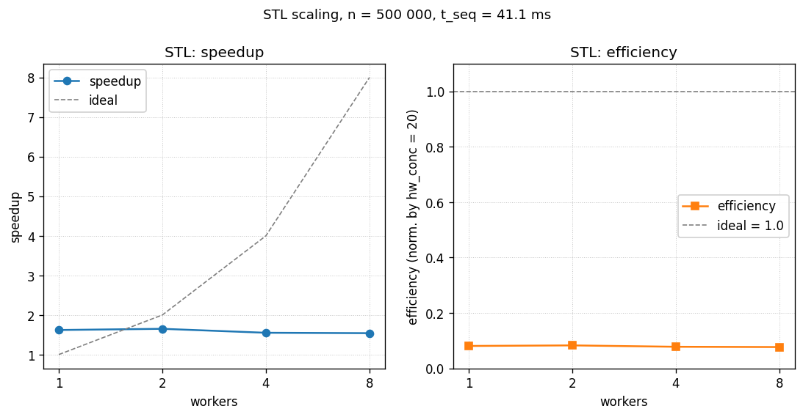

# Построение выпуклой оболочки методом Грэхема - STL

- Student: Маковский Илья Игоревич, группа 3823Б1ФИ2
- Technology: STL
- Variant: 22

## 1. Введение

STL-версия полностью ручная: ни pragma-обвязки, ни рантайм-планировщика.
Диапазоны я разбиваю формулой, futures получаются из
`std::async(std::launch::async)`, а барьеры выражаются через
`future::wait`. Это самая "ручная" из реализаций: каждое решение по
разбиению, синхронизации и порядку `start -> join` приходится принимать
самому.

## 2. Постановка задачи

- Вход: `std::vector<Point>` с двумерными `double` координатами
  (`Point = { double x, y }`).
- Выход: вершины выпуклой оболочки в порядке обхода против часовой стрелки,
  начиная с нижне-левой точки.
- Ограничения: при `n < 3` или после фильтрации `< 3` точек оболочка
  совпадает со входом / отрезком / точкой.
- Толерантность по cross product / координатам - `1e-9`.
- Критерий корректности: результат должен совпадать с выходом SEQ-реализации
  как множества вершин и в упорядоченности обхода.

## 3. Базовый алгоритм

Классический Graham scan, $O(n \log n)$ по времени:

1. Поиск базовой точки `p0` с минимальным `y` (при равенстве - минимальным `x`).
2. Сортировка остальных точек по полярному углу относительно `p0`; при
   коллинеарности - по квадрату расстояния (ближе - раньше).
3. Фильтрация подряд идущих коллинеарных точек.
4. Построение оболочки стековым проходом с условием строго левого поворота.

## 4. Схема распараллеливания

### 4.1. `FindMinPointIndexSTL` - ручное разбиение и сбор через `std::future`

```cpp
// File: stl/src/ops_stl.cpp
auto worker = [&points](size_t start, size_t end) {
  size_t local_min = start;
  for (size_t j = start + 1; j < end; ++j) {
    if (IsBetterMin(points[j], points[local_min])) {
      local_min = j;
    }
  }
  return local_min;
};

for (unsigned int i = 0; i < num_threads; ++i) {
  size_t start = i * chunk;
  size_t end = std::min(start + chunk, n);
  if (start >= n) break;
  futures.push_back(std::async(std::launch::async, worker, start, end));
}

size_t min_idx = futures[0].get();
for (size_t i = 1; i < futures.size(); ++i) {
  size_t local_min = futures[i].get();
  if (IsBetterMin(points[local_min], points[min_idx])) {
    min_idx = local_min;
  }
}
```

- Разбиение блочное: $\text{chunk} = \lceil n / T \rceil$, последний поток получает остаток.
  Поток `i` обрабатывает строго $[i \cdot \text{chunk}, \min((i+1) \cdot \text{chunk}, n))$ - диапазоны
  не пересекаются, гонок по чтению/записи нет.
- Локальный минимум возвращается через `future<size_t>`. Объединение -
  последовательно, в одном потоке, после того как все `get()` синхронизированы.
- `std::launch::async` (без `deferred`) гарантирует реальный запуск нового
  потока, а не ленивое вычисление на месте `.get()`. Без этого `async` мог бы
  выродиться в синхронный вызов.
- `IsBetterMin` вынесен в отдельную функцию: тот же критерий применяется
  и в потоковой лямбде, и в финальной редукции - это устраняет копи-пейст
  и согласует семантику.

При `n < 1000` `num_threads` принудительно понижается до 1 - для коротких
входов оверхед `std::async` доминирует.

### 4.2. Параллельная сортировка - двухуровневый `std::async` с fork-join-half

```cpp
// File: stl/src/ops_stl.cpp
template <typename RandomIt, typename Compare>
void StlParallelSort(RandomIt first, RandomIt last, Compare comp) {
  if (last - first < 2048) {
    std::sort(first, last, comp);
    return;
  }
  // two-pass three-way partition
  auto pivot = *(first + ((last - first) / 2));
  auto middle1 = std::partition(first, last, [pivot, comp](const auto& a) { return comp(a, pivot); });
  auto middle2 = std::partition(middle1, last, [pivot, comp](const auto& a) { return !comp(pivot, a); });

  auto future1 = std::async(std::launch::async,
      [first, middle1, comp]() { StlParallelSortSub(first, middle1, comp); });
  StlParallelSortSub(middle2, last, comp);  // вторая ветка - на текущем потоке
  future1.wait();
}
```

- Three-way partition (`< pivot`, `== pivot`, `> pivot`) - как в SEQ/OMP/TBB.
  Это снова критично для коллинеарных групп точек, где сортировка по углу даёт
  большие равные диапазоны.
- Только первая ветка идёт в `std::async`; вторая выполняется на текущем
  потоке. Это типовой паттерн ручного fork-join, который не плодит лишних
  потоков на каждой рекурсии: половину работы делает создатель, половину -
  фоновый поток.
- `StlParallelSort` (верхний уровень) и `StlParallelSortSub` (внутренние
  ветки) отличаются: верхний уровень оставляет рекурсию параллельной до
  второго уровня вложенности, а `Sub` уже использует обычный
  `std::sort`, чтобы не плодить экспоненциально растущее число потоков.
  Это выровненная по-середине стратегия: достаточно параллелизма для
  заполнения пула, но без неконтролируемого взрыва.
- `future1.wait()` - точка синхронизации; без неё родитель мог бы вернуть
  управление до завершения дочерней ветки, и последующий проход (`Filter`)
  читал бы недосортированный массив.

### 4.3. `FilterPointsSTL` - параллельный однопроходный фильтр + последовательная сборка

```cpp
// File: stl/src/ops_stl.cpp
std::vector<uint8_t> keep(n, 1);
auto worker = [&points, &keep, &p0](size_t start, size_t end) {
  for (size_t j = start; j < end; ++j) {
    if (std::abs(CrossProduct(p0, points[j], points[j + 1])) < 1e-9) {
      keep[j] = 0;
    }
  }
};

for (unsigned int i = 0; i < num_threads; ++i) {
  size_t start = 1 + (i * chunk);
  size_t end = std::min(start + chunk, n - 1);
  if (start >= n - 1) break;
  futures.push_back(std::async(std::launch::async, worker, start, end));
}
for (auto& f : futures) f.wait();
```

- Та же блочная схема, что и в `FindMin`. Записи идут в разные `keep[i]`,
  гонок по записи нет (uint8_t - отдельные байты, не bit-packed `vector<bool>`).
- Сборка `filtered` после всех `wait()` - последовательная: порядок записи
  в выходной вектор важен и `push_back` не безопасен из нескольких потоков.
- Все `std::async` создаются до первого `wait` - это критично. Если бы
  `wait` стоял внутри цикла создания (типовой антипаттерн), потоки шли бы
  строго последовательно и параллелизма не было бы вовсе.

### 4.4. `BuildHull` - последовательный

Не параллелится по тем же причинам, что в SEQ/OMP/TBB (цепочечная
зависимость по стеку).

## 5. Детали реализации

Файлы: `stl/include/ops_stl.hpp`, `stl/src/ops_stl.cpp`.

- `GetStaticTypeOfTask` возвращает `kSTL`.
- Заголовки: `<thread>`, `<future>` - стандартная библиотека, ничего внешнего.
- `num_threads` определяется как `std::thread::hardware_concurrency()`;
  при возврате `0` (что разрешено стандартом) подставляется фолбэк `4`.
- При `n < 1000` обе фазы (`FindMin`, `Filter`) форсированно
  схлопываются до одного потока - это явный отказ от параллелизма на
  входах, где он гарантированно проиграет оверхеду `std::async`.

Карта поток -> диапазон для всех трёх параллельных фаз:

| фаза | i-й поток обрабатывает | финальная редукция |
| ------ | ------------------------ | -------------------- |
| FindMin | $[i \cdot \text{chunk},\ \min((i+1) \cdot \text{chunk},\ n))$ | последовательное сравнение `futures[i].get()` |
| Sort (верхний уровень) | левая половина после partition в `future`, правая - на текущем потоке | `future.wait()` перед возвратом из функции |
| Filter | $[1 + i \cdot \text{chunk},\ \min(1 + (i+1) \cdot \text{chunk},\ n - 1))$ | `wait` всех futures, затем последовательная сборка |

Гонки данных и их разрешение:

- `FindMin`: разделённые диапазоны -> нет гонок по чтению; запись в общую
  `min_idx` идёт только из главного потока после всех `get()`.
- `Sort`: каждая параллельная задача владеет своим непересекающимся
  подотрезком; `partition` не пересекает middle1/middle2.
- `Filter`: запись в `keep[j]` - uint8_t, разные индексы у разных потоков;
  сборка `filtered` идёт после всех `wait`.

## 6. Проверка корректности

- Все 9 функциональных кейсов из `tests/functional/main.cpp` пройдены
  STL-реализацией (`*MakovskiyI*stl_enabled*`, 9/9 PASSED).
- Сравнение с SEQ - размеры оболочки и упорядоченность вершин совпадают.
- Кейс 6 (диагональ из 5 коллинеарных точек) и кейс 7 (вертикаль) проверяют
  поведение three-way partition в сортировке: без обработки равенства
  алгоритм мог бы зациклиться или вернуть избыточные точки.

Проверки на отсутствие гонок:

- Структурное доказательство выше: каждый разделяемый объект (`keep`,
  `points`, `min_idx`) либо пишется одним потоком, либо читается без
  одновременной записи.
- Под ThreadSanitizer / Helgrind эта задача отдельно не прогонялась -
  ни локально, ни в CI: пайплайн курса собирает только Address / UB /
  Leak санитайзеры. Обоснование отсутствия гонок - структурное, по
  построению разбиения диапазонов и отказа от `std::vector<bool>` в `keep`.

## 7. Экспериментальная среда

- CPU: 13th Gen Intel Core i7-13700H, 14 ядер (6P + 8E), 20 логических потоков.
- RAM: 32 GiB, OS: Ubuntu 24.04.4 LTS (контейнер
  `ghcr.io/learning-process/ppc-ubuntu:1.1`).
- Компилятор: GCC 13.3.0; CMake 3.28.3; build type `Release` с
  `-Wall -Wextra -Wpedantic` и `-Werror`.
- Стабилизация: CPU governor = `performance`, ноутбук на питании.
- Размер задачи: `n = 500 000` точек, заданных как `{sin(i)*100, cos(i)*100}` -
  плотное распределение по окружности радиуса 100.

Дополнительно для STL:

- В коде нет чтения `PPC_NUM_THREADS` - используется только
  `std::thread::hardware_concurrency()`. Это сознательное решение: backend
  "std::thread" в курсе сравнивает реализации именно при максимально
  доступном параллелизме. При желании зафиксировать число потоков нужно
  модифицировать код (передать `num_threads` параметром в конструктор или
  читать `ppc::util::GetNumThreads()`, как сделано в `all/`).
- Запуск:

  ```bash
  ./build/bin/ppc_perf_tests \
    --gtest_filter='*pipeline_makovskiy_i_graham_hull_stl_*'
  ```

## 8. Результаты

Медиана по 3 прогонам, `n = 500 000`, `pipeline`. SEQ baseline = `0.0411 s`.

В отличие от OMP и TBB, в `stl/` реализация не читает `PPC_NUM_THREADS` -
фактическое число потоков всегда равно `hardware_concurrency() = 20` на
тестовой машине. Поэтому в таблице приведены результаты для разных
значений `PPC_NUM_THREADS` (для согласованности с другими реализациями),
но колонка `efficiency` нормирована на фактические 20 потоков -
именно столько активных рабочих потоков создаётся через `std::async`.

| threads (PPC_NUM_THREADS) | time, s | speedup | efficiency (vs hw_conc=20) |
| ------------------------: | ------: | ------: | -------------------------: |
|                         1 |  0.0253 |    1.62 |                       8.1% |
|                         2 |  0.0249 |    1.65 |                       8.3% |
|                         4 |  0.0264 |    1.55 |                       7.8% |
|                         8 |  0.0267 |    1.54 |                       7.7% |

Mode `task_run`: ~0.025 s, отличия от `pipeline` в пределах шума.



*Рисунок 1. Speedup и efficiency STL почти константны вдоль оси
`PPC_NUM_THREADS` - это и есть прямое следствие того, что реализация
использует `std::thread::hardware_concurrency() = 20`, а не значение
`PPC_NUM_THREADS`. Низкая эффективность (~8%) - нормировка идёт на 20
фактических потоков.*

Низкая эффективность 7.7-8.3% - характерное значение для ручной
thread-based версии: сильно параллелится только сортировка (~80% времени
SEQ), а константный оверхед `std::async` на каждую рекурсию выедает
значительную долю выигрыша. Время практически не зависит от
`PPC_NUM_THREADS` - это и есть прямое следствие того, что код использует
`hardware_concurrency()`, а не `ppc::util::GetNumThreads()`.

## 9. Выводы

Получилось ускорение около 1.6x относительно SEQ. Это заметно меньше,
чем у TBB (3.55x) и OMP (2.83x на 8 потоках), но зато STL-версия не
тянет за собой никаких внешних рантайм-библиотек.

Самое полезное, что нашлось в сортировке - это схема "первая половина в
`std::async`, вторая на текущем потоке". Так не плодятся лишние потоки
на каждой рекурсии, и при этом получается реальный fork-join.

Основное ограничение - реализация игнорирует `PPC_NUM_THREADS`. В рамках
этой задачи это нормально, но в боевом коде число потоков лучше либо
принимать параметром, либо брать из `ppc::util::GetNumThreads()`. Ещё
один момент: при фактических 20 потоках через `hardware_concurrency()`
уже на одном `PPC_NUM_THREADS` имеем 1.62x, и дальше "больше потоков"
выигрыша почти не даёт - задача упирается в шаги, которые либо
последовательны (`BuildHull`), либо плохо параллелятся (сборка
`filtered`).
