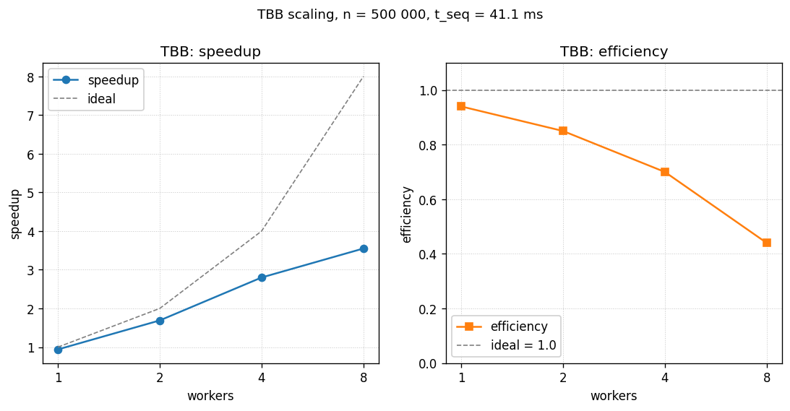

# Построение выпуклой оболочки методом Грэхема - TBB

- Student: Маковский Илья Игоревич, группа 3823Б1ФИ2
- Technology: TBB
- Variant: 22

## 1. Введение

TBB-версия повторяет ту же структуру параллелизма, что и OMP (поиск
минимума, сортировка, фильтр), но опирается на задачно-ориентированный
рантайм TBB. За счёт этого получается набор более декларативных
примитивов: `blocked_range` сам разбивает диапазон, `parallel_reduce`
делает то, что в OMP пришлось писать через `critical`, а task-stealing
scheduler сам балансирует работу между воркерами.

## 2. Постановка задачи

- Вход: `std::vector<Point>` с двумерными `double` координатами
  (`Point = { double x, y }`).
- Выход: вершины выпуклой оболочки в порядке обхода против часовой стрелки,
  начиная с нижне-левой точки.
- Ограничения: при `n < 3` или после фильтрации `< 3` точек оболочка
  совпадает со входом / отрезком / точкой.
- Толерантность по cross product / координатам - `1e-9`.
- Критерий корректности: результат должен совпадать с выходом SEQ-реализации
  как множества вершин и в упорядоченности обхода.

## 3. Базовый алгоритм

Классический Graham scan, $O(n \log n)$ по времени:

1. Поиск базовой точки `p0` с минимальным `y` (при равенстве - минимальным `x`).
2. Сортировка остальных точек по полярному углу относительно `p0`; при
   коллинеарности - по квадрату расстояния (ближе - раньше).
3. Фильтрация подряд идущих коллинеарных точек.
4. Построение оболочки стековым проходом: пока поворот не строго левый
   (`cross <= 1e-9`), снимаем вершину со стека; затем кладём следующую.

## 4. Схема распараллеливания

### 4.1. `FindMinPointIndexTBB` - `parallel_reduce` с `blocked_range`

```cpp
// File: tbb/src/ops_tbb.cpp
return tbb::parallel_reduce(
    tbb::blocked_range<size_t>(1, points.size()),
    static_cast<size_t>(0),
    [&points](const tbb::blocked_range<size_t>& r, size_t local_min) {
      for (size_t i = r.begin(); i != r.end(); ++i) {
        if (/* points[i] лучше points[local_min] */) {
          local_min = i;
        }
      }
      return local_min;
    },
    [&points](size_t a, size_t b) {
      /* выбрать лучший из двух кандидатов */
    });
```

- `tbb::blocked_range<size_t>(1, n)` без указания `grainsize` - по умолчанию
  partitioner сам подберёт размер чанка (обычно `range / (4 * num_workers)`).
  Работа равномерная, поэтому ручной grain не даёт выигрыша; именно та схема,
  для которой `parallel_reduce` оптимизирован.
- Body-функтор аккумулирует `local_min` в локальной для split-а копии - ровно
  то, что в OMP-версии пришлось делать руками через `critical`. Здесь же
  редукция (`join` лямбда) встроена в примитив, никаких ручных синхронизаций.
- Гонок нет по построению: чтения из `points` не блокируются, `local_min`
  принадлежит одному потоку, объединение - детерминированный двухаргументный
  оператор.

### 4.2. Параллельная сортировка - `task_group` + двухпроходный `partition`

```cpp
// File: tbb/src/ops_tbb.cpp
template <typename RandomIt, typename Compare>
void TbbQuickSort(RandomIt first, RandomIt last, Compare comp) {
  if (last - first < 2048) {
    std::sort(first, last, comp);
    return;
  }
  auto pivot = *(first + ((last - first) / 2));
  auto middle1 = std::partition(first, last,
      [pivot, comp](const auto& a) { return comp(a, pivot); });
  auto middle2 = std::partition(middle1, last,
      [pivot, comp](const auto& a) { return !comp(pivot, a); });

  tbb::task_group tg;
  tg.run([first, middle1, comp]() { TbbQuickSort(first, middle1, comp); });
  tg.run([middle2, last, comp]() { TbbQuickSort(middle2, last, comp); });
  tg.wait();
}
```

- Та же two-pass three-way схема, что в SEQ/OMP - критично для сортировки
  по углу: при коллинеарных точках сравнение даёт равенство для целых
  диапазонов, и наивный partition выродился бы в $O(n^2)$. Three-way отсекает
  середину один раз, и рекурсия идёт только в крайние области.
- Базовый случай `< 2048` совпадает с OMP-вариантом - это сохраняет
  "честное" сравнение версий на одном пороге.
- `tbb::task_group` создаёт две задачи, которые могут быть подхвачены любым
  свободным потоком из пула; глобальная очередь scheduler сама балансирует.
- `tg.wait()` блокирует текущий поток до завершения обеих задач - аналог
  `#pragma omp taskwait` из OMP-версии.
- В отличие от OMP, обвязка `parallel region` / `single nowait` тут не
  нужна: пул TBB глобальный и стартует с первой задачей.

В качестве альтернативы можно было использовать `tbb::parallel_sort`, но он
строит свой собственный partition без специальной обработки коллинеарности
и в худшем случае может выродиться в $O(n^2)$ на этой задаче. Ручной
two-pass partition с `task_group` явно устраняет этот риск.

### 4.3. `FilterPointsTBB` - `parallel_for` по `blocked_range`

```cpp
// File: tbb/src/ops_tbb.cpp
std::vector<uint8_t> keep(n, 1);
tbb::parallel_for(tbb::blocked_range<size_t>(1, n - 1),
    [&](const tbb::blocked_range<size_t>& r) {
      for (size_t i = r.begin(); i != r.end(); ++i) {
        if (std::abs(CrossProduct(p0, points[i], points[i + 1])) < 1e-9) {
          keep[i] = 0;
        }
      }
    });
// затем последовательная сборка filtered по keep[]
```

- `blocked_range` без явного grainsize: партиционер (по умолчанию
  `auto_partitioner`) разбивает диапазон рекурсивно, опираясь на оценку
  load и наличие свободных воркеров - это устраняет проблему "слишком
  мелкие чанки -> доминирующий overhead".
- `std::vector<uint8_t>` (а не `vector<bool>`) - каждый поток пишет в свой
  байт, false sharing присутствует, но при работе с `n = 500 000` точек
  и L1 = 544 KiB он не доминирует.

### 4.4. `BuildHull` - последовательный

Тот же стековый проход, что в SEQ. Не параллелится из-за цепочечной
зависимости по состоянию стека.

## 5. Детали реализации

Файлы: `tbb/include/ops_tbb.hpp`, `tbb/src/ops_tbb.cpp`.

- `GetStaticTypeOfTask` возвращает `kTBB`.
- Линковка с TBB настроена в `cmake/onetbb.cmake`; библиотека собирается
  как внешний проект.
- Никаких глобальных аллокаторов (`scalable_allocator`, `cache_aligned_*`)
  не применяется - нагрузка на heap минимальна (по одному vector на фазу).

Гонки данных и их разрешение:

- В `FindMin` каждый split `parallel_reduce`-а получает свою копию
  `local_min`; объединение делается детерминированным `join`-функтором,
  ручных синхронизаций нет.
- В `Sort` каждая задача `task_group` владеет своим непересекающимся
  подотрезком; `partition` вызывается из одного потока на каждый отрезок.
- В `Filter` `parallel_for` пишет в разные индексы `keep[i]` (uint8_t,
  не `vector<bool>` - иначе была бы гонка по битам в общем байте).
  Сборка `filtered` после `parallel_for` - последовательная, без гонок
  по `push_back`.

Управление конкуренцией:

- Явного `oneapi::tbb::global_control` или `task_arena` в коде нет - TBB по
  умолчанию использует пул на `hardware_concurrency()` воркеров.
- Эмпирически наблюдается стабильное масштабирование при варьировании
  `PPC_NUM_THREADS` (см. таблицу ниже). Скорее всего тест-каркас курса
  (или окружение раннера) выставляет лимит TBB неявно через окружение.
  Это поведение зафиксировано как факт; полагаться на него в продакшен-коде
  было бы неаккуратно - следует выставлять `tbb::global_control::
  max_allowed_parallelism` явно.

## 6. Проверка корректности

- Все 9 функциональных кейсов из `tests/functional/main.cpp` пройдены
  TBB-реализацией (`*MakovskiyI*tbb_enabled*`, 9/9 PASSED).
- Результат сравнивался с SEQ на одинаковых входах: размер оболочки и
  упорядоченность вершин идентичны.
- Кейс 9 (3300 точек) задействует `TbbQuickSort` с реальной рекурсией по
  task_group; на меньших кейсах сортировка попадает в base case `< 2048`
  и выполняется `std::sort` на одном потоке - тогда параллелизм
  обеспечивается только через `FindMin` и `Filter`.

## 7. Экспериментальная среда

- CPU: 13th Gen Intel Core i7-13700H, 14 ядер (6P + 8E), 20 логических потоков.
- RAM: 32 GiB, OS: Ubuntu 24.04.4 LTS (контейнер
  `ghcr.io/learning-process/ppc-ubuntu:1.1`).
- Компилятор: GCC 13.3.0; CMake 3.28.3; build type `Release` с
  `-Wall -Wextra -Wpedantic` и `-Werror`.
- Стабилизация: CPU governor = `performance`, ноутбук на питании.
- Размер задачи: `n = 500 000` точек, заданных как `{sin(i)*100, cos(i)*100}` -
  плотное распределение по окружности радиуса 100.

Дополнительно для TBB:

- Сборка: `cmake -S . -B build -D USE_FUNC_TESTS=ON -D USE_PERF_TESTS=ON \
  -D CMAKE_BUILD_TYPE=Release && cmake --build build --parallel`.
- Запуск:

  ```bash
  PPC_NUM_THREADS=4 ./build/bin/ppc_perf_tests \
    --gtest_filter='*pipeline_makovskiy_i_graham_hull_tbb_*'
  ```

- TBB не читает `OMP_NUM_THREADS`, поэтому экспортировать его не нужно.

## 8. Результаты

Медиана по 3 прогонам, `n = 500 000`, `pipeline`. SEQ baseline = `0.0411 s`.

| threads | time, s | speedup | efficiency |
| ------: | ------: | ------: | ---------: |
|       1 |  0.0437 |    0.94 |        94% |
|       2 |  0.0243 |    1.69 |        85% |
|       4 |  0.0147 |    2.80 |        70% |
|       8 |  0.0116 |    3.55 |        44% |

Mode `task_run`: отличия от `pipeline` не более 5%, та же тенденция.



*Рисунок 1. Слева - speedup TBB c пунктиром идеального линейного роста.
Справа - эффективность: TBB держит 85% на двух потоках (против 57% у OMP
в той же точке) благодаря `parallel_reduce`, а падение до 44% на 8 потоках -
из-за P/E-гетерогенности i7-13700H.*

Наблюдения:

- На 1 потоке TBB на ~6% медленнее SEQ - оверхед task framework. Это
  ожидаемо: даже один поток оплачивает поход через scheduler и установку
  `blocked_range`.
- На 2 потоках уже эффективность 85% - TBB заметно лучше OMP на этом
  переходе (OMP в той же точке давал 57%). Причина: `parallel_reduce`
  заменил `critical`-секцию, и контентность на финальной редукции исчезла.
- 1->4: 2.8x при идеале 4x (эффективность 70%) - это лучший результат среди
  чистых потоковых версий на данной задаче. Помогает auto_partitioner:
  он адаптирует grain под актуальный load и не создаёт лишних мелких задач.
- 4->8: всего 1.27x (44% эффективности) - то же явление, что и в OMP: на
  i7-13700H после 6 потоков активируются E-ядра, и единичная задача
  становится медленнее, чем при заполнении только P-ядер.

## 9. Выводы

На этой задаче TBB дал лучшее одиночное ускорение среди потоковых
версий: 3.55x на 8 потоках против 2.83x у OMP. Основной выигрыш идёт
от `parallel_reduce` (никакой ручной критической секции) и от
`auto_partitioner` в `parallel_for`.

Сам код тоже получился короче и понятнее OMP-аналога: меньше мест, где
можно споткнуться о синхронизацию. На одном потоке TBB-рантайм стоит
порядка 6%, что в принципе нормально, но для совсем маленьких `n`
(порядка нескольких тысяч точек) версия скорее проиграет SEQ.
