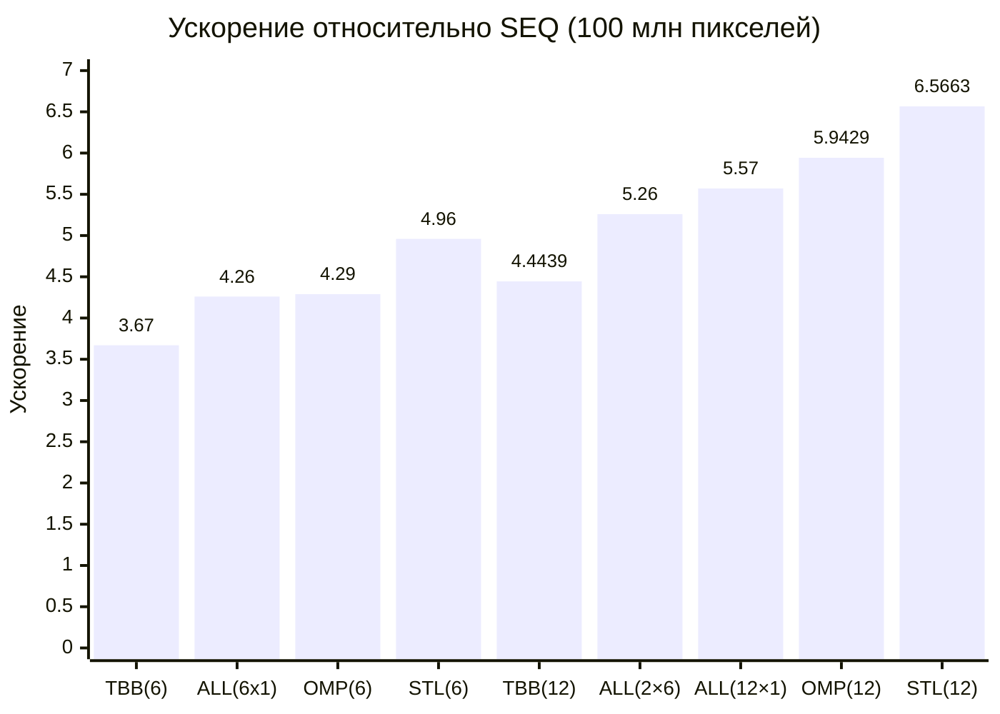
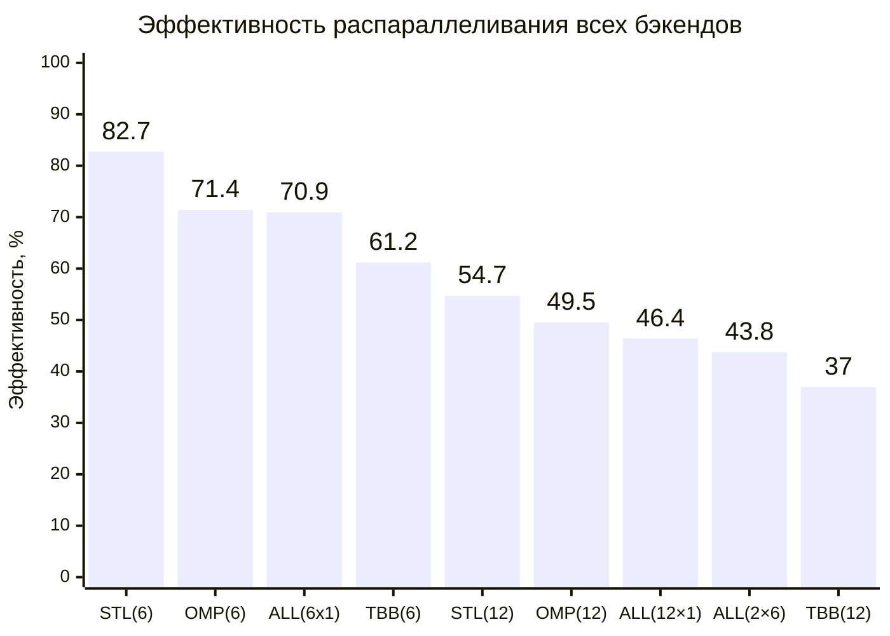

# Повышение контраста полутонового изображения посредством линейной растяжки гистограммы

- Student: Отческов Семён Андреевич, group 3823Б1ПР1
- Variant: 28
- Local reports: seq/report.md, omp/report.md, tbb/report.md, stl/report.md, all/report.md

## 1. Введение

Задача contrast stretching преобразует полутоновое изображение, растягивая яркости на диапазон [0, 255].

Алгоритм прост, итеративен и легко распараллеливается, что делает его идеальным полигоном для сравнения разных моделей параллелизма:

- последовательной (SEQ),
- OpenMP,
- oneTBB,
- ручного управления потоками (STL),
- гибридной MPI+STL (ALL).

В отчёте анализируются корректность, производительность и эффективность каждой версии на единой тестовой инфраструктуре.

## 2. Единая постановка задачи

**Вход:** `std::vector<uint8_t>` – пиксели полутонового изображения (значения 0…255).  
**Выход:** `std::vector<uint8_t>` той же длины – контрастированное изображение.  
**Ограничения:** только один канал (grayscale).
**Алгоритм:**

1. Найти `min` и `max` во входном векторе.
2. Если `min == max` – скопировать вход в выход.
3. Иначе для каждого пикселя `p`:
    - $output[i]=\frac{(input[i] - min_I) * (255 - 0)}{max_I-min_I}$
    - Привести к `[0,255]`.

**Критерий корректности** (общий для всех backend-ов):  

- Выходной вектор либо имеет `min == 0` и `max == 255` (растянуто), либо `min == max` (однороден).  
Функция `CheckRange` реализует эту проверку.

```cpp
bool CheckRange(const OutType &data) {
  if (data.empty()) return false;
  auto [min_it, max_it] = std::ranges::minmax_element(data);
  return (*min_it == 0 && *max_it == 255) || (*min_it == *max_it);
}
```

## 3. Единая методика эксперимента

### 3.1. Тестовая инфраструктура

| Параметр   | Значение                                             |
| ---------- | ---------------------------------------------------- |
| CPU        | Intel Core i5 12400F (6 cores, 12 threads, 2500 MHz) |
| RAM        | 32 GB DDR4 (3200 MHz)                                |
| OS         | Windows 10 (10.0.19045)                              |
| Компилятор | MSVC 19.42.34435, Release Build                      |
| MPI        | Microsoft MPI (MS-MPI) v10.0.12498.5                 |

### 3.2. Переменные окружения

- `PPC_NUM_THREADS` – число потоков внутри процесса (для OMP, TBB, STL, ALL).  
- `PPC_NUM_PROC` – число MPI-процессов (для ALL).  

### 3.3. Размер задачи

- Синтетическое изображение **10000×10000** (100 млн пикселей)
со значениями [100, 149] (низкая контрастность).
- Генерируется программно при каждом запуске теста производительности.

**Измеряемый режим**  

- Режим `task_run` – замеряется только `RunImpl` (исключая накладные расходы валидации и пре/постпроцессинга).  
- Для каждой конфигурации выполнено **5 повторных запусков**, в таблицах приведено **среднее время**.
- `T_seq = 1.667792` с – baseline последовательной версии.

**Формулы ускорения и эффективности**  

- Ускорение: `Speedup = T_seq / T_par`  
- Эффективность: `Efficiency = Speedup / (общее число работников)`  
  - Для SEQ работник = 1  
  - Для OMP, TBB, STL работники = число потоков  
  - Для ALL работники = `ranks × threads_per_rank`

## 4. Сводка корректности

Все параллельные версии **прошли функциональные тесты**:

- Валидация пустого входа.
- Однородные изображения (размеры 10×10, 501×501).
- Синтетические низкоконтрастные изображения (1×1, 2×2, 3×3, 100×100, 500×500).
- Реальное изображение `data/grayimg.jpg`.

Корректность подтверждена критерием `CheckRange`.  
Дополнительно для `MPI+STL` проверена согласованность результатов между разными рангами.

## 5. Агрегированные результаты

### 5.1. Сравнение backend-ов (режим `task_run`, размер 10000×10000)

| Технология | Конфигурация (процессов × потоков) | Рабочих (workers) | Время, s | Ускорение | Эффективность |
| ---------- | ------------ | ---------- | -------- | --------- | ------------- |
| SEQ | 1×1 | 1 | 1.667792 | 1.0000 | 100% |
| OMP | 1×6 | 6 | 0.389134 | 4.2859 | 71.4% |
| OMP | 1x12 | 12 | 0.280635 | 5.9429 | 49.5% |
| TBB | 1×6 | 6 | 0.454329 | 3.6709 | 61.2% |
| TBB | 1×12 | 12 | 0.375292 | 4.4439 | 37.0% |
| STL | 1×6 | 6 | 0.355927 | 4.9647 | 82.7% |
| STL | 1×12 | 12 | 0.253992 | 6.5663 | 54.7% |
| ALL | 6×1 | 6 | 0.391759 | 4.2572 | 70.9% |
| ALL | 2×6 | 12 | 0.317000 | 5.2612 | 43.8% |
| ALL | 12×1 | 12 | 0.299546 | 5.5677 | 46.4% |

*Лучшее время среди чистых thread‑backends: **STL (0.253992 с)**, среди гибридных: **ALL 12×1 (0.2995 с)**.*

#### График 1 – Ускорение для всех бэкендов (сравнение на 6 и 12 workers)



#### График 2 – Эффективность распараллеливания всех бэкендов (на 6 и 12 workers)



## 6. Интерпретация различий

### 6.1. SEQ – baseline

Последовательная версия работает на одном ядре, загружая его на 100% арифметикой и доступом к памяти.
Время `1.6678` с служит знаменателем для всех ускорений.

### 6.2. OMP – сильные и слабые стороны

- **Сильные стороны:** простота реализации (две директивы `parallel for` с `reduction`).
Ускорение на 6 физических ядрах – **4.29×** (эффективность **71.4%**), что отлично для целочисленной памяти-связанной задачи.
- При использовании гиперпоточности (12 потоков) ускорение достигает **5.94×**, эффективность **49.5%**,
но цена за каждое дополнительное логическое ядро высока.
- **Слабые стороны:** неявные барьеры добавляют накладные расходы.
`reduction` для двух переменных (min, max) требует двух отдельных редукций (или одной пользовательской операции).
Для данной задачи OpenMP – отличный выбор по соотношению «производительность / усилия».

### 6.3. TBB – роль grain size и runtime

- **Роль grain size:**  в реализации grainsize не задан явно – TBB выбирает
автоматически.
Для 100 млн пикселей автоматический выбор оказался рабочим:
ускорение на 6 потоках 3.67× (эффективность 61.2%) хуже, чем у OMP и STL.
Это связано с тем, что рекурсивное разбиение и планировщик задач (даже
с `static_partitioner`) вносят накладные расходы, которые на столь лёгкой
вычислительной нагрузке становятся заметными.
- **Runtime:** TBB создаёт глобальный пул потоков, и даже при ограничении
через `task_arena` сохраняется некоторый оверхед на управление задачами.
Для сильно вычислительных задач с нерегулярной нагрузкой TBB выигрывает,
но для простого цикла – проигрывает.

### 6.4. STL – цена ручного управления потоками

- **Цена ручного управления:** Цена ручного управления: код длиннее из-за ручного разбиения диапазонов,
локальных буферов и объединения результатов, но достигается максимальная производительность на данной задаче.
- На 6 потоках – **4.96×** (эффективность **82.7%**) – лучший результат среди однопроцессных реализаций.
- На 12 потоках ускорение **6.57×** (эффективность **54.7%**), что является наивысшим ускорением среди всех версий.
- **Выгода:** отсутствие лишних синхронизаций (нет барьеров, нет редукций с временными копиями).
Статическое разбиение идеально подходит для равномерной нагрузки.
Использование `std::jthread` упрощает управление жизненным циклом.

### 6.5. ALL – цена коммуникации и выигрыш гибридности

#### Цена коммуникации

- `6×1` (только MPI) – **0.3918** с, что хуже, чем STL на 6 потоках (**0.3559** с).
Накладные расходы на `MPI_Scatterv`/`Gatherv` даже на одном узле заметны.
- `2×6` (2 процесса × 6 потоков) – **0.3170** с.
Коммуникация между процессами (два вызова `MPI_Allreduce` для min/max) добавляет задержку.
Ускорение выше, чем у TBB на 12 потоках (4.44×), но ниже, чем у STL на 12 потоках (6.57x).
- `12×1` (12 процессов по 1 потоку) – **0.2995** с (ускорение 5.57×).
Чистый MPI на 12 процессах даёт почти такое же ускорение, как `2×6`, но эффективность низкая (46.4%).

#### Выигрыш гибридности

- Наилучшее ускорение среди гибридных конфигураций – **5.57×** (12×1) и **5.26×** (2×6).
Однако обе эти конфигурации уступают STL на 12 потоках (**6.57×**).
Таким образом, на одном узле гибридный подход не даёт преимущества перед лучшей чисто поточной версией (STL).
- Гибридная версия оправдана только при распределении данных между несколькими узлами кластера,
где необходимо задействовать память и вычислительные ресурсы нескольких физических машин.
Коммуникационные издержки окупаются при обработке очень больших изображений.

## 7. Репродуцируемость

### 7.1. Сборка

```bash
git submodule update --init --recursive --depth=1
cmake -S . -B build -D USE_FUNC_TESTS=ON -D USE_PERF_TESTS=ON -D CMAKE_BUILD_TYPE=Release
cmake --build build --parallel
```

### 7.2 Запуск функциональных тестов

```bash
export PPC_NUM_THREADS=4
./scripts/run_tests.py --running-type=threads --counts 1 2 4
# MPI версия
export PPC_NUM_PROC=4
./scripts/run_tests.py --running-type=processes --counts 2 4
```

### 7.3. Замеры производительности

```bash
./scripts/run_tests.py --running-type=performance
```

Отдельно для конкретного бэкенда:

```bash
./build/bin/ppc_perf_tests --gtest_filter="*Otcheskov*seq*"
./build/bin/ppc_perf_tests --gtest_filter="*Otcheskov*omp*"
./build/bin/ppc_perf_tests --gtest_filter="*Otcheskov*tbb*"
./build/bin/ppc_perf_tests --gtest_filter="*Otcheskov*stl*"
mpiexec -n 2 ./build/bin/ppc_perf_tests --gtest_filter="*Otcheskov*all*"
```

## 8. Заключение

**Лучшая версия для одиночного узла** – STL (ручное управление потоками), он даёт максимальную производительность:
**6.57×** на 12 логических ядрах (эффективность 54.7%) и **4.96×** на 6 физических ядрах (эффективность 82.7%).

- OpenMP – почти такая же производительность при меньших усилиях по кодированию (5.94× на 12 потоках).
- TBB показала себя хуже всех (4.44× на 12 потоках) из-за накладных расходов на рекурсивное разбиение и планировщик.

**Гибридная версия (ALL) не превосходит STL на одном узле** – её ускорения **5.57×** (12×1) и **5.26×** (2×6).
Однако обе уступают STL (**6.57×**).
Гибридный подход оправдан только при распределении вычислений на несколько узлов кластера,
где необходимо использовать память и вычислительные ресурсы нескольких машин.

### 8.1. Ограничения сравнения

- Измерения проведены на одной конфигурации оборудования.
На данном оборужовании не были применены дополнительные меры стабилизации,
за исключением закрытия всех активных окон и приложений.
- Размер задачи (100 млн пикселей) достаточно велик, чтобы окупить накладные расходы параллелизма;
на малых изображениях (менее 100 тыс пикселей) последовательная версия может быть быстрее или близка к параллельным.

### 8.2. Возможные улучшения

- Использование SIMD для векторизации.
- Блочная обработка для уменьшения промахов кэша.
- В ALL – объединение двух вызовов `MPI_Allreduce` в один вызов с пользовательской операцией, что сократит задержку.

## 9. Источники

- [Документация курса «Параллельное программирование»][docs]
- [OpenMP][openmp]
- [Документация oneTBB][oneTBB]
- [Документация C++ std::thread][thread]
- [Документация MPI][mpi]

<!-- LINKS -->
[mpi]: https://www.mpi-forum.org/docs/
[oneTBB]: https://uxlfoundation.github.io/oneTBB/index.html
[thread]: https://cppreference.com/cpp/thread
[openmp]: https://www.openmp.org/
[docs]: https://learning-process.github.io/parallel_programming_course/ru/
