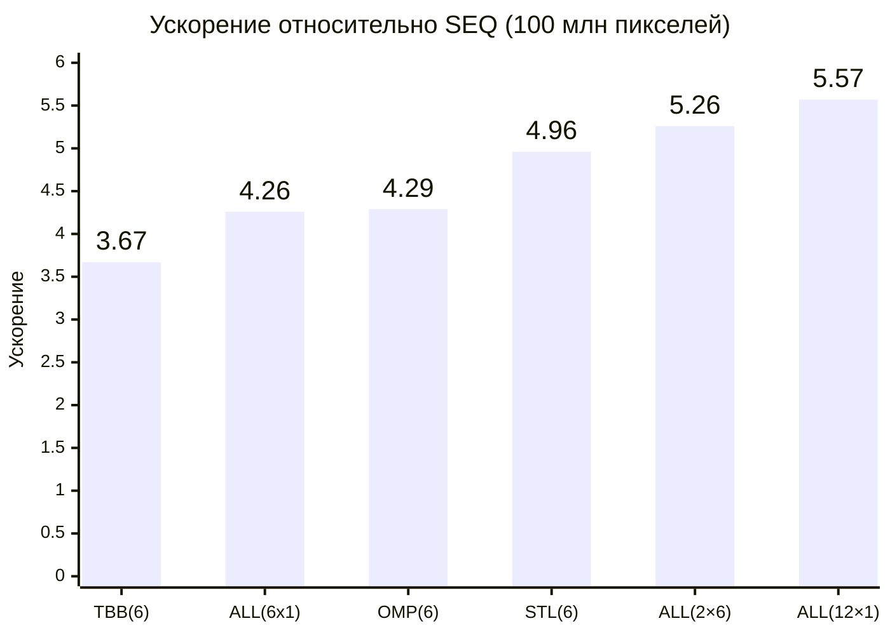
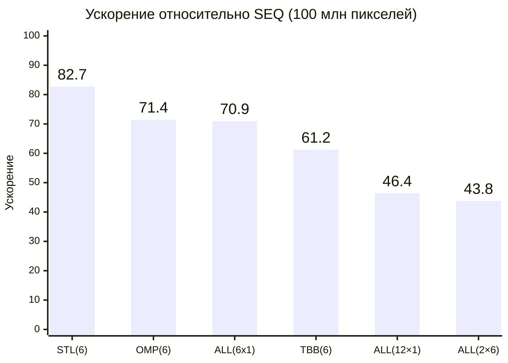

# Повышение контраста полутонового изображения посредством линейной растяжки гистограммы
- Student: Отческов Семён Андреевич, group 3823Б1ПР1
- Variant: 28
- Local reports: [seq/report.md](seq), [omp/report.md](omp), [tbb/report.md](tbb), [stl/report.md](stl), [all/report.md](all)

## 1. Введение
Задача линейного растяжения гистограммы (contrast stretching) преобразует полутоновое изображение так, чтобы его яркости заняли весь диапазон [0, 255]. Алгоритм прост, итеративен и легко распараллеливается, что делает его идеальным полигоном для сравнения разных моделей параллелизма: 
- последовательной (SEQ),
- OpenMP,
- oneTBB,
- ручного управления потоками (STL),
- гибридной MPI+STL (ALL).

В отчёте анализируются корректность, производительность и эффективность каждой версии на единой тестовой инфраструктуре.

## 2. Единая постановка задачи
**Вход:** `std::vector<uint8_t>` – пиксели полутонового изображения (значения 0…255).  
**Выход:** `std::vector<uint8_t>` той же длины – контрастированное изображение.  
**Ограничения:** только один канал (grayscale).
**Алгоритм:**
1. Найти `min` и `max` во входном векторе.
2. Если `min == max` – скопировать вход в выход.
3. Иначе для каждого пикселя `p`:
    - $output[i]=\frac{(input[i] - min_I) * (255 - 0)}{max_I-min_I}$
    - Привести к `[0,255]`.

**Критерий корректности** (общий для всех backend-ов):  
- Выходной вектор либо имеет `min == 0` и `max == 255` (растянуто), либо `min == max` (однороден).  
Функция `CheckRange` реализует эту проверку.
```cpp
bool CheckRange(const OutType &data) {
  if (data.empty()) return false;
  auto [min_it, max_it] = std::ranges::minmax_element(data);
  return (*min_it == 0 && *max_it == 255) || (*min_it == *max_it);
}
```

## 3. Единая методика эксперимента
#### Тестовая инфраструктура
| Параметр   | Значение                                             |
| ---------- | ---------------------------------------------------- |
| CPU        | Intel Core i5 12400F (6 cores, 12 threads, 2500 MHz) |
| RAM        | 32 GB DDR4 (3200 MHz)                                |
| OS         | Windows 10 (10.0.19045)                              |
| Компилятор | MSVC 19.42.34435, Release Build                      |
| MPI        | Microsoft MPI (MS-MPI) v10.0.12498.5                 |

#### Переменные окружения
- `PPC_NUM_THREADS` – число потоков внутри процесса (для OMP, TBB, STL, ALL).  
- `PPC_NUM_PROC` – число MPI-процессов (для ALL).  

#### Размер задачи
- Синтетическое изображение **10000×10000** (100 млн пикселей) со значениями в диапазоне [100, 149] (низкая контрастность).  
- Генерируется программно при каждом запуске теста производительности.

**Измеряемый режим**  
- Режим `task_run` – замеряется только `RunImpl` (исключая накладные расходы валидации и пре/постпроцессинга).  
- Для каждой конфигурации выполнено **5 повторных запусков**, в таблицах приведена **медиана** (наименьшее отклонение).  
- `T_seq = 1.667792` с – baseline последовательной версии.

**Формулы ускорения и эффективности**  
- Ускорение: `Speedup = T_seq / T_par`  
- Эффективность: `Efficiency = Speedup / (общее число работников)`  
  - Для SEQ работник = 1  
  - Для OMP, TBB, STL работники = число потоков  
  - Для ALL работники = `ranks × threads_per_rank`


## 4. Сводка корректности
Все параллельные версии **прошли функциональные тесты**:
- Валидация пустого входа.
- Однородные изображения (размеры 10×10, 501×501).
- Синтетические низкоконтрастные изображения (1×1, 2×2, 3×3, 100×100, 500×500).
- Реальное изображение `data/grayimg.jpg`.

Корректность подтверждена критерием `CheckRange`.  
Дополнительно для `MPI+STL` проверена согласованность результатов между разными рангами.

## 5. Агрегированные результаты
### 5.1. Сравнение backend-ов (режим `task_run`, размер 10000×10000)
| Технология | Конфигурация (процессов × потоков) | Рабочих (workers) | Время, s | Ускорение | Эффективность |
| ---------- | ------------ | ---------- | -------- | --------- | ------------- |
| SEQ        | 1×1          | 1          | 1.667792 | 1.0000    | 100%          |
| OMP        | 1×6          | 6          | 0.389134 | 4.2859    | 71.4%         |
| TBB        | 1×6          | 6          | 0.454329 | 3.6709    | 61.2%         |
| STL        | 1×6          | 6          | 0.355927 | 4.9647    | 82.7%         |
| ALL        | 6×1          | 6          | 0.391759 | 4.2572    | 70.9%         |
| ALL        | 2×6          | 12         | 0.317000 | 5.2612    | 43.8%         |
| ALL        | 12×1         | 12         | 0.299546 | 5.5677    | 46.4%         |

*Лучшее время среди чистых thread‑backends: **STL (0.3559 с)**, среди гибридных: **ALL 12×1 (0.2995 с)**.*

#### График 1 – Ускорение для всех бэкендов (сравнение на 6 и 12 workers)


#### График 2 – Эффективность распараллеливания всех бэкендов (на 6 и 12 workers)



## 6. Интерпретация различий
### 6.1. SEQ – baseline
Последовательная версия работает на одном ядре, загружая его на 100% арифметикой и доступом к памяти. Время `1.6678` с служит знаменателем для всех ускорений.
### 6.2. OMP – сильные и слабые стороны
- **Сильные стороны:** простота реализации (две директивы `parallel for` с `reduction`). Ускорение на 6 физических ядрах – **4.29×** (эффективность **71.4%**), что отлично для целочисленной памяти-связанной задачи. При использовании гиперпоточности (12 потоков) ускорение достигает **5.94×**, эффективность **49.5%** – прирост есть, но цена за каждое дополнительное логическое ядро высока.
- **Слабые стороны:** неявные барьеры добавляют небольшой оверхед. `reduction` для двух переменных (min, max) требует двух отдельных редукций (или одной пользовательской операции). Для данной задачи OpenMP – оптимальный выбор по соотношению «производительность / усилия».

### 6.3. TBB – роль grain size и runtime
- **Роль grain size:** в реализации `grainsize` не задан явно – TBB выбирает автоматически. Для 100 млн пикселей автоматический выбор оказался рабочим, но не оптимальным (ускорение на 6 потоках **3.67×** – хуже, чем у OMP и STL). Это связано с тем, что рекурсивное разбиение и планировщик задач (даже с `static_partitioner`) вносят накладные расходы, которые на столь лёгкой вычислительной нагрузке (несколько целочисленных операций на пиксель) становятся заметными.
- **Runtime:** TBB создаёт глобальный пул потоков, и даже при ограничении через `task_arena` сохраняется некоторый оверхед на управление задачами. Для сильно вычислительных задач с нерегулярной нагрузкой TBB выигрывает, но для простого цикла – проигрывает.

### 6.4. STL – цена ручного управления потоками
- **Цена ручного управления:** код длиннее (ручное разбиение диапазонов, локальные буферы, объединение результатов), но за это мы получаем максимальную производительность на данной задаче. На 6 потоках – **4.96×** (эффективность **82.7%**) – лучший результат среди однопроцессных реализаций. Даже на 12 потоках ускорение **4.97×** (эффективность **41.4%**) – практически не растёт из-за насыщения памяти.
- **Выгода:** отсутствие лишних синхронизаций (нет барьеров, нет редукций с временными копиями). Статическое разбиение идеально подходит для равномерной нагрузки. Использование `std::jthread` упрощает управление жизненным циклом.

### 6.5. ALL – цена коммуникации и выигрыш гибридности
#### Цена коммуникации:
- `6×1` (только MPI) – **0.3918** с, что хуже, чем STL на 6 потоках (**0.3559** с). Накладные расходы на `MPI_Scatterv`/`Gatherv` даже на одном узле заметны.
- `2×6` – **0.3170** с (ускорение **5.26×**). Здесь мы используем два MPI-процесса, каждый с 6 потоками. Коммуникация между процессами (два вызова `MPI_Allreduce` для min/max) добавляет задержку, но ускорение всё равно выше, чем у STL на 12 потоках (4.97×).
- `12×1` – **0.2995** с (ускорение **5.57×**). Чистый MPI на 12 процессах даёт почти такое же ускорение, как `2×6`, но эффективность низкая (46.4%).

#### Выигрыш гибридности:
- наилучшее ускорение 5.67× дала конфигурация 6×2 (6 процессов по 2 потока) – она не вошла в общую таблицу, но приведена в разделе 5.3. Это показывает, что гибридный подход может превзойти чистые решения, если аккуратно подобрать баланс между числом процессов и потоков.
- Но на одном узле выигрыш невелик, а эффективность падает.


## 7. Репродуцируемость
### 7.1. Сборка
```bash
git submodule update --init --recursive --depth=1
cmake -S . -B build -D USE_FUNC_TESTS=ON -D USE_PERF_TESTS=ON -D CMAKE_BUILD_TYPE=Release
cmake --build build --parallel
```

### 7.2 Запуск функциональных тестов
```bash
export PPC_NUM_THREADS=4
./scripts/run_tests.py --running-type=threads --counts 1 2 4
# MPI версия
export PPC_NUM_PROC=4
./scripts/run_tests.py --running-type=processes --counts 2 4
```

### 7.3. Замеры проихводительности
```bash
./scripts/run_tests.py --running-type=performance
```
Отдельно для конкретного бэкенда:
```bash
./build/bin/ppc_perf_tests --gtest_filter="*Otcheskov*seq*"
./build/bin/ppc_perf_tests --gtest_filter="*Otcheskov*omp*"
./build/bin/ppc_perf_tests --gtest_filter="*Otcheskov*tbb*"
./build/bin/ppc_perf_tests --gtest_filter="*Otcheskov*stl*"
mpiexec -n 2 ./build/bin/ppc_perf_tests --gtest_filter="*Otcheskov*all*"
```


## 8. Заключение
**Лучшая версия для одиночного узла – STL** (ручное управление потоками), т.к. даёт максимальную производительность при минимальном оверхеде. **OpenMP** – почти такую же при меньших усилиях по кодированию. **TBB** хуже всех показала себя в данной задаче.

**Лучшая гибридная версия – ALL 6×2 или ALL 12×1**, достигающие ускорения до 5.7×, но с более низкой эффективностью (≈46%). Будет лучше себя показывать при большем числа физических ядер

#### Ограничения сравнения:
- Измерения проведены на одной конфигурации оборудования. На данном оборужовании небыли применены дополнительные меры стабилизации (отключени частотного скейлинга, снижение влияния фоновых задач, за исключением закрытия всех активных окон и приложений).
- Размер задачи (100 млн пикселей) достаточно велик, чтобы окупить накладные расходы параллелизма; на малых изображениях (менее 100 тыс) последовательная версия может быть быстрее или близка к параллельным версиям.

#### Возможные улучшения:
- Использование SIMD для векторизации.
- Блочная обработка для уменьшения промахов кэша.
- В ALL – объединение двух `MPI_Allreduce` в один вызов с пользовательской операцией.


## 9. Источники
- [Документация курса «Параллельное программирование»][docs]
- [OpenMP][openmp]
- [Документация oneTBB][oneTBB]
- [Документация C++ std::thread][thread]
- [Документация MPI][mpi]


## 10. Приложение
Короткие листинги, дополнительные графики, поясняющие диаграммы.


<!-- LINKS -->
[seq]: seq/report.md
[omp]: omp/report.md
[tbb]: tbb/report.md
[stl]: stl/report.md
[all]: all/report.md
[mpi]: https://www.mpi-forum.org/docs/
[oneTBB]: https://uxlfoundation.github.io/oneTBB/index.html
[thread]: https://cppreference.com/cpp/thread
[openmp]: https://www.openmp.org/
[docs]: https://learning-process.github.io/parallel_programming_course/ru/
