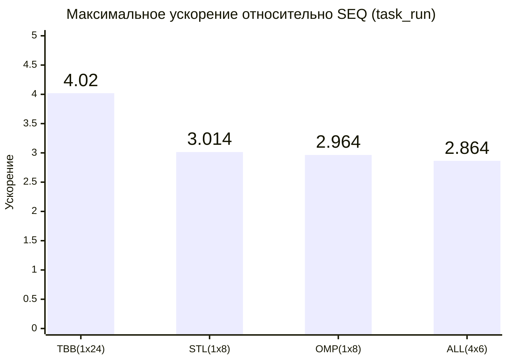
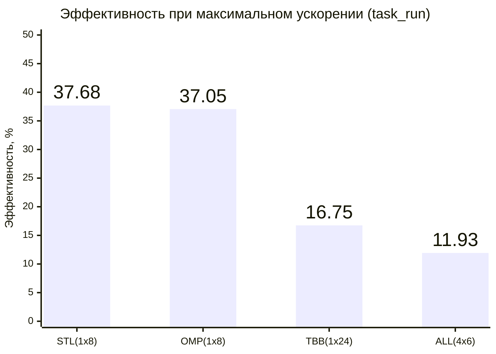
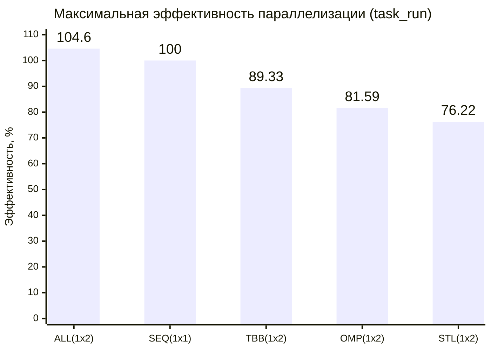

# Построение выпуклой оболочки – проход Грэхема

- Студент: Перепелкин Ярослав Михайлович, группа 3823Б1ПР1
- Вариант: 22
- Локальные отчёты: seq/report.md, omp/report.md, tbb/report.md, stl/report.md, all/report.md

## 1. Введение

Решается задача построения выпуклой оболочки для заданного множества точек на двумерной плоскости с использованием
алгоритма «Проход Грэхема».

Данная задача отлично подходит для сравнения разных моделей параллелизма (OpenMP, TBB, STL, ALL) благодаря своей
структуре, сочетающей разнородные этапы:

- **Поиск опорной точки** — легко распараллеливается через редукцию.
- **Сортировка точек по полярному углу** — наиболее трудоемкий этап O(N logN). В зависимости от технологии он
  реализуется либо готовыми высокоуровневыми алгоритмами (например, `tbb::parallel_sort`), либо вручную через разделение
  диапазонов и слияние блоков (например, в STL).
- **Построение оболочки** — строго последовательный шаг из-за сильной зависимости по данным: добавление точки в стек на
  каждом шаге зависит от предыдущих решений.

Присутствие последовательной части ограничивает максимальное теоретическое ускорение по закону Амдала. Тем не менее,
сочетание параллельного поиска опорной точки, многопоточной сортировки (или слияния блоков) и строго последовательного
финального обхода делает эту задачу крайне интересной для анализа накладных расходов, синхронизации и масштабируемости в
различных моделях параллелизма.

## 2. Единая постановка задачи

### Входные данные

- `std::vector<std::pair<double, double>>` – вектор, содержащий координаты точек на плоскости.

### Выходные данные

- `std::vector<std::pair<double, double>>` – вектор, содержащий точки, образующие выпуклую оболочку, упорядоченные
  против часовой стрелки.

### Ограничения

- Координаты точек – числа с плавающей запятой двойной точности (`double`).
- Максимальное количество точек ограничено допустимым размером `std::vector<std::pair<double, double>>` и объемом
  доступной оперативной памяти.

### Критерий корректности

Корректность работы последовательной версии (SEQ) проверяется на наборе валидационных и функциональных тестов путем
прямого сравнения результатов с эталонными векторами вершин. Для всех параллельных реализаций (OpenMP, TBB, STL, ALL)
критерием корректности служит совпадение выходного вектора с результатом, полученным от SEQ-версии. Такое сравнение
возможно, поскольку все версии выдают одинаково (канонически) упорядоченный результат.

#### Дополнительные проверки

- При `PPC_NUM_THREADS=1` (и `PPC_NUM_PROC=1` для ALL) результат работы параллельной версии полностью идентичен
  SEQ-версии.
- При различных значениях `PPC_NUM_THREADS` (и `PPC_NUM_PROC` для ALL) выходные векторы по-прежнему совпадают между
  собой и с эталоном, что подтверждает отсутствие гонок данных и детерминизм параллельного алгоритма.

## 3. Единая методика эксперимента

### Тестовая инфраструктура

| Параметр         | Значение                                            |
| ---------------- | --------------------------------------------------- |
| CPU              | Intel Core i5-12400 (6 cores, 12 threads, 2.50 GHz) |
| RAM              | 32 GB DDR4 (3200 MHz)                               |
| OS               | Windows 11 Home 23H2 (22631.6060)                   |
| Compiler         | GCC (MinGW-w64) 14.2.0                              |
| CMake build type | Release                                             |

### Переменные окружения

- `PPC_NUM_THREADS` – число потоков внутри каждого процесса (для OMP, TBB, STL, ALL).
- `PPC_NUM_PROC` – число MPI-процессов (для ALL).

### Размер задачи

- Набор из $2 \cdot 10^6$ точек, генерируется программно со случайными вещественными значениями в диапазоне
  $[-1000.0; 1000.0]$.

### Параметры тестирования

- **Метрики:**
  - Среднее время выполнения по серии из 100 запусков.
  - Ускорение относительно последовательной версии: `speedup = time_seq / time_par`.
  - Эффективность параллелизации: `efficiency = (speedup / workers) x 100%`. \
      Рассчитывается пропорционально суммарному количеству задействованных рабочих единиц, где:
    - Для SEQ: `workers = 1`.
    - Для OMP, TBB, STL: `workers = threads`.
    - Для ALL: `workers = ranks x threads_per_rank`.
- **Сценарии измерения:**
  - **Полный цикл (pipeline)** – измерение времени выполнения всей программы (`ValidationImpl`, `PreProcessingImpl`,
      `RunImpl`, `PostProcessingImpl`).
  - **Только вычислительная часть (task_run)** – измерение времени только этапа выполнения алгоритма (`RunImpl`).
- **Стабилизация производительности:** дополнительные меры по стабилизации производительности не применялись.

## 4. Сводка корректности

Для всех параллельных реализаций (OpenMP, TBB, STL, ALL) использовался тот же набор валидационных и функциональных
тестов, что и для SEQ-версии (подробное описание приведено в [seq/report.md](./seq/report.md#5-проверка-корректности)).
Тесты покрывают все основные сценарии и граничные случаи:

- Валидация на пустом входном векторе.
- Вырожденные случаи (1 или 2 точки на входе).
- Наборы с коллинеарными точками.
- Наборы с повторяющимися и полностью совпадающими точками.

Параллельные реализации успешно прошли все тесты и [дополнительные проверки](#дополнительные-проверки), что подтверждает
отсутствие гонок данных и детерминизм параллельного алгоритма.

Ограничений применимости отдельных параллельных реализаций не было выявлено.

## 5. Агрегированные результаты

В таблицах ниже для каждой параллельной технологии представлены результаты двух конфигураций: с максимальным полученным
ускорением и с максимальной эффективностью.

### Сравнение backend-ов (pipeline)

| Технология | Процессов | Потоков | Рабочих | Время, с | Ускорение | Эффективность, % |
| ---------- | --------- | ------- | ------- | -------- | --------- | ---------------- |
| SEQ        | 1         | 1       | 1       | 0.277642 | 1.000     | N/A              |
| OMP        | 1         | 8       | 8       | 0.093579 | 2.967     | 37.09            |
| OMP        | 1         | 2       | 2       | 0.169160 | 1.641     | 82.06            |
| TBB        | 1         | 12      | 12      | 0.068353 | 4.062     | 33.85            |
| TBB        | 1         | 2       | 2       | 0.159925 | 1.736     | 86.80            |
| STL        | 1         | 8       | 8       | 0.091850 | 3.023     | 37.78            |
| STL        | 1         | 2       | 2       | 0.179768 | 1.544     | 77.22            |
| ALL        | 1         | 6       | 6       | 0.096456 | 2.878     | 47.97            |
| ALL        | 1         | 2       | 2       | 0.133887 | 2.074     | 103.70           |

### Сравнение backend-ов (task_run)

| Технология | Процессов | Потоков | Рабочих | Время, с | Ускорение | Эффективность, % |
| ---------- | --------- | ------- | ------- | -------- | --------- | ---------------- |
| SEQ        | 1         | 1       | 1       | 0.275156 | 1.000     | N/A              |
| OMP        | 1         | 8       | 8       | 0.092830 | 2.964     | 37.05            |
| OMP        | 1         | 2       | 2       | 0.168631 | 1.632     | 81.59            |
| TBB        | 1         | 24      | 24      | 0.068455 | 4.020     | 16.75            |
| TBB        | 1         | 2       | 2       | 0.154009 | 1.787     | 89.33            |
| STL        | 1         | 8       | 8       | 0.091285 | 3.014     | 37.68            |
| STL        | 1         | 2       | 2       | 0.180500 | 1.524     | 76.22            |
| ALL        | 4         | 6       | 24      | 0.096065 | 2.864     | 11.93            |
| ALL        | 1         | 2       | 2       | 0.131530 | 2.092     | 104.60           |

#### График 1 – Максимальное ускорение относительно SEQ (task_run)



#### График 2 – Эффективность параллелизации при максимальном ускорении (task_run)



#### График 3 – Максимальная эффективность параллелизации (task_run)



## 6. Интерпретация различий

Анализ выполнялся на основе сценария `task_run`.

### SEQ – baseline

Последовательная версия загружает одно физическое ядро на 100%. Накладные расходы на создание потоков, синхронизацию или
пересылку данных отсутствуют. Время ~0.275с служит базовым значением, относительно которого рассчитывается ускорение для
всех параллельных реализаций.

### OMP – сильные и слабые стороны

- **Сильные стороны:** Простота реализации за счет высокоуровневых директив (`#pragma omp parallel`). OMP достигает
  хорошего ускорения (до 2.964x на 8 потоках) при минимуме изменений в коде.
- **Слабые стороны:** Высокие накладные расходы на неявные барьеры. Синхронизация на каждом уровне дерева слияния сильно
  замедляет работу. При использовании более 8 потоков издержки на барьеры и контекст перевешивают выгоду
  распараллеливания, вызывая деградацию производительности.

### TBB – роль grain size и runtime

- **Максимальная производительность:** TBB показал наивысшее пиковое ускорение — 4.02x на 24 потоках (без деградации при
  переподписке ядер).
- **Grain size:** Явно не задавался. Абстракция `tbb::parallel_sort` выбирает размер блока автоматически, что в связке с
  механизмом кражи задач (work-stealing) отлично балансирует нагрузку без ручной настройки.
- **Runtime:** Встроенный планировщик и единый пул потоков минимизируют расходы на жесткие барьеры (как в OMP) и
  пересоздание потоков (как в STL). Это позволяет TBB задействовать вплоть до 24 потоков без просадок по времени, хотя
  эффективность предсказуемо снижается до 16.75% (максимальная скорость в обмен на эффективность).

### STL – цена ручного управления потоками

- **Ручное управление:** Ручное разбиение массивов на непересекающиеся блоки, управление локальными буферами и написание
  дерева слияний значительно усложнили реализацию по сравнению с TBB и OMP. Однако использование `std::jthread` частично
  сгладило эти трудности: автоматический `join` в деструкторе заметно упростил управление жизненным циклом потоков и
  избавил от необходимости явной синхронизации.
- **Результат:** Отсутствие глобального пула задач (как в TBB) привело к огромным накладным расходам на постоянное
  пересоздание системных потоков на каждом этапе алгоритма. И хотя на 8 потоках STL-версия показала наивысшую
  эффективность среди ручных реализаций (37.68%), при дальнейшем увеличении числа рабочих единиц масштабируемость
  останавливается и переходит в деградацию производительности.

### ALL – цена коммуникации и выигрыш гибридности

- **Цена коммуникации:** Значительная доля времени уходит на обмен массивами точек между процессами (`MPI_Scatterv`,
  `MPI_Gatherv`). Дополнительно, алгоритм требует `MPI_Allreduce` для поиска глобального минимума, что создает жесткую
  барьерную синхронизацию для всех процессов, ожидающих результаты друг друга. На одном вычислительном узле эти сетевые
  накладные расходы полностью перекрывают вычислительный выигрыш.
- **Выигрыш гибридности:** Использование MPI поверх потоков в пределах одной машины не дает преимуществ (эффективность
  падает до 11.93% на конфигурации `4x6`). Гибридный подход оправдывает себя исключительно на многоузловых кластерах,
  когда вычислительная сложность многократно превышает стоимость пересылки, а данные не помещаются в оперативной памяти
  одного узла.

## 7. Репродуцируемость

### Сборка

```bash
cmake -S . -B build \
  -D USE_FUNC_TESTS=ON \
  -D USE_PERF_TESTS=ON \
  -D CMAKE_BUILD_TYPE=Release
cmake --build build --parallel --config Release
```

### Запуск функциональных тестов

```bash
# Потоковые backend-ы
$env:PPC_NUM_THREADS = "4"
./scripts/run_tests.py --running-type=threads --counts 1 2 4
```

```bash
# MPI / гибридная конфигурация
$env:PPC_NUM_PROC = "2"
./scripts/run_tests.py --running-type=processes --counts 2 4
```

### Замеры производительности

```bash
./scripts/run_tests.py --running-type=performance
```

**Запуск конкретного backend:**

```bash
./build/bin/ppc_perf_tests --gtest_filter="*perepelkin*seq*"
./build/bin/ppc_perf_tests --gtest_filter="*perepelkin*omp*"
./build/bin/ppc_perf_tests --gtest_filter="*perepelkin*tbb*"
./build/bin/ppc_perf_tests --gtest_filter="*perepelkin*stl*"
mpiexec -n <num_proc> ./build/bin/ppc_perf_tests --gtest_filter="*perepelkin*all*"
```

## 8. Заключение

### Лучшая версия

В условиях тестирования на одной локальной машине с общей памятью лидером можно назвать реализацию на базе oneTBB. Она
продемонстрировала наивысшее пиковое ускорение 4.02x и способность эффективно работать даже в условиях превышения
количества логических ядер (вплоть до 24 рабочих единиц) без деградации времени выполнения. Планировщик задач TBB и
механизм work-stealing полностью нивелировали издержки балансировки, в отличие от OMP (пострадавшего от жестких
барьеров) и STL (пострадавшего от накладных расходов на пересоздание потоков).

Если же критерием выступает простота разработки при приемлемой скорости, то лучшим выбором является OpenMP — он требует
минимального вмешательства в код и на 8 потоках обеспечивает ускорение 2.96x, что является приемлемым результатом.

### Ограничения сравнения

1. **Аппаратная среда:** Все эксперименты проводились в рамках одного вычислительного узла с общей памятью. В таких
   условиях гибридная (MPI+TBB) версия заведомо оказалась в проигрышном положении из-за избыточных затрат на
   межпроцессное взаимодействие, для которого она в данном случае не предназначена.
2. **Тип и распределение данных:** Тестирование проводилось на случайно сгенерированных и равномерно распределенных
   точках. На вырожденных наборах данных (например, когда почти все точки лежат на самой границе оболочки) может
   возникнуть дисбаланс нагрузки, что скажется на эффективности распараллеливания.

### Возможные улучшения

- **Смена алгоритма:** Ключевым узким местом текущей реализации является алгоритм Грэхема, который концептуально
  содержит строго последовательный этап (непосредственно финальный проход по точкам для формирования оболочки). Это
  накладывает жесткое ограничение на максимальное ускорение. Главным потенциальным улучшением является переход на
  алгоритмы построения выпуклой оболочки, поддающиеся распараллеливанию на всех этапах, в которых объединение локальных
  оболочек можно выполнять параллельно.
- **Векторизация:** Переписывание базовых геометрических проверок (расчет векторного произведения) с использованием
  SIMD-инструкций для ускорения локальных вычислений.

## 9. Источники

- [Документация по курсу «Параллельное программирование»][ppc-docs]
- [OpenMP API Specification][openmp]
- [oneTBB Documentation][oneTBB]
- [C++ (cppreference): std::thread и std::jthread][thread]
- [MPI Documents][mpi]
- [Convex Hull using Graham Scan (GeeksforGeeks)][gfg]
- [Algorithmic Efficiency in Convex Hull Computation: Insights from 2D and 3D Implementations][research]
- [Parallel Implement of Convex Hull Problem (Weiyang Chen)][weiyang]

<!-- LINKS -->

[ppc-docs]: https://learning-process.github.io/parallel_programming_course/ru/
[openmp]: https://www.openmp.org/resources/refguides/
[oneTBB]: https://uxlfoundation.github.io/oneTBB/index.html
[thread]: https://en.cppreference.com/w/cpp/thread
[mpi]: https://www.mpi-forum.org/docs/
[gfg]: https://www.geeksforgeeks.org/dsa/convex-hull-using-graham-scan/
[research]:
    https://www.researchgate.net/publication/386206669_Algorithmic_Efficiency_in_Convex_Hull_Computation_Insights_from_2D_and_3D_Implementations
[weiyang]:
    https://www.uio.no/studier/emner/matnat/ifi/IN3030/v25/lecture-materials-in3030v25/l11v25-lecture-materials/weiyang-chen-spring-2020.pdf/
