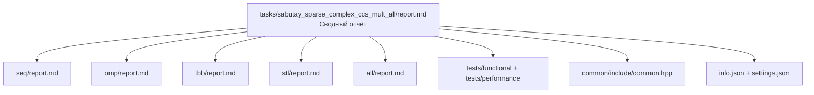

# Умножение разреженных комплексных матриц в формате CCS

- Student: Иманов Сабутай Ширзад оглы, группа 3823Б1ПР5
- Variant: 7
- Local reports: [seq/report.md](seq/report.md), [omp/report.md](omp/report.md), [tbb/report.md](tbb/report.md),
  [stl/report.md](stl/report.md), [all/report.md](all/report.md)

## 1. Введение

В работе реализовано и сравнено **пять вариантов** умножения двух разреженных комплексных матриц в формате CCS
(Compressed Column Storage). Задача удобна для курса по параллельному программированию: результат можно считать **по
столбцам** правой матрицы, и столбцы в основном независимы — это естественная область для OpenMP и TBB. При этом после
параллельной части нужна **сборка** итоговой матрицы, а на маленьких тестовых данных заметны **накладные расходы** на
запуск потоков.

Подробные отчёты по каждой технологии — в папках `seq/`, `omp/`, `tbb/`, `stl/`, `all/`.

## 2. Единая постановка задачи

Нужно вычислить $C = A \cdot B$, где:

- $A$, $B$ — разреженные комплексные матрицы в формате CCS;
- $C$ — результат в том же формате;
- вход программы: `std::tuple<CCS, CCS>`, выход: `CCS` (см. `common/include/common.hpp`).

**Критерий корректности:** результат совпадает с умножением «в лоб» через плотные матрицы с допуском $10^{-12}$
(`tests/functional/main.cpp`, три тестовых случая).

**Ограничения:** размеры матриц должны согласовываться ($\text{cols}(A) = \text{rows}(B)$); структура CCS проверяется в
`ValidationImpl` каждого класса. Очень малые по модулю элементы при слиянии отбрасываются (порог $10^{-14}$ в
`all/src/ops_all.cpp`).

## 3. Единая методика эксперимента

- **Окружение:**
  - **CPU:** Intel(R) Core(TM) Ultra 5 125H (14 ядер / 18 потоков).
  - **RAM:** 32 ГБ.
  - **ОС:** Windows 11.
  - **Сборка:** Release.
  - **Компилятор:** Microsoft Visual C++ (MSVC), Visual Studio 2022.

- **Методика:**
  - Размер perf-задачи: случайные матрицы $80 \times 90$ и $90 \times 70$ (`tests/performance/main.cpp`).
- Для каждой технологии каркас perf запускает **`task_run`** и **`pipeline`**; в сводных таблицах ниже — **`task_run`**
(единое сравнение).
  - Число потоков: `PPC_NUM_THREADS` $\in \{1, 2, 4, 8\}$; для MPI-замеров: `PPC_NUM_PROC = 1`.
  - Внутри одного замера — **5** вызовов `Run()` (каркас `ppc::performance::Perf`).
  - Базовое время: $T_{seq}$ при SEQ и $p = 1$.
  - Ускорение: $S = T_{seq} / T$.
  - Эффективность: $E = S / p \cdot 100\%$, где $p$ — число потоков (`PPC_NUM_THREADS`).

## 4. Сводка корректности

Все **15** func-тестов (5 технологий × 3 случая `case_id`) завершились **PASSED**. Сравнение с плотным эталоном,
допуск $10^{-12}$ (`tests/functional/main.cpp`).

### Таблица результатов func-тестов

| Backend | `case_id` | Имя теста (суффикс GTest) | Результат |
| :-----: | :-------: | ------------------------- | :-------: |
| ALL | 0 | `..._all_enabled_0` | PASSED |
| ALL | 1 | `..._all_enabled_1` | PASSED |
| ALL | 2 | `..._all_enabled_2` | PASSED |
| OMP | 0 | `..._omp_enabled_0` | PASSED |
| OMP | 1 | `..._omp_enabled_1` | PASSED |
| OMP | 2 | `..._omp_enabled_2` | PASSED |
| SEQ | 0 | `..._seq_enabled_0` | PASSED |
| SEQ | 1 | `..._seq_enabled_1` | PASSED |
| SEQ | 2 | `..._seq_enabled_2` | PASSED |
| STL | 0 | `..._stl_enabled_0` | PASSED |
| STL | 1 | `..._stl_enabled_1` | PASSED |
| STL | 2 | `..._stl_enabled_2` | PASSED |
| TBB | 0 | `..._tbb_enabled_0` | PASSED |
| TBB | 1 | `..._tbb_enabled_1` | PASSED |
| TBB | 2 | `..._tbb_enabled_2` | PASSED |

## 5. Агрегированные результаты

Базовое время: **$T_{seq} = 0.00001390$ с** (SEQ, 1 поток, `task_run`).

### Таблица: лучший замер по каждой технологии

В таблице для каждого варианта выбрана конфигурация с **наименьшим временем** среди $p \in \{1, 2, 4, 8\}$.

| Backend | Конфигурация | Время (с) | Ускорение ($S$) | Эффективность ($E$) | Примечание |
| ------- | ------------ | --------- | --------------- | ------------------- | ---------- |
| **SEQ** | 1 поток | 0.00001390 | 1.00 | 100% | Эталон |
| **STL** | 4 потока | 0.00001258 | 1.11 | 28% | То же ядро, что SEQ; разница — погрешность замера |
| **OMP** | 1 поток | 0.00002268 | 0.61 | 61% | Быстрее при 1 потоке, чем при 8 |
| **TBB** | 4 потока | 0.00011596 | 0.12 | 3% | Медленнее SEQ на этой задаче |
| **ALL** | 1 процесс × 1 поток | 0.00030686 | 0.05 | 5% | Доп. код после умножения |

На данном размере матриц **быстрее всех** оказались SEQ и STL (последовательное умножение). Параллельные OMP и TBB
**не дали выигрыша** — задача слишком мала, а затраты на потоки заметны.

### Таблица: полная сетка замеров (`task_run`)

| Backend | $p=1$ (с) | $p=2$ (с) | $p=4$ (с) | $p=8$ (с) |
| :-----: | :-------: | :-------: | :-------: | :-------: |
| SEQ | 0.00001390 | 0.00001416 | 0.00001538 | 0.00002128 |
| OMP | 0.00002268 | 0.00008498 | 0.00007856 | 0.00011186 |
| TBB | 0.00008308 | 0.00011736 | 0.00011596 | 0.00014240 |
| STL | 0.00001266 | 0.00001302 | 0.00001258 | 0.00001262 |
| ALL | 0.00030686 | 0.00048390 | 0.00085534 | 0.00244152 |

Подробные таблицы с $S$ и $E$ по потокам — в локальных отчётах.

### Таблица: полная сетка замеров (`pipeline`)

| Backend | $p=1$ (с) | $p=2$ (с) | $p=4$ (с) | $p=8$ (с) |
| :-----: | :-------: | :-------: | :-------: | :-------: |
| SEQ | 0.00002352 | 0.00008262 | 0.00002692 | 0.00004238 |
| OMP | 0.00044970 | 0.00076444 | 0.00177710 | 0.00148146 |
| TBB | 0.00021300 | 0.00024880 | 0.00023686 | 0.00027230 |
| STL | 0.00003026 | 0.00010842 | 0.00002598 | 0.00002726 |
| ALL | 0.00237558 | 0.00256790 | 0.00320222 | 0.00456848 |

Режим `pipeline` включает полный цикл задачи (валидация, подготовка, выполнение, постобработка). Детали — в локальных
отчётах, §8.

## 6. Интерпретация различий

1. **SEQ (эталон).** Один поток, цикл по столбцам в `SpmmAbc`. Это база для проверки и для формулы ускорения. Время
   почти не растёт с $p$, потому что параллелизм в коде не включается.

2. **STL.** В умножении вызывается тот же `SpmmAbc`, что и в SEQ (`kSTL` и `kSEQ` — одна ветка в `BuildProductMatrix`).
   Поэтому STL и SEQ близки по времени. Отдельные потоки `std::thread` в этой задаче показаны в ALL, а не в `stl/src`.

3. **OpenMP.** Столбцы результата делятся между потоками (`#pragma omp for`). На perf-матрицах (~70 столбцов) мало
   работы на поток, зато есть стоимость входа в `parallel` и последовательная **склейка** столбцов в конце. Итог: при
   $p > 1$ время **растёт**, а не падает.

4. **oneTBB.** Та же идея — параллельно по столбцам, но через `parallel_for`. На маленькой задаче библиотека тоже
   проигрывает SEQ: организация работы стоит дороже, чем само умножение.

5. **ALL (MPI + демо-потоки).** При одном MPI-процессе умножение идёт как SEQ, но в `RunImpl` после него выполняются
   учебные фрагменты OpenMP, `std::thread` и TBB, плюс `MPI_Barrier`. Чем больше `PPC_NUM_THREADS`, тем дольше эти
   дополнительные циклы — поэтому ALL **самый медленный** в perf.

**Общий вывод по сравнению:** на **малых** матрицах из perf-теста курса выигрывает последовательный код. OMP и TBB
имеют смысл на **больших** матрицах, когда столбцов много и работы на поток достаточно.

## 7. Репродуцируемость

```powershell
# Сборка
cmake -S . -B build -D USE_FUNC_TESTS=ON -D USE_PERF_TESTS=ON -DCMAKE_BUILD_TYPE=Release
cmake --build build --config Release --target ppc_perf_tests

# Функциональные тесты
$env:PPC_NUM_PROC = "1"
$env:PPC_NUM_THREADS = "4"
mpiexec -n 1 build\bin\ppc_func_tests.exe --gtest_filter="*sabutay_sparse_complex_ccs_mult_all*"

# Perf: последовательная версия
$env:PPC_NUM_PROC = "1"
$env:PPC_NUM_THREADS = "1"
build\bin\ppc_perf_tests.exe --gtest_filter="*sabutay_sparse_complex_ccs_mult_all*seq_enabled*"

# Perf: OMP / TBB / STL (пример для 4 потоков)
$env:PPC_NUM_THREADS = "4"
$env:OMP_NUM_THREADS = "4"
build\bin\ppc_perf_tests.exe --gtest_filter="*sabutay_sparse_complex_ccs_mult_all*omp_enabled*"

# Perf: ALL (один MPI-процесс, как в замерах)
$env:PPC_NUM_PROC = "1"
$env:PPC_NUM_THREADS = "4"
build\bin\ppc_perf_tests.exe --gtest_filter="*sabutay_sparse_complex_ccs_mult_all*all_enabled*"
```

## 8. Заключение

Для умножения разреженных CCS на **тестовых размерах** курса лучше всего подходят **SEQ** и **STL** (одно и то же
вычислительное ядро). **OpenMP** и **TBB** на этих данных не ускоряют программу из-за малого объёма работы и накладных
расходов. **ALL** полезен как демонстрация связки MPI и потоковых API, но в perf-тесте замедляет выполнение из-за
дополнительного кода в `RunImpl`.

Чтобы увидеть реальное ускорение от OMP/TBB, нужны **большие** разреженные матрицы (больше столбцов и ненулевых
элементов), чтобы время полезной работы заметно превысило время запуска потоков.

## 9. Источники

1. Материалы курса «Параллельное программирование», репозиторий [ppc-2026-threads][repo-ppc].
2. Методическое руководство по отчётам и структура `tasks/example_threads` в том же репозитории.
3. [OpenMP](https://www.openmp.org/) — директивы `parallel`, `for`.
4. [oneTBB][onetbb-doc] — `parallel_for`, `blocked_range`.
5. [MPI Forum](https://www.mpi-forum.org/) — `MPI_Comm_rank`, `MPI_Barrier`.
6. [cppreference.com](https://en.cppreference.com/) — `std::thread`, контейнеры STL.

## 10. Приложение

### Структура задачи

Каталог задачи построен по минимальному каркасу курса (как в `example_threads`).

```text
tasks/sabutay_sparse_complex_ccs_mult_all/
  report.md                      # обязательный корневой сводный отчёт
  info.json                      # сведения о студенте
  settings.json                  # включённые технологии
  common/
    include/common.hpp           # InType, OutType, TestType, BaseTask
  seq/
    include/ops_seq.hpp
    src/ops_seq.cpp
    report.md                    # локальный отчёт по SEQ
  omp/
    include/ops_omp.hpp
    src/ops_omp.cpp
    report.md                    # локальный отчёт по OMP
  tbb/
    include/ops_tbb.hpp
    src/ops_tbb.cpp
    report.md                    # локальный отчёт по TBB
  stl/
    include/ops_stl.hpp
    src/ops_stl.cpp
    report.md                    # локальный отчёт по std::thread
  all/
    include/ops_all.hpp
    src/ops_all.cpp
    report.md                    # локальный отчёт по гибридной версии
  tests/
    functional/main.cpp
    performance/main.cpp
  data/                          # опционально (в задаче не используется)
  img/                           # опционально (графики в отчётах — таблицы)
```

В `common/include/common.hpp` заданы тип `CCS` и типы задачи `InType`, `OutType`, `BaseTask`. В каждом каталоге `seq/`,
`omp/`, `tbb/`, `stl/`, `all/` — класс-наследник `BaseTask` со своим `TypeOfTask` и методами `ValidationImpl`,
`PreProcessingImpl`, `RunImpl`, `PostProcessingImpl`.

`tests/functional/main.cpp` — один набор из трёх тестовых случаев (`case_id` 0, 1, 2) для всех backend-ов; эталон —
умножение через плотные матрицы. `tests/performance/main.cpp` — общий каркас курса (`BaseRunPerfTests`,
`MakeAllPerfTasks`), режимы `task_run` и `pipeline`.

Каталог `all/` — гибридная версия: `MPI_Comm_rank`, ветвление по рангу, `MPI_Barrier`, а также демонстрационные
фрагменты OpenMP, `std::thread` и oneTBB в `RunImpl` (подробнее — [all/report.md](all/report.md)).

### Связь отчётов



### Короткий листинг: типы входа и выхода

```cpp
// File: common/include/common.hpp
struct CCS {
  int row_count{0};
  int col_count{0};
  std::vector<int> col_start;
  std::vector<int> row_index;
  std::vector<std::complex<double>> nz;
};

using InType = std::tuple<CCS, CCS>;
using OutType = CCS;
using BaseTask = ppc::task::Task<InType, OutType>;
```

[repo-ppc]: https://github.com/learning-process/ppc-2026-threads
[onetbb-doc]: https://github.com/uxlfoundation/oneTBB
