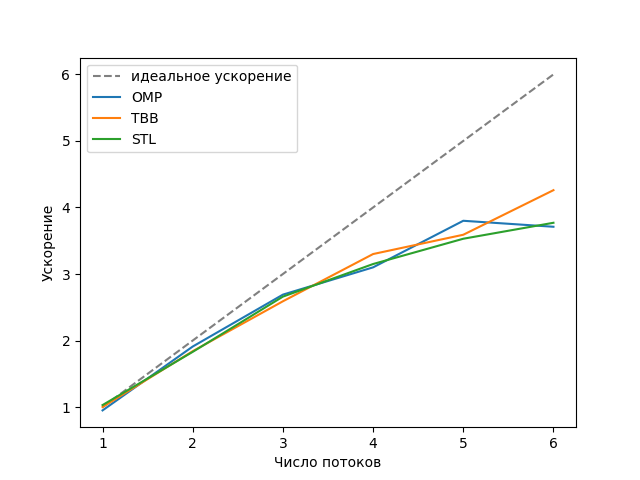
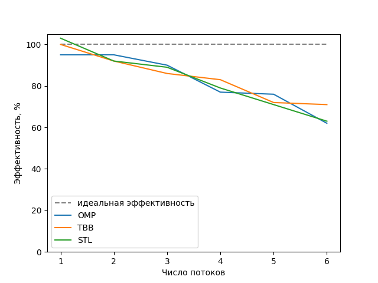
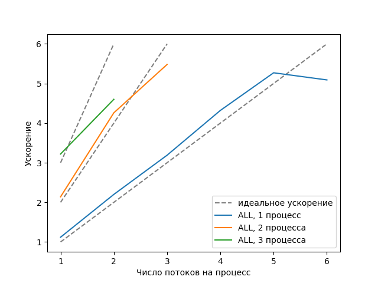
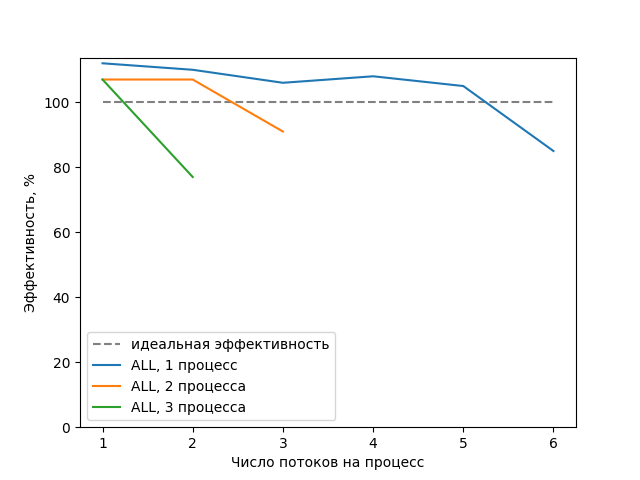

# Вычисление многомерного интеграла методом трапеций

- Студент: Самойленко Илья Андреевич, группа 3823Б1ПР3
- Вариант: 10
- Локальные отчёты: `seq/report.md`, `omp/report.md`, `tbb/report.md`, `stl/report.md`, `all/report.md`

## 1. Введение

Задача - приближённое вычисление определённого интеграла функции нескольких переменных методом трапеций. Алгоритм
сводится к перебору большого числа независимых точек сетки и суммированию их взвешенных вкладов.

Реализовано пять версий: последовательная (SEQ) и четыре параллельные - OMP (OpenMP), TBB (oneTBB), STL (`std::thread`)
и ALL (MPI + OpenMP).

## 2. Единая постановка задачи

Вход - структура `Input`: векторы границ `a` и `b`, число разбиений `n` по каждому измерению и номер подынтегральной
функции `function_choice` (0-3).

Выход - число `double`, приближённое значение интеграла. Размерность интеграла равна длине вектора `a` (и,
соответственно, `b` и `n`).

Ограничения на входные данные: вектор `a` не пуст, длины `a`, `b`, `n` совпадают, $n_i > 0$, $a_i < b_i$,
`function_choice` в диапазоне от 0 до 3.

Критерий корректности: результат должен совпадать с эталонным (заранее посчитанным и известным аналитически) значением
интеграла с точностью $10^{-3}$ в функциональных тестах.

## 3. Единая методика эксперимента

Аппаратное обеспечение и ОС:

- CPU: AMD Ryzen 5 2600X
- Ядра и потоки: 3 физических ядра, 6 логических ядер
- RAM: 8 GB
- OS: Ubuntu 24.04.2 LTS

Набор инструментов:

- Компилятор: g++ 13.3.0
- Тип сборки: Release
- CMake 3.28.3
- MPI: Open MPI 4.1.6

Переменные окружения и конфигурация:

- `PPC_NUM_THREADS` - число потоков
- число процессов для ALL задаётся флагом `-n` команды `mpirun`;

Данные для тестов производительности одинаковы для всех версий: трёхмерный интеграл от суммы квадратов на области
$[0,1]$ в трёх измерениях с разбиением 421 по каждому измерению (что даёт ~75 000 000 точек).

Каждая конфигурация запускалась 3 раза в каждом из двух режимов курса (`task` и `pipeline`); в таблицах приведена
медиана времени режима `pipeline`.

Ускорение и эффективность считаются одинакого для всех реализаций:

- Ускорение = Время SEQ / Время версии;
- Эффективность = Ускорение / Число работников.

Для OMP, TBB и STL число работников - число потоков. Для ALL число работников - число потоков * число процессов

## 4. Сводка корректности

Все четыре параллельные версии сравнивались с эталоном SEQ на общем наборе функциональных тестов. Тесты покрывают разные
подынтегральные функции (сумма, произведение, сумма квадратов, синус суммы) и разные размерности. Всего
проходит 25 тестов (5 тестов на 5 реализаций). Версия ALL дополнительно проверялась при 1 и 2 процессах.

## 5. Агрегированные результаты

Все версии замерены на одном размере задачи - ~75 000 000 точек.

| Технология | Процессы | Потоки | Работники | Время, с | Ускорение | Эффективность |
| --- | --- | --- | --- | --- | --- | --- |
| SEQ | 1 | 1 | 1 | 1.053 | 1.00 | - |
| OMP | 1 | 2 | 2 | 0.552 | 1.91 | 95% |
| OMP | 1 | 4 | 4 | 0.340 | 3.10 | 77% |
| OMP | 1 | 6 | 6 | 0.284 | 3.71 | 62% |
| TBB | 1 | 2 | 2 | 0.572 | 1.84 | 92% |
| TBB | 1 | 4 | 4 | 0.319 | 3.30 | 83% |
| TBB | 1 | 6 | 6 | 0.247 | 4.26 | 71% |
| STL | 1 | 2 | 2 | 0.574 | 1.83 | 92% |
| STL | 1 | 4 | 4 | 0.334 | 3.15 | 79% |
| STL | 1 | 6 | 6 | 0.279 | 3.77 | 63% |
| ALL | 2 | 1 | 2 | 0.492 | 2.14 | 107% |
| ALL | 4 | 1 | 4 | 0.251 | 4.20 | 105% |
| ALL | 6 | 1 | 6 | 0.191 | 5.51 | 92% |



Рисунок 1. Ускорение OMP, TBB и STL относительно SEQ в зависимости от числа потоков



Рисунок 2. Эффективность OMP, TBB и STL относительно SEQ в зависимости от числа потоков



Рисунок 3. Ускорение версии ALL относительно SEQ в зависимости от числа потоков на процесс



Рисунок 4. Эффективность версии ALL относительно SEQ в зависимости от числа потоков на процесс

## 6. Интерпретация различий

SEQ - эталон. Время около 1.05 с. Почти всё время уходит на основной цикл по ~75 млн точек, где для каждой точки
выполняется преобразование индекса в координаты делением и взятием остатка.

OMP - одна параллельная область с `reduction(+:sum)` поверх последовательного цикла. Ускорение близко к линейному до 2-3
потоков, дальше эффективность падает - до 62% на 6 потоках.

TBB - `parallel_reduce` сам делит работу и собирает суммы; `auto_partitioner` подбирает размер блоков. Результаты близки
к OMP, но на большом числе потоков TBB был эффективнее (на 6 потоках 71% против 62-63% у OMP и STL).

STL - ручное разбиение списка точек на блоки и ручной сбор результата. Так как блоки не пересекаются, синхронизация не
нужна вовсе. Результаты близки к OMP и TBB.

ALL - лучшие результаты. Во-первых, MPI добавляет второй уровень параллелизма, поэтому можно занять все 6 логических
процессоров комбинацией процессов и потоков. Во-вторых, в алгоритме ALL, в отличие от других реализаций, оптимизировано вычисление координат сетки для точек диапазона. Поэтому на графиках эффективности она местами превышает 100%.

Падение эффективности у OMP, TBB, STL связано с ограничением аппаратного обеспечения в тестовой среде.

Близость чисел OMP, TBB и STL объясняется тем, что у всех трёх одинаковый вычислительный алгоритм и одинаковый характер
работы - деление независимых однородных итераций. Разница между ними - только в инструменте распределения.

## 7. Репродуцируемость

Сборка:

```bash
cmake -S . -B build -D CMAKE_BUILD_TYPE=Release
cmake --build build -j1
```

Функциональные тесты:

```bash
PPC_NUM_THREADS=4 mpirun --oversubscribe --bind-to none -n 2 ./build/bin/ppc_func_tests --gtest_filter='*samoylenko*'
```

Тесты производительности:

```bash
PPC_NUM_THREADS=4 ./build/bin/ppc_perf_tests --gtest_filter='*_omp_*'
PPC_NUM_THREADS=4 ./build/bin/ppc_perf_tests --gtest_filter='*_tbb_*'
PPC_NUM_THREADS=4 ./build/bin/ppc_perf_tests --gtest_filter='*_stl_*'
PPC_NUM_THREADS=2 mpirun --oversubscribe --bind-to none -n 2 ./build/bin/ppc_perf_tests --gtest_filter='*_all_*'
```

## 8. Заключение

Реализованы и протестированы пять версий вычисления многомерного интеграла методом трапеций. Все версии проходят
функциональные тесты и совпадают с эталоном SEQ. Параллельные версии дают ожидаемое ускорение.

Лучший результат показывает версия ALL: MPI + OpenMP занимает все доступные ядра и достигает ускорения около 5.5 на 6
работниках, а также имеет более оптимизированный алгоритм по сравнению с другими реализациями.
Версии OMP, TBB и STL близки между собой и масштабируются почти линейно, пока число потоков не превышает
число физических ядер.

## 9. Источники

1. Метод трапеций: <https://en.wikipedia.org/wiki/Trapezoidal_rule>
2. Материалы курса: <https://learning-process.github.io/parallel_programming_course/ru/index.html>
3. Референс OpenMP: <https://www.openmp.org/resources/refguides/>
4. Документация oneTBB: <https://uxlfoundation.github.io/oneTBB/>
5. Документация Open MPI: <https://www.open-mpi.org/doc/>
6. Документация `std::thread`: <https://en.cppreference.com/w/cpp/thread/thread>