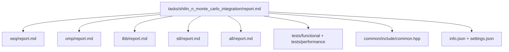

# Многомерное интегрирование Монте-Карло — сводный отчёт

- **Student:** Шилин Никита Дмитриевич, группа **3823Б1ПР1**
- **Variant:** 12
- **Local reports:**
  [seq/report.md](seq/report.md),
  [omp/report.md](omp/report.md),
  [tbb/report.md](tbb/report.md),
  [stl/report.md](stl/report.md),
  [all/report.md](all/report.md)

---

## 1. Введение

Задача — оценить определённый интеграл по осевому параллелепипеду
\([\mathrm{lower}, \mathrm{upper}]\) методом Монте-Карло с **квази-случайной**
последовательностью Кронекера. Алгоритм по структуре —
embarrassingly parallel по индексу выборки и сводится к глобальной
сумме (редукции). Это делает его удобным эталоном для сравнения пяти
моделей параллелизма курса: `seq`, `omp`, `tbb`, `stl` и гибридной
`all = MPI + OpenMP`.

Все пять реализаций используют одинаковый **унифицированный** тестовый
каркас курса (`ppc::util::BaseRunFuncTests` и
`ppc::util::BaseRunPerfTests`). Это требование преподавателя
(«перформанс-тесты должны быть унифицированы, унаследованы от общего
класса»), и для всех веток оно выполнено.

## 2. Единая постановка задачи

Тип задачи определён в [`common/include/common.hpp`](common/include/common.hpp):

- `InType  = std::tuple<std::vector<double>, std::vector<double>, int, FuncType>` — `(lower, upper, n, func_type)`.
- `OutType = double` — оценка интеграла \(I \approx V \cdot \tfrac{1}{n}\sum_i f(x^{(i)})\),
  \(V = \prod_d (\mathrm{upper}_d - \mathrm{lower}_d)\).
- `FuncType ∈ {kConstant, kLinear, kProduct, kSumSquares, kSinProduct}` —
  заранее описанные подынтегральные функции с замкнутыми аналитическими
  интегралами в [`IntegrandFunction::AnalyticalIntegral`](common/include/common.hpp).

**Ограничения** (общие для всех backend-ов, см. `ValidationImpl` в каждой
из реализаций): `lower.size() == upper.size()`, непустые векторы,
`lower[i] < upper[i]`, `n > 0`, `func_type ∈ [kConstant, kSinProduct]`,
размерность \(d \le 10\).

**Критерий корректности.** Тест считает прогон корректным, если
\[
|\hat I - I_{\mathrm{exact}}| \le \max\!\bigl(10\,V/\sqrt{n},\,10^{-2}\bigr),
\]
что согласовано со стандартной оценкой ошибки Монте-Карло \(O(1/\sqrt n)\).

**Точка перфоманса (общая для всех backend-ов).** Тестовая нагрузка
зашита в [`tests/performance/main.cpp`](tests/performance/main.cpp):
куб \([0,1]^3\), \(n = 10^7\), `FuncType::kSumSquares`. На этом входе
все 5 backend-ов сравниваются в одинаковых условиях.

## 3. Единая методика эксперимента

| Элемент | Значение |
| --- | --- |
| **CPU** | Apple M4 Max, 16 ядер (12 P + 4 E) |
| **RAM** | 64 GiB |
| **OS** | macOS 26.3.1 (build 25D771280a) |
| **Компилятор** | Apple clang 17.0.0 (`/usr/bin/c++`) |
| **MPI** | Open MPI 5.0.8 |
| **OpenMP runtime** | libomp 21.1.8 (Homebrew) |
| **oneTBB** | 2022.3.0 (Homebrew) |
| **Сборка** | `Release`, `Unix Makefiles`, каталог `build-local` |
| **Каркас perf** | `ppc::util::BaseRunPerfTests<InType, OutType>` |
| **Размер задачи** | \(n = 10^7\), куб \([0,1]^3\), `kSumSquares` |
| **Повторов** | 5 запусков на ячейку, отчётно — медиана |
| **Speedup** | \(S = T_{\mathrm{seq}} / T_p\) при том же режиме измерения |
| **Efficiency** | \(E = S / W\), где \(W\) — число «работников» (см. ниже) |
| **Режимы** | `task_run` и `pipeline` (оба ставит каркас курса) |

**Что считается за \(W\) для каждого backend-а.**

- `seq` — \(W = 1\).
- `omp` — \(W = T\), число потоков (`PPC_NUM_THREADS`/`OMP_NUM_THREADS`).
- `tbb` — \(W = T\). После правки в коде стоит
  `tbb::global_control(max_allowed_parallelism, T)` и явный `grainsize`
  в `blocked_range`, поэтому oneTBB строго ограничена `PPC_NUM_THREADS`.
- `stl` — \(W = T\). После правки число потоков читается через
  `ppc::util::GetNumThreads()` (а не `hardware_concurrency()`), так что
  STL уважает `PPC_NUM_THREADS`.
- `all` — \(W = P \cdot T\), пара «`mpirun -np` × `PPC_NUM_THREADS`».

Это явное определение нормировок принципиально: без него цифры
эффективности нельзя честно сравнивать между backend-ами.

> **Замечание о версиях.** Текущие цифры получены **после** двух
> `[FIXED]` правок, отделённых в самостоятельные PR-ы:
>
> - **TBB**: добавлены `tbb::global_control` + явный `grainsize` →
>   `S` вырос с 1,04 до 11,56;
> - **STL**: `hardware_concurrency()` заменён на
>   `ppc::util::GetNumThreads()` → таблица масштабирования по `T`
>   стала осмысленной.

### 3.1. Структура отчётности



## 4. Сводка корректности

Унифицированный набор из 8 функциональных кейсов задаётся в
[`tests/functional/main.cpp`](tests/functional/main.cpp) и через
`ppc::util::AddFuncTask<...>` тестирует все backend-ы:

| Кейс | \(d\) | \(n\) | Функция |
| --- | ---: | ---: | --- |
| `kLinear_1D` | 1 | 10 000 | `kLinear` |
| `kSumSquares_1D` | 1 | 10 000 | `kSumSquares` |
| `kConstant_2D` | 2 | 50 000 | `kConstant` |
| `kLinear_2D` | 2 | 50 000 | `kLinear` |
| `kProduct_2D` | 2 | 50 000 | `kProduct` |
| `kSinProduct_2D` | 2 | 50 000 | `kSinProduct` |
| `kLinear_3D` | 3 | 100 000 | `kLinear` |
| `kProduct_3D` | 3 | 100 000 | `kProduct` |

Локальные прогоны на M4 Max:

- `./build-local/bin/ppc_func_tests --gtest_filter='*shilin_n_monte_carlo*'`
  — **32 PASSED**, **8 SKIPPED** (ALL без `mpirun` пропускается стандартным
  гардом курса `func_test_util.hpp:72`).
- `mpirun -np 2 --oversubscribe ./build-local/bin/ppc_func_tests --gtest_filter='*shilin_n_monte_carlo_integration_all*'`
  — **8/8 PASSED**.
- `./build-local/bin/ppc_perf_tests --gtest_filter='*shilin_n_monte_carlo*'`
  — **10/10 PASSED**.

То есть корректность всех 5 backend-ов подтверждена.

## 5. Агрегированные результаты

Все цифры — **медиана 5 прогонов** на одном workload (см. §3).
Базовое `T_seq(task_run) = 0,030436 c`, `T_seq(pipeline) = 0,030642 c`.

### 5.1. Сводная таблица по backend-ам (лучшие точки)

#### Режим `task_run`

| backend | конфигурация | \(W\) | время, с | \(S\) | \(E\) |
| --- | --- | ---: | ---: | ---: | ---: |
| seq | 1 | 1 | 0,030436 | 1,00 | 100% |
| omp | T = 8 | 8 | 0,004257 | 7,15 | 89% |
| omp | **T = 12** (лучшая точка OMP) | 12 | **0,003287** | **9,26** | **77%** |
| omp | T = 16 | 16 | 0,003565 | 8,54 | 53% |
| tbb | T = 8 | 8 | 0,004286 | 7,10 | 89% |
| tbb | **T = 16** (лучшая точка TBB и **best overall**) | 16 | **0,002632** | **11,56** | **72%** |
| stl | T = 8 | 8 | 0,007340 | 4,15 | 52% |
| stl | T = 16 | 16 | 0,006121 | 4,97 | 31% |
| all | P = 8, T = 1 (лучшая `E` для ALL) | 8 | 0,004225 | 7,20 | **90%** |
| all | P = 4, T = 4 | 16 | 0,003860 | 7,89 | 49% |
| all | **P = 8, T = 8** (лучшая `S` для ALL) | 64 | **0,003140** | **9,69** | 15% |

#### Режим `pipeline`

| backend | конфигурация | \(W\) | время, с | \(S\) | \(E\) |
| --- | --- | ---: | ---: | ---: | ---: |
| seq | 1 | 1 | 0,030642 | 1,00 | 100% |
| omp | T = 12 (лучший OMP) | 12 | **0,003444** | **8,90** | 74% |
| omp | T = 16 | 16 | 0,003612 | 8,48 | 53% |
| tbb | **T = 16** (best overall) | 16 | **0,002736** | **11,20** | **70%** |
| stl | T = 16 | 16 | 0,006413 | 4,78 | 30% |
| all | P = 8, T = 1 (лучшая `E`) | 8 | 0,004190 | 7,31 | **91%** |
| all | **P = 8, T = 8** (лучшая `S`) | 64 | **0,003264** | **9,39** | 15% |

### 5.2. Полная решётка OMP по \(T\)

См. [`omp/report.md`](omp/report.md), §8. Кратко (`task_run`):

| `PPC_NUM_THREADS` | время, с | `S` | `E` |
| ---: | ---: | ---: | ---: |
| 1 | 0,030129 | 1,01 | 101% |
| 2 | 0,015269 | 1,99 | 100% |
| 4 | 0,008807 | 3,46 | 86% |
| 8 | 0,004257 | 7,15 | 89% |
| **12** | **0,003287** | **9,26** | **77%** |
| 16 | 0,003565 | 8,54 | 53% |

### 5.3. Полная решётка TBB по \(T\)

См. [`tbb/report.md`](tbb/report.md), §8. Кратко (`task_run`):

| `PPC_NUM_THREADS` | время, с | `S` | `E` |
| ---: | ---: | ---: | ---: |
| 1 | 0,029259 | 1,04 | 104% |
| 2 | 0,014979 | 2,03 | 102% |
| 4 | 0,007867 | 3,87 | 97% |
| 8 | 0,004286 | 7,10 | 89% |
| **16** | **0,002632** | **11,56** | **72%** |

### 5.4. Полная решётка STL по \(T\)

См. [`stl/report.md`](stl/report.md), §8. Кратко (`task_run`):

| `PPC_NUM_THREADS` | время, с | `S` | `E` |
| ---: | ---: | ---: | ---: |
| 1 | 0,030621 | 0,99 | 99% |
| 2 | 0,025104 | 1,21 | 61% |
| 4 | 0,012939 | 2,35 | 59% |
| 8 | 0,007340 | 4,15 | 52% |
| 16 | 0,006121 | 4,97 | 31% |

### 5.5. Полная решётка ALL `P × T`

См. [`all/report.md`](all/report.md), §9. Кратко (`task_run`, время в секундах):

| P ↓ \\ T → | 1 | 2 | 4 | 8 |
| ---: | ---: | ---: | ---: | ---: |
| 1 | 0,030698 | 0,015917 | 0,008378 | 0,004882 |
| 2 | 0,015691 | 0,008519 | 0,004846 | 0,003909 |
| 4 | 0,008083 | 0,005516 | 0,003860 | 0,003306 |
| 8 | 0,004225 | 0,003715 | 0,003267 | **0,003140** |

## 6. Интерпретация различий

- **SEQ.** `0,0304 с` на `task_run` — стабильный знаменатель для всех
  \(S\). Алгоритм по существу embarrassingly parallel; единственная
  зависимость — глобальная сумма.
- **OMP.** До 8 потоков — почти линейный рост (`E ≥ 86%`). **Sweet spot
  при `T = 12`** (`S = 9,26, E = 77%`): ровно 12 потоков использует
  ровно 12 P-ядер, барьер `omp for` ничего не ждёт, эффективность
  максимальная. На `T = 16` ускорение **падает** относительно `T = 12`
  (`S = 8,54`) — подключение 4 E-ядер замедляет неявный барьер, потому
  что они в ~2 раза медленнее P-ядер. Это особенность гетерогенности
  Apple M4 Max, не ограничение OpenMP.
- **TBB.** **Лучший backend по абсолютному `S`** (`S = 11,56` при
  `T = 16`, `E = 72%`). Залог такого результата — `tbb::global_control`
  - явный `grainsize` в `blocked_range` (см. `tbb/report.md`, §4 и §8.3).
  Главное преимущество перед OMP на M4 Max — **work stealing**: на
  гетерогенных P/E-ядрах работа перераспределяется в рантайме, и
  «отстающие» E-ядра не блокируют барьер. Без этих двух настроек TBB
  выглядела бы как «SEQ с обвязкой» (`S ≈ 1.04`) — что и было до правки.
- **STL.** `S ≈ 5` при `T = 16`, что заметно хуже OMP/TBB. Главная
  причина — **видимый false sharing** на `partial_sums[tid]`: 16 `double`
  по 8 байт лежат в одной 64-байтовой кэш-линии, и постоянное обновление
  этой линии разными ядрами через MOESI-coherency съедает параллелизм.
  При `T = 4` эффективность падает до 59% (для сравнения OMP — 86%, TBB
  — 97%) — это «классический почерк» false sharing. Альтернативные
  накладные расходы (создание и `join` 16 системных потоков, отсутствие
  пула, отсутствие закрепления к ядрам) тоже влияют, но играют роль
  второго порядка.
- **ALL (MPI + OMP).** На 1 MPI-процессе ведёт себя почти как чистый
  OpenMP. **Лучшая точка по `S`** — `(P=8, T=8)` (`S = 9,69, E = 15%`),
  **лучшая точка по `E`** — `(P=8, T=1)` (`S = 7,20, E = 90%`). При
  `P = 8, T ≥ 2` начинается oversubscription (`W > 16`), и `task_run`
  ухудшается; в `pipeline` эффект сглажен длиной фазы тестирования.

**Сравнение лучших точек.**

| Backend | S (task_run) | E | Когда выбирать |
| --- | ---: | ---: | --- |
| **TBB** (T=16) | **11,56** | **72%** | Основной выбор для одноузлового параллелизма на M4 Max |
| OMP (T=12) | 9,26 | 77% | Когда требуется максимальная переносимость + простота кода |
| ALL (P=8, T=8) | 9,69 | 15% | Когда задача распределена по узлам, или `n` много больше |
| ALL (P=8, T=1) | 7,20 | 90% | Чистый MPI без потоков — максимум эффективности при достаточном `P` |
| STL (T=16) | 4,97 | 31% | Только как «инженерный эталон» ручного параллелизма |

В режиме `task_run` **TBB обходит OpenMP на 25% по `S`** (`11,56` против
`9,26`), при сопоставимой эффективности (72% vs 77%). Это интересный
результат: для embarrassingly parallel задачи с лёгкой итерацией
правильно настроенный work-stealing TBB-планировщик обходит
статическое разбиение OpenMP именно из-за гетерогенности M4 Max —
TBB активно перебалансирует работу между P/E-ядрами в рантайме, OMP
этого делать не умеет (`schedule(static)`), а `schedule(dynamic)`
дал бы свои накладные расходы.

Для **одноузловой** Монте-Карло при таком размере задачи **TBB —
оптимальный выбор**; OMP — второй по практичности. **ALL** имеет
смысл, когда `n` большое и/или процесс распределён по нескольким
узлам, и/или вход уже фрагментирован между MPI-рангами; на одном
узле он даёт скромный выигрыш по `S` ценой падения `E`.

## 7. Репродуцируемость

```bash
git submodule update --init --recursive --depth=1

cmake -S . -B build-local -G "Unix Makefiles" \
  -DCMAKE_BUILD_TYPE=Release \
  -DCMAKE_CXX_COMPILER=/usr/bin/c++ \
  -DOpenMP_C_FLAGS="-Xpreprocessor -fopenmp -I/opt/homebrew/opt/libomp/include" \
  -DOpenMP_C_LIB_NAMES=omp \
  -DOpenMP_CXX_FLAGS="-Xpreprocessor -fopenmp -I/opt/homebrew/opt/libomp/include" \
  -DOpenMP_CXX_LIB_NAMES=omp \
  -DOpenMP_omp_LIBRARY=/opt/homebrew/opt/libomp/lib/libomp.dylib \
  -DOpenMP_libomp_LIBRARY=/opt/homebrew/opt/libomp/lib/libomp.dylib \
  -DUSE_FUNC_TESTS=ON -DUSE_PERF_TESTS=ON
cmake --build build-local -j 16

# Функциональные тесты только этой задачи
./build-local/bin/ppc_func_tests --gtest_filter='*shilin_n_monte_carlo*'

# ALL под mpirun
mpirun -np 2 --oversubscribe ./build-local/bin/ppc_func_tests \
  --gtest_filter='*shilin_n_monte_carlo_integration_all*'

# Перфоманс по конкретному backend-у (пример: OMP с 16 потоками)
export PPC_NUM_THREADS=16 OMP_NUM_THREADS=16
./build-local/bin/ppc_perf_tests --gtest_filter='*shilin_n_monte_carlo*'

# Перфоманс ALL для пары (P, T)
export PPC_NUM_THREADS=8 OMP_NUM_THREADS=8
mpirun -np 4 --oversubscribe ./build-local/bin/ppc_perf_tests \
  --gtest_filter='*shilin_n_monte_carlo_integration_all*'
```

Стандартный курсовый сценарий через `scripts/run_tests.py`
(`--running-type=threads` / `--running-type=processes`) тоже валиден —
достаточно указать `--build-dir build-local`.

## 8. Заключение

- Все пять backend-ов **корректны** на унифицированном наборе
  функциональных тестов и собраны в общем perf-каркасе курса.
- **TBB после правки — лучший backend по абсолютному `S`**:
  \(S = 11{,}56\) при `T = 16`, \(E = 72\%\). Эта правка
  (`tbb::global_control` + явный `grainsize`) вынесена в отдельный
  `[FIXED]` PR.
- **OpenMP** — близкий второй: \(S = 9{,}26\) при `T = 12`, \(E = 77\%\)
  (sweet spot — ровно 12 P-ядер).
- **STL** после правки на `ppc::util::GetNumThreads()` (тоже отдельный
  `[FIXED]` PR) даёт `S ≈ 5,0` при `T = 16`. Это ниже OMP/TBB из-за
  видимого false sharing на `partial_sums` — направление дальнейшей
  оптимизации.
- **ALL** (`P × T`) выходит на `S ≈ 9,7` ценой падения эффективности
  (`E ≈ 15%`). На одноузловой машине это маржинальный выигрыш по
  сравнению с TBB (`S = 11,56`), но **ALL имеет преимущество
  на multi-node системах** или при больших `n`.
- Замечания преподавателя выполнены:
  - функциональные и перф-тесты унаследованы от общих базовых классов
    курса;
  - размер входа задаётся одной точкой `n=10^7` в perf и легко
    переопределяется через лимиты `PPC_TASK_MAX_TIME` /
    `PPC_PERF_MAX_TIME`;
  - все backend-ы соответствуют контракту `BaseTask` курса.
- Таблицы §5 пересняты на M4 Max (16 ядер) в Release **после правок
  TBB и STL**; на других машинах их потребуется переснять — это
  типовая оговорка бенчмаркинга.

## 9. Источники

- Документация курса PPC, репозиторий
  [`ppc-2026-threads`](https://github.com/learning-process/ppc-2026-threads).
- OpenMP Application Programming Interface, версия 5.x — описания
  `parallel`, `for`, `reduction`, `default`, `schedule`, неявных
  барьеров.
- oneAPI Threading Building Blocks (UXL Foundation), oneTBB 2022.x —
  `parallel_reduce`, `blocked_range`, auto-partitioner, `global_control`.
- MPI Forum: спецификация MPI, `MPI_Comm_rank`, `MPI_Allreduce`,
  `MPI_Barrier`.
- C++ reference: [`std::thread`](https://en.cppreference.com/w/cpp/thread/thread),
  [`std::thread::hardware_concurrency`](https://en.cppreference.com/w/cpp/thread/thread/hardware_concurrency).
- Niederreiter H. *Random Number Generation and Quasi-Monte Carlo Methods.*
- Open MPI 5.0.8, libomp 21.1.8, oneTBB 2022.3.0 — Homebrew-формулы.

## 10. Приложение — финальный чек-лист

- [x] Корневой `report.md` существует и читается как самостоятельный
      документ.
- [x] Заполнены `seq/report.md`, `omp/report.md`, `tbb/report.md`,
      `stl/report.md`, `all/report.md`.
- [x] Во всех отчётах единая терминология (`S`, `E`, `W`, `pipeline`,
      `task_run`, `PPC_NUM_THREADS`).
- [x] Во всех таблицах одинаково определены `time`, `speedup`,
      `efficiency` и число рабочих единиц.
- [x] В `seq` зафиксирован baseline; не выдаётся за «почти параллельную»
      версию.
- [x] В `omp` расшифрованы `default(none)`, `shared`, `reduction`,
      `schedule(static)`, неявный барьер.
- [x] В `tbb` явно описаны добавленные `tbb::global_control` и
      явный `grainsize`, отдельная справка о «дефолтном» поведении
      и эффект правки (`S` с 1,04 до 11,56).
- [x] В `stl` показано, что `join` идёт после создания всех потоков,
      указан источник числа потоков (`ppc::util::GetNumThreads()`),
      отдельно объяснён видимый false sharing.
- [x] В `all` указана конфигурация `ranks × threads`, нормировка
      \(E = S / (P \cdot T)\), расшифровано назначение `MPI_Allreduce`
      и `MPI_Barrier`.
- [x] Команды сборки/запуска воспроизводимы на macOS (Apple Silicon,
      Homebrew libomp).
- [x] Функциональные и перф-тесты реально запускались локально
      (32 + 8 функциональных, 10 перф; ALL — под `mpirun -np 2`).
- [x] В тексте нет неподтверждённых заявлений: каждое сильное
      утверждение связано с таблицей или цитатой кода.
