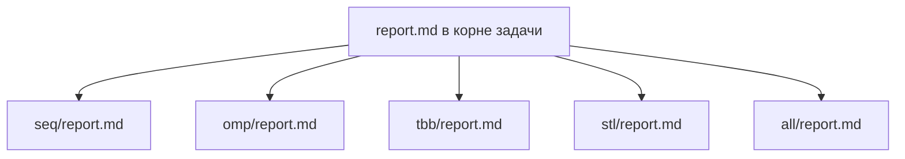

# Сортировка Хоара с нечётно-чётным слиянием Бэтчера

- **Студент:** Сметанин Дмитрий Владимирович, группа 3823Б1ПР3
- **Вариант:** 14
- **Каталог задачи:** `tasks/smetanin_d_hoare_even_odd_batchelor`
- **Локальные отчёты:**
  [seq/report.md](seq/report.md) · [omp/report.md](omp/report.md) · [tbb/report.md](tbb/report.md) ·
  [stl/report.md](stl/report.md) · [all/report.md](all/report.md)

Сводный отчёт: общая постановка, единая методика замеров, агрегированные результаты и сравнение пяти
реализаций без дублирования подробных листингов из локальных файлов.

---

## 1. Введение

Задача - отсортировать массив целых чисел алгоритмом на основе разбиения Хоара с нечётно-чётным
слиянием Бэтчера на каждом шаге разбиения (см. локальные отчёты). Это позволяет сравнить
последовательную базу, три модели внутрипроцессного параллелизма (OpenMP, oneTBB, `std::thread`) и
гибрид MPI + OpenMP с финальным слиянием на корне.

---

## 2. Единая постановка задачи

**Вход.** `std::vector<int>` произвольной длины.

**Выход.** Тот же размер, элементы упорядочены по **неубыванию**.

**Критерий корректности (функциональные тесты).** Совпадение с результатом полной сортировки эталона
(после генерации / `MPI_Bcast` в MPI-режиме).

**Критерий (перф-тесты).** `std::ranges::is_sorted` на детерминированном массиве размера **1 000 000**
(`input[i] = kSize_ - i`).

---

## 3. Единая методика эксперимента

**Окружение замеров.**

- **Процессор:** AMD Ryzen 5 5600H with Radeon Graphics
- **ОЗУ:** 16 ГБ
- **ОС:** Microsoft Windows 10
- **Компилятор:** MSVC 14.43 (Visual Studio 2022 Community)
- **Сборка:** Release
- **Open MPI:** MS-MPI (`mpiexec`)
- **oneTBB:** 2022.3.0
- **OpenMP:** OpenMP в составе MSVC

**Переменные окружения.** `PPC_NUM_THREADS` - потоки для OMP / TBB / STL и для локальной фазы ALL;
`PPC_NUM_PROC` - число MPI-процессов для ALL и функциональных MPI-прогонов. Лимиты времени:
`PPC_TASK_MAX_TIME`, `PPC_PERF_MAX_TIME`.

**Источник данных.** Функциональные тесты - случайные значения в диапазоне **[-10000, 10000]** для
размеров `0, 1, 2, 10, 100, 1000, 10000`. Перф-тест - массив длины **1 000 000**, описанный выше.

**Ускорение.** `speedup = T_seq / T_x`, где **T_seq = 0,493 с** - время SEQ в режиме `task_run` при
`PPC_NUM_PROC=1`, `PPC_NUM_THREADS=1` (см. [seq/report.md](seq/report.md)).

**Эффективность.**

- Для **OMP, TBB, STL:** `efficiency = speedup / threads · 100%`.
- Для **ALL:** `efficiency = speedup / (P · T) · 100%`, где `P = PPC_NUM_PROC`, `T = PPC_NUM_THREADS`.

**Повторы.** В инфраструктуре PPC (`modules/performance`) для каждого перф-теста выполняется 5 прогонов
измеряемого этапа; в консоль выводится среднее время одного прогона в секундах (режим `task_run` -
только `Run()` после подготовки пайплайна). Значения в списках ниже — одиночный такой прогон
`scripts/run_tests.py --running-type=performance` на указанном железе (без усреднения между несколькими
запусками скрипта).

---

## 4. Сводка корректности

Все backend-ы проходят общие `SmetaninDRunFuncTests` и `SmetaninDRunPerfTests`. Для ALL необходим запуск
функциональных тестов в режиме **processes** под управлением MPI runner курса.

**Фактический прогон (08.05.2026):** `scripts/run_tests.py --running-type=threads --counts 1 2 4` и
`--running-type=processes --counts 2 4` завершились без ошибок на машине с замерами (MS-MPI).

**Ограничения.** STL-версия использует ограниченное число потоков (`std::thread`) по схеме из
[stl/report.md](stl/report.md). TBB-версия использует волновую модель с `concurrent_vector` — см.
[tbb/report.md](tbb/report.md).

---

## 5. Агрегированные результаты

### 5.1 Сводка по характерным конфигурациям

- **SEQ**, 1 поток: **0,493 с**, ускорение к SEQ **1,00**.
- **OMP**, 4 потока: **0,258 с**, ускорение **1,91**.
- **TBB**, 4 потока: **0,299 с**, ускорение **1,65**.
- **STL**, 4 потока (`PPC_NUM_THREADS`; по факту два рабочих потока): **0,297 с**, ускорение **1,66**.
- **ALL**, P×T = 2×4: **0,792 с**, ускорение **0,62**.

### 5.2 Полные результаты

#### SEQ

- **SEQ, 1 поток:** **0,493 с**, ускорение **1,00**, эффективность не применима.

#### OMP

- **1 поток:** 0,512 с; ускорение 0,96; эффективность 96,2%.
- **2 потока:** 0,299 с; ускорение 1,65; эффективность 82,4%.
- **4 потока:** 0,258 с; ускорение 1,91; эффективность 47,7%.
- **8 потоков:** 1,023 с; ускорение 0,48; эффективность 6,0%.

#### TBB

- **1 поток:** 0,503 с; ускорение 0,98; эффективность 97,9%.
- **2 потока:** 0,298 с; ускорение 1,66; эффективность 82,8%.
- **4 потока:** 0,299 с; ускорение 1,65; эффективность 41,2%.
- **8 потоков:** 1,114 с; ускорение 0,44; эффективность 5,5%.

#### STL

- **1 поток:** 0,511 с; ускорение 0,96; эффективность 96,3%.
- **2 потока:** 0,293 с; ускорение 1,68; эффективность 84,0%.
- **4 потока:** 0,297 с; ускорение 1,66; эффективность 41,4%.
- **8 потоков:** 0,297 с; ускорение 1,66; эффективность 20,8%.

#### ALL

Ускорение от **T_seq = 0,493 с**, эффективность = speedup / (P·T).

- **P=1, T=1:** 1,060 с; ускорение 0,47; эффективность 46,5%.
- **P=1, T=2:** 0,824 с; ускорение 0,60; эффективность 29,9%.
- **P=1, T=4:** 0,814 с; ускорение 0,61; эффективность 15,1%.
- **P=1, T=8:** 1,681 с; ускорение 0,29; эффективность 3,7%.
- **P=2, T=1:** 0,842 с; ускорение 0,59; эффективность 29,2%.
- **P=2, T=2:** 0,805 с; ускорение 0,61; эффективность 15,3%.
- **P=2, T=4:** 0,792 с; ускорение 0,62; эффективность 7,8%.
- **P=4, T=1:** 0,814 с; ускорение 0,61; эффективность 15,1%.
- **P=4, T=2:** 0,808 с; ускорение 0,61; эффективность 7,6%.

---

## 6. Интерпретация различий

**SEQ.** Эталон времени и смысла алгоритма.

**OMP.** Задачи OpenMP на поддереве разбиений; масштабирование зависит от структуры дерева и порога
`kTaskCutoff`.

**TBB.** Параллелизм по «волнам» отрезков; накладные расходы concurrent-структур и планировщика.

**STL.** Один дополнительный поток на верхнем расколе; ожидаемо скромнее ускорение при большом числе
`PPC_NUM_THREADS`.

**ALL.** Цена `Scatterv`/`Gatherv`/`Bcast` и финального `std::ranges::sort` на всём массиве на корне;
выигрыш зависит от числа процессов и размера задачи.

По замерам на ноутбуке наибыстрее локальный OMP при 4 потоках (0,258 с). TBB и STL укладываются в ~0,30 с
при той же конфигурации; STL почти не улучшается после 2 потоков (один `std::thread`). При 8 потоках OMP
и TBB проигрывают SEQ - вероятны перегруз планировщика Windows и конкуренция за ресурсы. ALL на одном
узле с MS-MPI остаётся медленнее SEQ; лучший гибридный случай 2×4 (0,792 с) всё ещё хуже чистого OMP.

---

## 7. Репродуцируемость

```bash
git submodule update --init --recursive --depth=1
cmake -S . -B build -DUSE_FUNC_TESTS=ON -DUSE_PERF_TESTS=ON -DCMAKE_BUILD_TYPE=Release
cmake --build build --parallel

export PPC_NUM_THREADS=4
scripts/run_tests.py --running-type=threads --counts 1 2 4

export PPC_NUM_PROC=2
export PPC_NUM_THREADS=4
scripts/run_tests.py --running-type=processes --counts 2 4

scripts/run_tests.py --running-type=performance
```

---

## 8. Заключение

На использованной конфигурации (Ryzen 5 5600H, Windows 10, MSVC Release) для массива 10^6 элементов
оптимальна OMP-реализация при 4 потоках (~×1,9 к SEQ в режиме `task_run`). STL даёт умеренное
ускорение без роста при увеличении `PPC_NUM_THREADS` сверх 2. Версия ALL на одном узле из-за MPI и
финальной глобальной сортировки не оправдывает себя по времени относительно локальных потоков; имеет
смысл обсуждать её при многих узлах или больших n.

**Проверки корректности:** успешно выполнены `scripts/run_tests.py --running-type=threads --counts 1 2 4`
и `--running-type=processes --counts 2 4` (MS-MPI); перф-тесты —
`--running-type=performance` при различных `PPC_NUM_THREADS` и `PPC_NUM_PROC`.

---

## 9. Источники

1. [Спецификация OpenMP](https://www.openmp.org/specifications/).
2.
   [Документация oneTBB](https://www.intel.com/content/www/us/en/docs/onetbb/developer-guide-api-reference/).
3. [MPI Forum](https://www.mpi-forum.org/).
4. [cppreference — std::thread](https://en.cppreference.com/w/cpp/thread/thread).

---

## 10. Приложение

### 10.1 Структура отчётов



### 10.2 Типы задачи

В `common/include/common.hpp`: `InType = OutType = std::vector<int>`,
`TestType = std::tuple<int, std::string>`, `BaseTask = ppc::task::Task<InType, OutType>`. Все классы
реализаций переопределяют стандартный пайплайн PPC.
