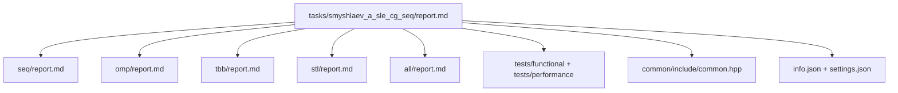

# Решение систем линейных уравнений методом сопряженных градиентов

- Student: Смышляев Александр Павлович, группа 3823Б1ФИ2
- Variant: 8
- Local reports: [seq/report.md](seq/report.md), [omp/report.md](omp/report.md), [tbb/report.md](tbb/report.md),
  [stl/report.md](stl/report.md), [all/report.md](all/report.md)

## 1. Введение

В данной работе исследуется производительность пяти различных реализаций метода сопряженных градиентов для решения СЛАУ.
Эта задача является классическим примером итерационного алгоритма, где на каждой итерации преобладают операции линейной
алгебры уровня 1 (dot product) и уровня 2 (matrix-vector multiplication). Задача идеально подходит для сравнения
различных моделей параллелизма, так как содержит как независимые вычисления, так и жесткие точки синхронизации.

## 2. Единая постановка задачи

Решается система уравнений $Ax = b$, где:

- $A$ — симметричная положительно определенная матрица размерности $N \times N$.
- $b$ — вектор свободных членов размерности $N$.
- $x$ — искомый вектор решения.

Критерий корректности: евклидова норма невязки $||Ax - b|| < 10^{-6}$. Ограничения: алгоритм должен сходиться за
конечное число итераций (не более $2N$) и корректно обрабатывать вырожденные случаи.

## 3. Единая методика эксперимента

- **Окружение:**
- **CPU:** 12th Gen Intel(R) Core(TM) i7-1255U (1.70 GHz, 10 ядер / 12 потоков).
- **RAM:** 16 GB.
- **ОС:** Windows 11 Pro.
- **Build type:** Release.
- **Compiler:** Microsoft Visual C++ (MSVC).
- **Методика:**
  - Размер тестовой системы: $3000 \times 3000$.
  - Для каждой технологии снимались показатели времени в режиме `task_run`.
  - Ускорение считалось как $T_{seq} / T_{parallel}$.
  - Эффективность считалась как $S / p$, где $p$ — число работников.

## 4. Сводка корректности

Все пять реализаций успешно прошли набор функциональных тестов (кейсы $2\times2$, $3\times3$, $4\times4$). При проверке
производительности на системе $3000 \times 3000$ каждый backend выдал результат, совпадающий с эталонным вектором (все
единицы) с погрешностью менее $10^{-7}$, что подтверждает математическую эквивалентность параллельных схем
последовательному алгоритму.

## 5. Агрегированные результаты

В таблице ниже представлены лучшие показатели для каждого backend-а при разных конфигурациях потоков.

| Backend | Конфигурация        | Время (с) | Ускорение ($S$) | Эффективность ($E$) | Примечание                   |
| ------- | ------------------- | --------- | --------------- | ------------------- | ---------------------------- |
| **SEQ** | 1 thread            | 0.1282    | 1.00            | 100%                | Baseline                     |
| **OMP** | 8 threads           | 0.0719    | 1.78            | 22.2%               | Насыщение после 2 ядер       |
| **TBB** | 8 workers           | 0.0434    | 2.95            | 36.9%               | **Лидер производительности** |
| **STL** | 8 threads           | 0.4688    | 0.27            | 3.4%                | Значительное замедление      |
| **ALL** | 2 ranks × 4 threads | 0.1008    | 1.27            | 15.8%               | Hybrid (MPI + OMP)           |

### График производительности (Task Run)

_На графиках в локальных отчетах видна следующая динамика: TBB показывает стабильный рост, OMP имеет плато после 4
потоков, STL демонстрирует линейную деградацию._

## 6. Интерпретация различий

1. **SEQ (Эталон):** Использование одномерного массива `flat_A_` обеспечило высокую локальность данных, что дало очень
   сильный базовый результат (0.128 с).
2. **oneTBB (Победитель):** Показал лучший результат (ускорение почти в 3 раза). Это связано с механизмом
   _work-stealing_. В процессоре i7-1255U только 2 ядра являются мощными (P-cores). TBB эффективно перебрасывал задачи с
   медленных E-ядер на освободившиеся P-ядра, минимизируя общее время ожидания.
3. **OpenMP:** Показал хороший результат на 2 потоках, но на 8 потоках не смог догнать TBB. Это связано со статическим
   распределением итераций, которое в условиях разной производительности ядер (P и E) приводит к тому, что быстрые ядра
   простаивают, ожидая медленные в точках барьерной синхронизации.
4. **STL (Провал):** Время выполнения выросло почти в 4 раза относительно последовательной версии. Причина: создание и
   `join` потоков внутри каждой вычислительной функции. При 6000 итерациях и 3-4 функциях на итерацию ОС тратит
   колоссальные ресурсы на системные вызовы. Это доказывает неприменимость "сырых" `std::thread` без пула потоков для
   мелкозернистого параллелизма.
5. **ALL (MPI + OMP):** Гибридная версия работает быстрее последовательной, но медленнее чистых OMP/TBB. Основной
   ограничитель — `MPI_Allgatherv`, который на каждой итерации должен синхронизировать вектор $p$ между процессами. Цена
   коммуникации в рамках одного CPU выше, чем цена обмена через общую память.

## 7. Репродуцируемость

Для воспроизведения результатов необходимо выполнить следующие команды:

```bash
# Сборка
cmake -S . -B build -D ENABLE_ADDRESS_SANITIZER=ON -D CMAKE_BUILD_TYPE=RelWithDebInfo
cmake --build build --config Release --parallel

# Запуск последовательной версии
build/bin/ppc_perf_tests.exe --gtest_filter=*Smyshlaev*seq_enabled*

# Запуск OMP/TBB/STL (пример для 4 потоков)
export PPC_NUM_THREADS=4
build/bin/ppc_perf_tests.exe --gtest_filter=*Smyshlaev*omp_enabled*

# Запуск гибридной версии (2 процесса)
export PPC_NUM_THREADS=4
mpiexec -n 2 build/bin/ppc_perf_tests.exe --gtest_filter=*Smyshlaev*all_enabled*
```

## 8. Заключение

Наилучшей технологией для решения СЛАУ методом сопряженных градиентов на современных многоядерных процессорах со
смешанной архитектурой (P/E-ядра) является **oneTBB**. Она обеспечивает наилучшую балансировку нагрузки. Использование
`std::thread` без пула потоков в итерационных методах категорически не рекомендуется. Гибридная схема (MPI+OMP)
демонстрирует жизнеспособность, но требует очень больших объемов данных для компенсации затрат на межпроцессное
взаимодействие.

## 9. Источники

1. Материалы курса «Параллельное программирование», репозиторий [ppc-2026-threads][repo-ppc].
2. Лекции Сысоева А. В. (в т. ч. теоретические основы метода сопряженных градиентов и гибридные вычисления).
3. Shewchuk J. R. _An Introduction to the Conjugate Gradient Method Without the Agonizing Pain_ (математическое
   обоснование и итерационные схемы).
4. [OpenMP](https://www.openmp.org/) — спецификации и примеры использования директив.
5. [oneTBB (Intel / UXL)][onetbb-doc] — документация по параллельным алгоритмам и редукциям.
6. [MPI Forum](https://www.mpi-forum.org/) — стандарт передачи сообщений.
7. [cppreference.com](https://en.cppreference.com/) — справочные материалы по `std::thread`, `std::accumulate` и
   управлению памятью.

[repo-ppc]: https://github.com/learning-process/ppc-2026-threads
[onetbb-doc]: https://www.intel.com/content/www/us/en/developer/tools/oneapi/onetbb.html

## 10. Приложение: схема отчётности и кода

## 10. Приложение: схема отчётности и кода


