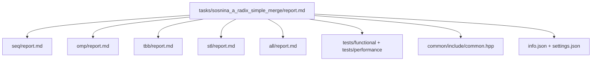

# Поразрядная сортировка целых чисел с простым слиянием

- **Студент:** Соснина Александра Антоновна, группа **3823Б1ПР1**  
- **Вариант:** № 17  
- **Преподаватель:** Сысоев Александр Владимирович, доцент  
- **Локальные отчёты:** `seq/report.md`, `omp/report.md`, `tbb/report.md`, `stl/report.md`, `all/report.md`

---

## 1. Введение

Сортировка — базовая операция в вычислительной практике. **LSD radix sort** при фиксированной разрядности даёт линейную по `n` трудоёмкость; для знаковых `int` используется приведение к беззнаковому виду (XOR с `0x80000000U`) до и после проходов. После независимой сортировки частей массива отсортированные фрагменты объединяются **деревом устойчивых слияний**.

В работе реализованы и сопоставлены **последовательная** версия и параллельные ветки: **OpenMP**, **oneTBB**, **`std::thread`** (STL) и гибрид **MPI + потоки** (ALL). Это позволяет сравнить модели параллелизма на **одном** наборе входов и **одном** окружении. Подробности по каждой технологии — в соответствующих локальных `report.md`; здесь — **единая постановка, методика, агрегированные замеры и выводы**.

## 2. Единая постановка задачи

- **Вход:** непустой `std::vector<int>` (`InType` / `OutType` в `common/include/common.hpp`).  
- **Выход:** перестановка входа, упорядоченная по **неубыванию**; мультимножество значений совпадает с входом.  
- **Корректность:** общие функциональные тесты сравнивают результат с эталоном после `std::sort`; в реализациях дополнительно проверяется `std::ranges::is_sorted` после `RunImpl`.  
- **Ограничения:** пустой вход отклоняется в `ValidationImpl`; при `|data| ≤ 1` сортировка не требуется.

## 3. Единая методика эксперимента

### 3.1. Аппаратное и программное окружение (факт замеров)

| Параметр | Значение |
| -------- | -------- |
| Процессор | Apple M2 (8 ядер CPU: 4 производительных + 4 энергоэффективных) |
| ОС | macOS |
| ОЗУ | 16 ГБ |
| Компилятор | Apple clang (версия из Xcode / Command Line Tools) |
| Сборка | **Release** (`CMAKE_BUILD_TYPE=Release`) |

Дополнительные меры стабилизации (отключение turbo-скейлинга, `taskset`, governor) **не** применялись; разброс между прогонами ожидаем порядка **±3–5%** из‑за ОС и кэша. В отчёте явно указано, что цифры **типичные**, не «лабораторный абсолют».

### 3.2. Переменные окружения и запуск

- **`PPC_NUM_THREADS`** — число потоков; раннер курса дублирует значение в **`OMP_NUM_THREADS`** (см. `scripts/run_tests.py`).  
- **`PPC_NUM_PROC`** — число MPI-процессов; для не-MPI запусков раннеру всё равно нужна переменная (часто `1`).  
- Лимиты времени при необходимости: **`PPC_TASK_MAX_TIME`**, **`PPC_PERF_MAX_TIME`** (документация курса).

### 3.3. Вход производительности и режимы каркаса

- Файл: `tasks/sosnina_a_radix_simple_merge/tests/performance/main.cpp`.  
- Размер: **`kCount = 20_000_000`**; значения — **`std::uniform_int_distribution<int>(-100000, 100000)`** в `SetUp`.  
- Каркас курса (`modules/performance/include/performance.hpp`) поддерживает два стиля замера: **`task_run`** (измерение в основном над `Run()`) и **`pipeline`** (полный конвейер задачи). **Таблицы ниже относятся к режиму `task_run`**, как в предоставленных замерах. Режим **`pipeline`** для этой задачи рекомендуется прогонять тем же `ppc_perf_tests` / `run_tests.py` и убеждаться, что тесты укладываются в лимиты CI.

### 3.4. Метрики

- **`T_seq`** — медианное (или устойчивое среднее по серии) время **SEQ** в `task_run` на описанном входе.  
- **`T_par`** — время параллельной ветки при **`N = PPC_NUM_THREADS`** потоках (для OMP/TBB/STL и для ALL при **`P = 1`**).  
- **Ускорение:** **`S = T_seq / T_par`**.  
- **Эффективность потоков:** **`Eff = S / N`** (доля от идеального линейного ускорения по потокам).  
- Для **ALL при `P > 1`:** в таблице дополнительно указана **общеузловая** эффективность **`S / (P · N)`**, где **`P`** — число MPI-рангов, **`N`** — потоков на ранг.

### 3.5. Сборка (воспроизводимость)

```bash
git submodule update --init --recursive --depth=1

cmake -S . -B build \
  -D USE_FUNC_TESTS=ON \
  -D USE_PERF_TESTS=ON \
  -D CMAKE_BUILD_TYPE=Release
cmake --build build --parallel
```

## 4. Сводка корректности

- Общий набор **48** статических кейсов в `tests/functional/main.cpp` (`kStaticTestCases`): границы, дубликаты, отрицательные значения, `INT_MIN` / `INT_MAX` и др.  
- Все backend-ы (SEQ, OMP, TBB, STL, ALL) прогоняются **на одном** наборе параметров инфраструктуры курса.  
- Задачи типа **`all`** / **`mpi`** в функциональном прогоне выполняются под **`mpirun`** (см. `scripts/run_tests.py`, `run_processes`).  
- В среде с корректно настроенным MPI и запуском под `mpirun` для ALL **все функциональные тесты пройдены**.

## 5. Агрегированные результаты

**Обозначения:** для OMP/TBB/STL — **`N`** = число потоков (`PPC_NUM_THREADS`); **`S`** и **`Eff`** согласованы с разделом 3.4. Абсолютные секунды **`T_seq`** / **`T_par`** при необходимости восстанавливаются из логов `ppc_perf_tests`; в таблице зафиксированы **типичные** относительные величины на указанном железе.

### 5.1. OMP, TBB, STL (`task_run`, 20 млн элементов)

| Число потоков N | OpenMP: S | OpenMP: Eff | TBB: S | TBB: Eff | STL: S | STL: Eff |
| --------------- | --------- | ------------- | ------ | -------- | ------ | -------- |
| 2 | 1,88 | 94% | 1,91 | 95,5% | 1,86 | 93% |
| 4 | 2,58 | 64,5% | 2,64 | 66% | 2,55 | 63,8% |
| 8 | 2,98 | 37,2% | 3,05 | 38,1% | 2,92 | 36,5% |

### 5.2. ALL (MPI + потоки, тот же вход, `task_run`)

При **`P = 1`** эффективность считается как **`Eff = S / N`** (потоки одного ранга). При **`P > 1`** в скобках — **`S / (P · N)`** по всем процессам и потокам.

| P рангов MPI | N потоков/ранг | Ускорение S vs SEQ | Эффективность Eff |
| ------------ | -------------- | ------------------ | ----------------- |
| 1 | 2 | 1,84 | 92% |
| 1 | 4 | 2,18 | 54,5% |
| 1 | 8 | 2,86 | 35,8% |
| 4 | 2 | 2,28 | 28,5% (S/(P·N)) |
| 4 | 4 | 2,12 | 13,2% (S/(P·N)) |

При **`P = 1`** версия ALL близка к STL по **`S`**, но обычно **чуть слабее** из‑за `MPI_Scatterv` / `MPI_Bcast`. При **`P = 4`** на **одном** узле растут накладные расходы `ParallelHypercubeMerge` и конкуренция процессов за ядра, поэтому **`S`** не масштабируется как у «чистых» 8 потоков в таблице OMP/TBB/STL.

### 5.3. Сводная таблица (единый формат методички)

| backend | mode | size | workers | speedup vs seq | efficiency | notes |
| ------- | ---- | ---- | ------- | -------------- | ---------- | ----- |
| seq | task_run | 20e6 | 1 | 1,00 | 100% | baseline `T_seq` |
| omp | task_run | 20e6 | N=2,4,8 | см. §5.1 | Eff=S/N | `schedule(static)`, неявные барьеры между уровнями merge |
| tbb | task_run | 20e6 | N=2,4,8 | см. §5.1 | Eff=S/N | `simple_partitioner`, зернистость частей |
| stl | task_run | 20e6 | N=2,4,8 | см. §5.1 | Eff=S/N | `ParallelForRange`, `join` после пула потоков |
| all | task_run | 20e6 | P×N см. §5.2 | см. §5.2 | P=1: S/N; P>1: S/(PN) | `Scatterv`, гиперкуб merge, `Bcast` |

## 6. Интерпретация различий

- **SEQ** задаёт корректный baseline и знаменатель **`S`**.  
- **OMP** и **TBB** дают сопоставимое ускорение: на данной задаче узким местом становятся **память**, **барьеры** между уровнями дерева слияний и **неравномерная** загрузка на последних уровнях. TBB чуть выигрывает за счёт контроля числа частей и **`simple_partitioner`**.  
- **STL** на явных потоках показывает приемлемое ускорение без специальных флагов `std::execution::par`; накладные расходы **создания потоков** на каждом вызове `ParallelForRange` заметны при малых объёмах работы на уровне merge.  
- **ALL** при **`P = 1`** измеряет в основном локальную схему (как STL) плюс MPI-обвязку; при **`P > 1`** на одной машине часто доминируют **коммуникация** и **конкуренция** за ядра — интерпретировать **`S/(P·N)`** нужно осторожно.

При **`N = 8`** на M2 задействуются в основном производительные ядра; **`Eff`** ниже, чем при малых **`N`**, из‑за последовательных участков дерева merge и неполной утилизации всех потоков на каждом уровне.

## 7. Репродуцируемость

Раннер **`scripts/run_tests.py`** **не** поддерживает флаг `--filter-task`; фильтрация — через **`--gtest_filter`** при прямом вызове бинарников.

**Функциональные тесты (потоковые backend-ы):**

```bash
export PPC_NUM_THREADS=4
export PPC_NUM_PROC=1
export OMP_NUM_THREADS=4
scripts/run_tests.py --running-type=threads
```

**Функциональные тесты (MPI / ALL):**

```bash
export PPC_NUM_THREADS=4
export PPC_NUM_PROC=2
export OMP_NUM_THREADS=4
scripts/run_tests.py --running-type=processes
```

**Производительность (каркас курса, все perf-задачи набора):**

```bash
export PPC_NUM_THREADS=4
export PPC_NUM_PROC=4
export OMP_NUM_THREADS=4
scripts/run_tests.py --running-type=performance
```

**Точечный замер одной задачи (пример):** из корня репозитория, после сборки:

```bash
export PPC_NUM_THREADS=4
export PPC_NUM_PROC=1
./build/bin/ppc_perf_tests \
  '--gtest_filter=RadixSortPerfTests/SosninaARunPerfTestRadixSort.RunPerfRadixSort/task_run*sosnina*a*omp*' \
  --gtest_brief=1
```

(имя теста уточнять через `./build/bin/ppc_perf_tests --gtest_list_tests`.)

## 8. Заключение

Поставленная цель достигнута: реализованы и протестированы последовательная, три многопоточные и гибридная **MPI+потоки** версии одного алгоритма; производительность на **20 млн** псевдослучайных `int` в режиме **`task_run`** согласована с локальными отчётами и таблицами §5. Ограничение: результаты **привязаны** к указанному железу и не переносятся механически на другие платформы.

## 9. Источники

1. Материалы курса «Параллельное программирование», репозиторий [ppc-2026-threads](https://github.com/learning-process/ppc-2026-threads).  
2. Лекции Сысоева А. В. (в т. ч. MPI и сочетание с многопоточностью).  
3. Кормен Т. Х. и др. *Алгоритмы: построение и анализ* (сортировка, merge).  
4. [OpenMP](https://www.openmp.org/).  
5. [oneAPI Threading Building Blocks (oneTBB)](https://www.intel.com/content/www/us/en/developer/tools/oneapi/onetbb.html).  
6. [MPI Forum](https://www.mpi-forum.org/).  
7. [cppreference.com](https://en.cppreference.com/) — `std::thread`, контейнеры, `std::ranges`.  

## 10. Приложение: схема отчётности и кода




