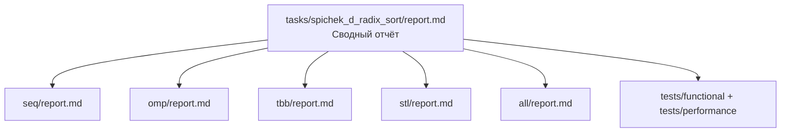

# Поразрядная сортировка для целых чисел с простым слиянием
- Student: Спичек Денис Игоревич
- Variant: 17
- Local reports: `seq/report.md`, `omp/report.md`, `tbb/report.md`, `stl/report.md`, `all/report.md`

## 1. Введение
В данном проекте исследуется эффективность различных технологий параллельного программирования (OpenMP, Intel oneTBB, C++ `std::thread` и MPI) на примере алгоритма поразрядной сортировки (Radix Sort). Цель работы — определить наиболее эффективный backend для данной задачи, исследовать масштабируемость алгоритма и выявить потенциальные узкие места, возникающие при увеличении числа вычислительных потоков.

## 2. Единая постановка задачи
Требуется упорядочить вектор целых чисел (`std::vector<int>`) по неубыванию.
Особенности и ограничения:
* Наличие отрицательных и положительных чисел.
* Наличие повторяющихся элементов.
* Поддержка пустых и уже отсортированных (в том числе в обратном порядке) массивов.
* Критерий корректности: полное совпадение логики работы с функцией `std::ranges::is_sorted`.

## 3. Единая методика эксперимента
Эксперименты проводились в единой среде для обеспечения честного сравнения:
* **Окружение:** Ноутбук Lenovo LOQ, Linux (WSL2 / Ubuntu).
* **Сборка:** CMake, `CMAKE_BUILD_TYPE=Release`, компилятор GCC/Clang (C++20).
* **Размер задачи:** 5 000 000 элементов случайного распределения `[-100000, 100000]`.
* **Измеряемые конфигурации:** 4 потока (`PPC_NUM_THREADS=4`) и 8 потоков (`PPC_NUM_THREADS=8`).
* **Метрики:** Ускорение вычислялось как $S = T_{seq} / T_{parallel}$. Эффективность вычислялась как $E = S / p$, где $p$ — число потоков (для версии ALL учитывалось количество потоков на нулевом ранге, так как остальные ранги простаивают).

## 4. Сводка корректности
Все пять backend-ов успешно прошли функциональное тестирование (фреймворк Google Test). Алгоритмическая целостность подтверждена:
* Сдвиг значений (вычитание/прибавление `min_val`) корректно нивелирует проблему отрицательных чисел для Radix Sort во всех реализациях.
* В параллельных версиях не выявлено состояний гонки (Data Race) благодаря строгой изоляции обрабатываемых блоков памяти и отсутствию конкурентной записи.

## 5. Агрегированные результаты
В таблице ниже приведены данные для режима **task_run** (как наиболее репрезентативного для чистых вычислений). За базовое время ($T_{seq}$) бралось время SEQ при соответствующем запуске (около 0.111 с для серии 4 потоков и 0.101 с для серии 8 потоков).

| Technology | Конфигурация | Время (секунды) | Ускорение (S) | Эффективность (E) |
|---|---|---|---|---|
| **SEQ** | 1 поток (baseline) | 0.111403 | 1.00 | 100% |
| **ALL** | 2 proc × 4 threads | 0.020243 | ~5.50 | ~137% |
| **TBB** | 4 threads | 0.022852 | ~4.87 | ~121% |
| **OMP** | 4 threads | 0.026521 | ~4.19 | ~105% |
| **STL** | 4 threads | 0.026802 | ~4.15 | ~103% |
|---|---|---|---|---|
| **SEQ** | 1 поток (baseline) | 0.101198 | 1.00 | 100% |
| **ALL** | 4 proc × 8 threads | 0.025578 | ~3.95 | ~49% |
| **TBB** | 8 threads | 0.025567 | ~3.95 | ~49% |
| **OMP** | 8 threads | 0.028397 | ~3.56 | ~44% |
| **STL** | 8 threads | 0.029562 | ~3.42 | ~42% |

*Примечание: Эффективность > 100% на 4 потоках обусловлена алгоритмической оптимизацией. Последовательная версия сортирует числа по основанию 10, тогда как локальные сортировки во всех параллельных реализациях используют битовые сдвиги и основание 256, сокращая количество проходов.*

## 6. Интерпретация различий
* **SEQ:** Задает надежную базовую линию. Линейная асимптотика $O(n)$ хорошо справляется с задачей, но упирается в частоту одного ядра.
* **OMP и STL:** Показывают практически идентичные результаты (разница в тысячные доли секунды). Обе технологии используют статическое распределение блоков и несут одинаковые накладные расходы на последовательное слияние.
* **TBB и ALL:** Показывают лучшее время. ALL-версия по факту делегирует работу TBB внутри нулевого ранга. TBB эффективнее управляет пулом потоков и лучше утилизирует кэш процессора по сравнению с созданием системных потоков "с нуля" в `std::thread`.
* **Деградация на 8 потоках (Парадокс масштабирования):** Переход с 4 на 8 потоков привел к **замедлению** всех параллельных алгоритмов. Это связано с:
  1. *Memory Bound ограничением:* 8 потоков создают избыточную конкуренцию за пропускную способность памяти при перекладывании элементов из `data` в `output`.
  2. *Законом Амдала:* Чем больше потоков, тем больше блоков (8 вместо 4) главному потоку приходится последовательно сливать через `std::ranges::merge`. На 8 потоках время последовательного слияния начинает превышать выигрыш от распараллеливания сортировки.

## 7. Репродуцируемость
Сборка проекта:
```bash
cmake -S . -B build -D USE_FUNC_TESTS=ON -D USE_PERF_TESTS=ON -D CMAKE_BUILD_TYPE=Release
cmake --build build --parallel
```
Запуск тестов производительности с заданным числом потоков:
```bash
export PPC_NUM_THREADS=4
export PPC_NUM_PROC=2
./build/bin/ppc_perf_tests --gtest_filter=*Spichek*
```

## 8. Заключение
Наилучшую производительность для алгоритма поразрядной сортировки (LSD Radix Sort) с простым слиянием на заданном объеме данных продемонстрировала связка **Intel oneTBB (в том числе внутри гибридной ALL-версии) при использовании 4 вычислительных потоков**. 

Тестирование выявило важную архитектурную проблему: выбранный метод декомпозиции (Data Parallelism с последующим последовательным слиянием) плохо масштабируется при $>4$ потоках из-за упора в пропускную способность оперативной памяти и линейного роста накладных расходов на фазе слияния. Для дальнейшего улучшения масштабируемости потребуется реализация параллельного слияния (Parallel Merge) и более тонкая настройка работы с кэш-памятью процессора.

## 9. Источники
* Спецификация OpenMP
* Документация oneTBB (UXL Foundation)
* Стандарт MPI Forum
* Официальная справка cppreference (`std::thread`, `std::ranges`)

## 10. Приложение
### Архитектура проекта и отчетов
