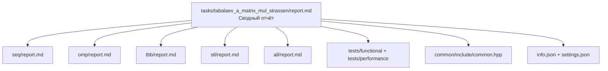

# Умножение плотных матриц. Алгоритм Штрассена

- **Student:** Табалаев Антон Максимович, 3823Б1ПР1
- **Variant:** 3
- **Local reports:** [seq/report.md](seq/report.md), [omp/report.md](omp/report.md),
  [tbb/report.md](tbb/report.md), [stl/report.md](stl/report.md), [all/report.md](all/report.md)

## 1. Введение

Задача умножения плотных матриц — фундаментальная операция линейной алгебры,
используемая во многих вычислительных задачах. Алгоритм Штрассена снижает асимптотическую
сложность с $O(N^3)$ до $O(N^{2.81})$ ценой более сложного управления памятью.
Этот алгоритм интересен для сравнения разных моделей параллелизма, так как содержит
как регулярные поэлементные операции (сложение, вычитание, копирование), так и независимые
подзадачи (7 умножений $P_1 \dots P_7$ на верхнем уровне рекурсии).

В работе реализованы и протестированы пять backend-ов:

- **SEQ** – последовательный эталон (итеративный стек фреймов).
- **OMP** – распараллеливание через OpenMP (директивы `parallel for`).
- **TBB** – задачно-ориентированное распараллеливание через oneTBB.
- **STL** – ручное управление потоками `std::thread`.
- **ALL** – гибрид MPI + OpenMP (распределение 7 подзадач между процессами,
  внутри процесса – OpenMP).

## 2. Единая постановка задачи

**Вход:** структура `MatrixData` (размеры `a_rows`, `a_cols_b_rows`, `b_cols` и
векторы `a`, `b`).  
**Выход:** вектор `double` – результирующая матрица `a_rows × b_cols`.  
**Ограничения:** все размерности > 0, размеры векторов соответствуют размерностям.  
**Корректность:** результат должен совпадать с точностью $10^{-8}$ (проверяется функциональными тестами).  

## 3. Единая методика эксперимента

**Окружение:**

- CPU: AMD Ryzen 5 5600X (6 ядер, 12 потоков)
- RAM: 16 ГБ, 3400 МГц
- OS: Windows 11 Pro + WSL 2 (Ubuntu 24.04.4 LTS)
- Компилятор: GCC 13.2.0
- Сборка: Release

**Переменные окружения:**

- `PPC_NUM_THREADS` – число потоков для OMP, TBB, STL.
- `PPC_NUM_PROC` – число MPI‑процессов (для ALL).
- `OMP_NUM_THREADS` – для OpenMP внутри ALL и OMP.

**Размер задачи:** квадратные матрицы 512×512.
**Измерения:** для каждой конфигурации выполнено 3–5 запусков, в таблицах
приведена **медиана** времени в режиме `task_run`.  
**Ускорение:** $S = T_{\text{seq}} / T_p$, где $T_{\text{seq}} = 0.039966$ с.  
**Эффективность:** $E = S / p$ (где $p$ – общее число работников: потоков для
OMP/TBB/STL, `рангов × потоков` для ALL).

## 4. Сводка корректности

Все пять backend-ов прошли одинаковый набор из 6 функциональных тестов. Сравнение покомпонентное, с допуском
`constexpr double kEpsilon = 1e-8`.

| Размер   | Тип                        |
|----------|----------------------------|
| 3×3      | SmallPadded                |
| 4×4      | SmallPowerOfTwo_4x4        |
| 15×15    | MediumPadded               |
| 16×16    | MediumPowerOfTwo_16x16     |
| 255×255  | LargePadded                |
| 256×256  | LargePowerOfTwo_256x256    |

## 5. Агрегированные результаты

Таблица содержит лучшие (или наиболее показательные) конфигурации для каждого
backend-а. Полные таблицы – в локальных отчётах.

| Backend | Конфигурация           | Всего работников | Время (с) | Ускорение | Эффективность |
|---------|------------------------|------------------|-----------|-----------|---------------|
| SEQ     | 1 поток                | 1                | 0.039966  | 1.00x     | 100%          |
| OMP     | 4 потока               | 4                | 0.015324  | 2.61x     | 65.2%         |
| TBB     | 4 потока               | 4                | 0.016463  | 2.43x     | 60.7%         |
| STL     | 2 потока               | 2                | 0.025827  | 1.55x     | 77.5%         |
| ALL     | 4×2 (ранги×потоки)     | 8                | 0.012645  | 3.16x     | 39.5%         |

## 6. Интерпретация различий

**SEQ (baseline)** – даёт честное время для одного потока, служит знаменателем.
Не содержит синхронизационных накладных расходов.

**OMP** – хорошее ускорение до 2.61x на 4 потоках, эффективность 65%. Ускорение на 2 потоках
(2.14x) связано с увеличенным порогом `kBaseCaseSize=128` (против 32 в SEQ)
и улучшенной локальностью кэша. Узкое место – память.

**TBB** – аналогично OMP (ускорение 2.43x на 4 потоках), но немного уступает
из-за более высоких накладных расходов планировщика. Задачный подход удобен,
но для данной задачи не даёт преимущества перед OpenMP.

**STL** – ручное управление потоками даёт лишь 1.55x на 2 потоках, а при 4 и 6
потоках ускорение не растёт. Причина – многократное создание/уничтожение потоков
при каждом вызове `RunParallel`.

**ALL (MPI+OpenMP)** – лучший результат (3.16x) достигается за счёт двух
уровней параллелизма: 4 MPI процесса распределяют 7 подзадач, а внутри каждого
процесса 2 потока OpenMP ускоряют поэлементные операции.

## 7. Репродуцируемость

**Сборка:**

```bash
git submodule update --init --recursive --depth=1
cmake -S . -B build -DCMAKE_BUILD_TYPE=Release
cmake --build build --parallel
```

**Функциональные тесты (для всех backend-ов):**

```bash
./build/bin/ppc_func_tests --gtest_filter=*tabalaev_a_matrix_mul_strassen*
```

**Тесты производительности (пример для OMP, TBB, STL):**

```bash
OMP_NUM_THREADS=4 ./build/bin/ppc_perf_tests --gtest_filter=*tabalaev_a_matrix_mul_strassen_omp*

export PPC_NUM_THREADS=4
./build/bin/ppc_perf_tests --gtest_filter=*tabalaev_a_matrix_mul_strassen_tbb*
./build/bin/ppc_perf_tests --gtest_filter=*tabalaev_a_matrix_mul_strassen_stl*
```

**Гибридная версия (ALL):**

```bash
export PPC_NUM_PROC=4
export PPC_NUM_THREADS=2
mpiexec -n $PPC_NUM_PROC ./build/bin/ppc_perf_tests \
    --gtest_filter=*tabalaev_a_matrix_mul_strassen_all*
```

## 8. Заключение

На тестовой матрице 512×512 гибридная MPI+OpenMP реализация (ALL) показала
лучшее ускорение – **3.16x** (при 4 процессах × 2 потока). Однако
с практической точки зрения **OpenMP** даёт более чем достаточное ускорение
(2.61x) при значительно меньшей сложности кода.

**Ограничения:** алгоритм Штрассена остаётся memory‑bound, поэтому дальнейшее
увеличение числа работников (>8–12) не приносит выигрыша.

## 9. Источники

- Лекции Сысоева А. В. по курсу «Параллельное программирование для систем с общей памятью».
- Документация курса «Параллельное программирование».
- OpenMP Specification (<https://www.openmp.org/spec-html/5.0/openmp.html>)
- CppReference (<https://cppreference.com>)
- Microsoft Learn (<https://learn.microsoft.com>)

## 10. Приложение

**Структура отчётов:**  


