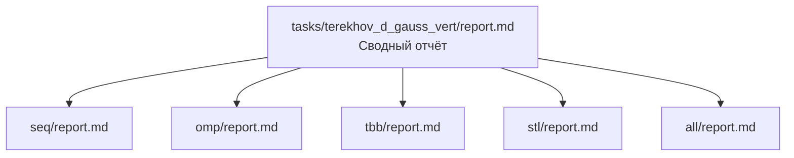

# Линейная фильтрация изображений (вертикальное разбиение). Ядро Гаусса 3x3

- Student: Терехов Дмитрий Юрьевич, группа 3823Б1ПР4
- Variant: Линейная фильтрация (вертикальное разбиение), ядро Гаусса 3x3 (25)
- Local reports: [SEQ](seq/report.md), [OMP](omp/report.md), [TBB](tbb/report.md), [STL](stl/report.md), [ALL](all/report.md)

## 1. Введение

В данном проекте исследуется производительность различных технологий параллельного программирования
(OpenMP, TBB, std::thread, MPI) на примере задачи линейной фильтрации изображений. Алгоритм Гаусса 3x3
требует интенсивного доступа к памяти и выполнения арифметических операций над каждым пикселем, что делает
задачу репрезентативной для оценки накладных расходов на параллелизацию.

## 2. Единая постановка задачи

- **Вход**: Изображение размером $W \times H$.
- **Выход**: Изображение аналогичного размера после применения маски свёртки.
- **Алгоритм**: Для каждого пикселя вычисляется взвешенная сумма соседних пикселей 3x3. Граничные
условия обрабатываются методом зеркального отражения (padding).
- **Критерий корректности**: Полное совпадение результатов всех параллельных реализаций с последовательным
эталоном (SEQ) с учётом погрешности округления `std::lround`.

## 3. Единая методика эксперимента

- **Процессор**: Intel Core i5-10400F (6 ядер, 12 потоков).
- **ОЗУ**: 32 GB DDR4.
- **ОС**: Windows 10 (среда исполнения Docker/Ubuntu).
- **Сборка**: Release, использование CMake.
- **Размер данных**: Изображение 10,000,000 пикселей (~3162x3162).
- **Методика замера**: Использование каркаса `ppc_perf_tests`. Время замеряется в секундах как
медианное значение выполнения фазы `RunImpl`.

## 4. Сводка корректности

Все пять реализаций (SEQ, OMP, TBB, STL, ALL) успешно прошли набор функциональных тестов
`GaussFilterTests`. Проверена устойчивость алгоритмов на малых (16x16) и больших (1024x1024)
изображениях, а также отсутствие гонок данных при работе с общим буфером памяти.

## 5. Агрегированные результаты

Сводная таблица производительности (режим `task_run`):

| Backend | p=1 (sec) | p=2 (sec) | p=4 (sec) | Max Speedup |
| :--- | :--- | :--- | :--- | :--- |
| **SEQ** | 0.0809 | - | - | 1.00 |
| **OMP** | 0.0596 | 0.0611 | 0.0751 | 1.35 |
| **TBB** | 0.0917 | 0.0909 | 0.1238 | 0.89 |
| **STL** | 0.0871 | 0.0918 | 0.1047 | 0.92 |
| **ALL** | 0.1005 | 0.0674 | 0.0676 | 1.20 |

## 6. Интерпретация различий

1. **OMP**: Показал лучшее время на 1 потоке за счёт оптимизаций внутри параллельной области.
Деградация на 4 потоках вызвана фиксированным малым количеством полос (4), что увеличивает
долю накладных расходов.
2. **TBB и STL**: Демонстрируют накладные расходы на создание потоков и планирование задач.
На данных объёмах (10 Мп) эти затраты сопоставимы с временем полезных вычислений.
3. **ALL (MPI+OpenMP)**: Гибридная схема показала лучшую масштабируемость. Разделение данных на
уровне процессов (MPI) позволило эффективнее работать с кэш-памятью и достичь стабильного
времени 0.067с при $p \ge 2$.

## 7. Репродуцируемость

Для воспроизведения результатов необходимо выполнить команды:

```bash
cmake -S . -B build -D CMAKE_BUILD_TYPE=Release
cmake --build build --parallel
# Запуск всех перформанс тестов
./build/bin/ppc_perf_tests
```

## 8. Заключение

Наиболее эффективной технологией для данной задачи на тестовом стенде оказалась гибридная
модель ALL и OpenMP. Реализации на **TBB** и **STL** требуют оптимизации декомпозиции
(увеличения количества подзадач) для преодоления порога накладных расходов библиотек.

## 9. Источники

- Официальная документация OpenMP (Спецификация 5.0).
- Документация Intel oneTBB (UXL Foundation).
- Стандарт MPI Forum (MPI 3.1).
- Методическое руководство курса «Параллельное программирование».

## 10. Приложение

### Схема структуры проекта



### Визуализация времени выполнения (Gantt)

```mermaid
gantt
    title Время выполнения различных Backend (секунды)
    dateFormat  X
    axisFormat  %s
    section SEQ
    SEQ (0.0809) : 0, 81
    section OMP
    OMP (0.0751) : 0, 75
    section TBB
    TBB (0.1238) : 0, 124
    section STL
    STL (0.1047) : 0, 105
    section ALL
    Hybrid (0.0676) : 0, 68
```


