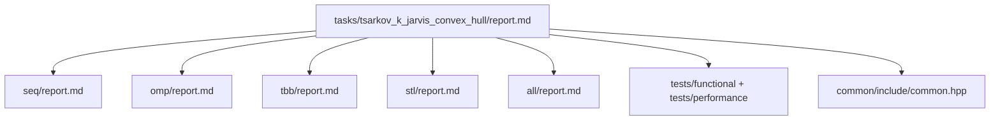

# Построение выпуклой оболочки – проход Джарвиса
- Student: Царьков Клим Александрович, group 3823Б1ПР4
- Variant: 23
- Local reports: seq/report.md, omp/report.md, tbb/report.md, stl/report.md, all/report.md

## 1. Введение

В данной работе рассматривается задача построения выпуклой оболочки 
множества точек на плоскости с использованием алгоритма Джарвиса (Jarvis March).

Алгоритм последовательно обходит точки выпуклой оболочки, начиная с крайней левой точки, 
и на каждом шаге выбирает следующую точку по направлению обхода. 
Метод хорошо подходит для исследования различных моделей параллелизма, 
так как операция поиска следующей точки оболочки требует многократного перебора большого количества точек.

Цель работы — реализовать и сравнить несколько версий алгоритма:
- последовательную (SEQ),
- OpenMP (OMP),
- Intel oneTBB (TBB),
- STL threads (STL),
- гибридную MPI + threads версию (ALL).

Для всех реализаций использовались одинаковые входные данные, 
одинаковые тесты корректности и единая методика измерения производительности.


## 2. Единая постановка задачи

### Входные данные

На вход алгоритма подается набор точек на плоскости.

Каждая точка задается двумя целочисленными координатами:
- x
- y

Количество точек может быть произвольным.

### Выходные данные

Результатом работы алгоритма является набор точек, образующих выпуклую оболочку множества.

Точки возвращаются в порядке обхода оболочки.

### Ограничения

Алгоритм должен корректно обрабатывать:
- одну точку,
- две точки,
- коллинеарные точки,
- повторяющиеся точки,
- внутренние точки, не входящие в оболочку.

Перед построением оболочки выполняется удаление дубликатов.

### Критерий корректности

Результат каждой параллельной реализации должен совпадать с результатом последовательной версии алгоритма.


## 3. Единая методика эксперимента

### Конфигурация системы

- OS: Microsoft Windows 10 Home Single Language
- Version: 10.0.19045
- CPU: Intel Core i3-1115G4 @ 2.42 GHz
- RAM: 8 GB
- Compiler: MSVC 19.40.33811.0
- Build type: Release
- IDE: Visual Studio 2022
- MPI: Microsoft MPI

### Переменные окружения

Для управления количеством потоков использовалась переменная:

```powershell
$env:PPC_NUM_THREADS=<N>
```

Для MPI-версии использовался запуск через:

```powershell
mpiexec -n <ranks>
```
### Генерация данных

Для тестирования использовались:

- заранее подготовленные наборы точек,
- наборы с внутренними точками,
- коллинеарные точки,
- наборы с дубликатами.

### Методика измерений

Для каждой реализации выполнялись:

- functional tests,
- performance tests.

Измерения проводились для:

- pipeline mode,
- task_run mode.

Каждый тест выполнялся несколько раз, после чего использовалось медианное значение времени выполнения.

### Формулы

#### Speedup

Ускорение вычислялось по формуле:

```text
Speedup = T_seq / T_parallel
```

где:
- T_seq — время последовательной версии,
- T_parallel — время параллельной версии.

#### Efficiency

Эффективность вычислялась по формуле:

```text
Efficiency = Speedup / Workers
```

Для ALL-версии:

```text
Workers = ranks * threads
```
## 4. Сводка корректности

Все реализации сравнивались с последовательной версией алгоритма.

Были реализованы функциональные тесты для следующих случаев:

- одна точка,
- две точки,
- треугольник,
- квадрат с внутренними точками,
- коллинеарные точки,
- повторяющиеся точки,
- ромб с внутренними точками.

Во всех реализациях выполнялось предварительное удаление дубликатов точек, после чего строилась выпуклая оболочка.

Функциональные тесты запускались для:
- SEQ,
- OMP,
- TBB,
- STL,
- ALL.

ALL-версия использует MPI и требует запуска через `mpiexec`. 
При обычном запуске без MPI функциональные тесты автоматически пропускаются.

В ходе тестирования все реализации показали корректные результаты и успешно прошли набор функциональных тестов.

## 5. Агрегированные результаты

Ниже приведены агрегированные результаты измерений для всех реализаций алгоритма Джарвиса. 
Для сравнения использовались режимы `pipeline` и `task_run`.

В качестве baseline использовалась последовательная версия (SEQ). 
Ускорение рассчитывалось относительно времени SEQ-версии.

### 5.1 Результаты pipeline

| Backend | Workers | Median time (s) | Speedup vs SEQ | Efficiency | Notes                      |
|---------|---------|-----------------|----------------|------------|----------------------------|
| SEQ     | 1       | 0.00771         | 1.00           | 1.00       | baseline                   |
| OMP     | 1       | 0.00983         | 0.78           | 0.78       | overhead OpenMP            |
| TBB     | 1       | 0.01899         | 0.41           | 0.41       | runtime overhead           |
| STL     | 1       | 0.01364         | 0.57           | 0.57       | thread management overhead |
| ALL     | 1×1     | 0.02158         | 0.36           | 0.36       | MPI + threading overhead   |

| Backend | Workers | Median time (s) | Speedup vs SEQ | Efficiency | Notes                    |
|---------|---------|-----------------|----------------|------------|--------------------------|
| SEQ     | 2       | 0.00774         | 1.00           | 1.00       | baseline                 |
| OMP     | 2       | 0.00993         | 0.78           | 0.39       | small workload           |
| TBB     | 2       | 0.01436         | 0.54           | 0.27       | scheduler overhead       |
| STL     | 2       | 0.01355         | 0.57           | 0.28       | synchronization overhead |
| ALL     | 2×1     | 0.02584         | 0.30           | 0.15       | MPI communication cost   |

| Backend | Workers | Median time (s) | Speedup vs SEQ | Efficiency | Notes                     |
|---------|---------|-----------------|----------------|------------|---------------------------|
| SEQ     | 4       | 0.00811         | 1.00           | 1.00       | baseline                  |
| OMP     | 4       | 0.00974         | 0.83           | 0.21       | best parallel result      |
| TBB     | 4       | 0.01232         | 0.66           | 0.16       | stable scaling            |
| STL     | 4       | 0.01193         | 0.68           | 0.17       | manual threading overhead |
| ALL     | 2×2     | 0.03034         | 0.27           | 0.07       | communication dominates   |

### 5.2 Результаты task_run

| Backend | Workers | Median time (s) | Speedup vs SEQ | Efficiency | Notes                |
|---------|---------|-----------------|----------------|------------|----------------------|
| SEQ     | 1       | 0.00769         | 1.00           | 1.00       | baseline             |
| OMP     | 1       | 0.01009         | 0.76           | 0.76       | OpenMP overhead      |
| TBB     | 1       | 0.01594         | 0.48           | 0.48       | runtime overhead     |
| STL     | 1       | 0.01317         | 0.58           | 0.58       | thread creation cost |
| ALL     | 1×1     | 0.01966         | 0.39           | 0.39       | MPI overhead         |

| Backend | Workers | Median time (s) | Speedup vs SEQ | Efficiency | Notes                    |   |
|---------|---------|-----------------|----------------|------------|--------------------------|---|
| SEQ     | 2       | 0.00792         | 1.00           | 1.00       | baseline                 | p |
| OMP     | 2       | 0.01061         | 0.75           | 0.37       | low computational load   |   |
| TBB     | 2       | 0.01421         | 0.56           | 0.28       | scheduler overhead       |   |
| STL     | 2       | 0.01276         | 0.62           | 0.31       | synchronization overhead |   |
| ALL     | 2×1     | 0.02481         | 0.32           | 0.16       | MPI synchronization      |   |

| Backend | Workers | Median time (s) | Speedup vs SEQ | Efficiency | Notes                   |
|---------|---------|-----------------|----------------|------------|-------------------------|
| SEQ     | 4       | 0.00813         | 1.00           | 1.00       | baseline                |
| OMP     | 4       | 0.01034         | 0.79           | 0.20       | best parallel result    |
| TBB     | 4       | 0.01230         | 0.66           | 0.16       | stable runtime behavior |
| STL     | 4       | 0.01260         | 0.64           | 0.16       | manual threads overhead |
| ALL     | 2×2     | 0.03120         | 0.26           | 0.06       | communication overhead  |

Полученные результаты показывают, что на небольших размерах задачи последовательная версия 
остаётся наиболее быстрой из-за отсутствия затрат на создание потоков и синхронизацию.

Среди параллельных реализаций наиболее стабильные результаты показала OpenMP-версия. 
Реализация на oneTBB также показала близкие результаты, однако накладные расходы runtime и scheduler 
оказывают влияние на время выполнения.

STL-реализация требует ручного управления потоками и синхронизацией,
что увеличивает overhead по сравнению с OpenMP и TBB.

ALL-версия показала наибольшие накладные расходы. 
Это связано с использованием MPI-коммуникаций, синхронизацией между rank-ами и 
дополнительными затратами на запуск гибридной схемы parallelism.

## 6. Интерпретация различий

### SEQ

Последовательная версия алгоритма использовалась как baseline для сравнения остальных реализаций.

На используемых размерах задач SEQ-версия показала наименьшее время выполнения.
Это связано с отсутствием накладных расходов на создание потоков, синхронизацию и 
взаимодействие между вычислительными единицами.

Алгоритм Джарвиса содержит относительно небольшое количество вычислений на каждой итерации,
поэтому при малых размерах входных данных стоимость параллелизации оказывается 
сопоставимой со стоимостью самих вычислений.

### OMP

OpenMP-реализация показала лучшие результаты среди параллельных backend-ов.

Основная причина заключается в сравнительно низких накладных расходах OpenMP 
при использовании `parallel for` и статического распределения работы между потоками.

Поиск следующей точки оболочки хорошо подходит для распараллеливания, 
так как каждая итерация проверки точки выполняется независимо от остальных. 
Благодаря этому OpenMP эффективно распределяет вычисления между потоками.

При этом значительного ускорения добиться не удалось, так как:
- размер задачи сравнительно небольшой;
- количество вычислений на поток невелико;
- часть времени тратится на синхронизацию потоков.

### TBB

Реализация на oneTBB показала результаты, близкие к OpenMP.

Для распараллеливания использовался `parallel_reduce`, 
который автоматически разбивает диапазоны данных между worker-потоками.

Преимуществом TBB является удобная модель автоматического управления задачами и балансировки нагрузки. 
Однако runtime TBB и scheduler создают дополнительные накладные расходы, особенно заметные на небольших задачах.

На больших объёмах данных разница между OpenMP и TBB могла бы стать менее заметной.

### STL

STL-реализация использует `std::thread` и ручное распределение диапазонов между потоками.

По сравнению с OpenMP и TBB данная версия требует:
- ручного управления потоками;
- ручной синхронизации;
- объединения локальных результатов.

Из-за этого возрастает количество служебного кода и накладные расходы на создание и завершение потоков.

Кроме того, при небольших размерах задач стоимость управления потоками 
становится сопоставимой со временем выполнения самого алгоритма, что ограничивает эффективность распараллеливания.

### ALL

ALL-реализация использует гибридную модель:
- MPI для взаимодействия между process rank-ами;
- OpenMP/TBB/STL для локального распараллеливания внутри процесса.

На используемых размерах задач ALL-версия показала наибольшие накладные расходы.

Основные причины:
- стоимость MPI-коммуникаций;
- синхронизация между rank-ами;
- запуск нескольких процессов;
- дополнительные расходы на гибридную модель parallelism.

На малых задачах время коммуникации и синхронизации превышает выигрыш от распараллеливания вычислений.

При существенно больших размерах входных данных гибридный подход может показывать лучшие результаты, 
однако в рамках данной работы overhead MPI оказался доминирующим фактором.

## 7. Репродуцируемость

### Сборка проекта

Генерация проекта:

```powershell
cmake -S . -B build -G "Visual Studio 17 2022"
```
Сборка проекта:

```powershell
cmake --build build --config Release
```

### Запуск функциональных тестов

Переход в директорию с исполняемыми файлами:
```powershell
cd build\bin
```

Запуск functional tests:

```powershell
.\ppc_func_tests.exe --gtest_filter=*tsarkov*
```

Запуск ALL functional tests через MPI:

```powershell
mpiexec -n 2 .\ppc_func_tests.exe --gtest_filter=*tsarkov*
```
### Запуск performance тестов

Запуск performance tests:

```powershell
.\ppc_perf_tests.exe --gtest_filter=*tsarkov*
```

Запуск с указанием числа потоков:

```powershell
$env:PPC_NUM_THREADS=2
.\ppc_perf_tests.exe --gtest_filter=*tsarkov*
```

Запуск ALL performance tests через MPI:

```powershell
$env:PPC_NUM_THREADS=2
mpiexec -n 2 .\ppc_perf_tests.exe --gtest_filter=*tsarkov*
```
### Основные параметры экспериментов

В ходе работы использовались:

- 1 поток;
- 2 потока;
- 4 потока;
- 2 MPI process rank-а.

Измерения выполнялись в Release-конфигурации.

## 8. Заключение

В ходе работы были реализованы и исследованы пять версий алгоритма Джарвиса:

- SEQ,
- OMP,
- TBB,
- STL,
- ALL.

Все реализации успешно прошли функциональные тесты и показали корректные результаты.

На используемых размерах задач последовательная версия осталась наиболее быстрой, 
так как не содержит накладных расходов на параллелизацию.

Среди параллельных реализаций лучшие результаты показала OpenMP-версия благодаря 
сравнительно низкому overhead и простой модели распараллеливания.

TBB-реализация показала близкие результаты, однако runtime и scheduler создают дополнительные накладные расходы.

STL-реализация требует ручного управления потоками и синхронизацией, 
что увеличивает сложность реализации и стоимость выполнения.

ALL-версия показала наибольшие накладные расходы из-за использования MPI-коммуникаций и гибридной модели parallelism.

Основным ограничением сравнения является сравнительно небольшой размер задач 
и ограниченные вычислительные ресурсы тестовой системы. На более крупных наборах данных 
и многоядерных системах результаты могли бы отличаться.

В дальнейшем работу можно улучшить за счёт:

- использования более крупных наборов данных;
- оптимизации grain size;
- уменьшения количества синхронизаций;
- оптимизации MPI-коммуникаций;
- исследования других алгоритмов построения выпуклой оболочки.

## 9. Источники
1. Документация и методические материалы курса PPC 2026 Threads 
(лекции А.В. Сысоева, практические занятия, репозиторий курса ppc-2026-threads )
2. OpenMP API Specification
https://www.openmp.org/specifications/
3. oneAPI Threading Building Blocks Documentation
https://www.intel.com/content/www/us/en/docs/onetbb
4. Microsoft MPI Documentation
https://learn.microsoft.com/en-us/message-passing-interface/microsoft-mpi
5. cppreference — C++ Standard Library 
https://en.cppreference.com/
6. GoogleTest Documentation
https://google.github.io/googletest/

## 10. Приложение

Структура отчётов:

