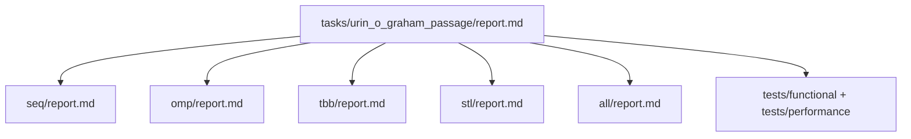

# Построение выпуклой оболочки методом Грэхема
- Student: Юрин Олеег Игоревич, 3823Б1ПР4
- Variant: 22
- Local reports: seq/report.md, omp/report.md, tbb/report.md, stl/report.md, all/report.md

## 1. Введение
Задача построения выпуклой оболочки используется для сравнения разных моделей параллелизма, потому что часть операций является независимыми проходами по массиву точек, а часть имеет последовательную зависимость. Это позволяет увидеть границы ускорения: поиск опорной точки и проверки можно распараллелить, но сортировка и стековый проход остаются основными ограничителями.

## 2. Единая постановка задачи
Вход: `InType = std::vector<Point>`, где `Point` содержит координаты `double x`, `double y`.

Выход: `OutType = std::vector<Point>` — вершины выпуклой оболочки.

Ограничения:

| Случай | Требуемое поведение |
|---|---|
| `n < 3` | отказ валидации |
| все точки совпадают | отказ валидации |
| все точки коллинеарны | две крайние точки |
| есть внутренние точки | исключаются из оболочки |

Критерий корректности: результат является выпуклой оболочкой, а последовательные тройки вершин не образуют правого поворота.

## 3. Единая методика эксперимента
Окружение:

| Параметр | Значение |
|---|---|
| CPU | 12th Gen Intel(R) Core(TM) i5-12450H |
| RAM | 16 GB |
| OS | Windows 11 |
| Compiler | Clang 21.1.8, C++23 |
| Build type | Release |

Переменные окружения: для потоковых запусков используется `PPC_NUM_THREADS`; для гибридной схемы должен использоваться `PPC_NUM_PROC`, но текущий `all` не содержит MPI-уровня.

Данные в текущем performance-тесте генерируются случайно: координаты равномерно выбираются из диапазона `[-1000.0, 1000.0]`. Размеры задач: `100`, `500`, `1000`, `5000`, `10000`.

Формулы:

```text
speedup = T_seq / T_parallel
efficiency = speedup / workers
```

`tests/performance/main.cpp` обновлен так, чтобы в одном запуске измерялись `SEQ`, `OMP`, `STL`, `TBB` и `ALL` на одинаковых входных данных. Для таблиц выполнено 5 запусков, используется медиана. Число логических потоков на машине — 12; для efficiency параллельных версий используется нормировка на 12 workers.

## 4. Сводка корректности
Функциональные тесты в `tests/functional/main.cpp` оформлены как typed tests и запускают один и тот же набор сценариев для `SEQ`, `OMP`, `STL`, `TBB` и `ALL`. Они проверяют пустой вход, 1 и 2 точки, коллинеарность, одинаковые точки, треугольник, квадрат, прямоугольник с точками на сторонах, точку на границе, точки на окружности и шестиугольник с центром. Для всех параллельных backend-ов результат дополнительно сравнивается с SEQ по множеству вершин оболочки.

| backend | functional tests | performance sanity check | ограничение |
|---|---|---|---|
| SEQ | есть, 13 сценариев | есть | baseline |
| OMP | есть, 13 сценариев + сравнение с SEQ | есть | OpenMP |
| STL | есть, 13 сценариев + сравнение с SEQ | есть | `std::thread` |
| TBB | есть, 13 сценариев + сравнение с SEQ | есть | oneTBB |
| ALL | есть, 13 сценариев + сравнение с SEQ | есть | MPI-уровень отсутствует |

Сами functional-сценарии сведены в таблицу:

| Группа тестов | Тесты | Назначение |
|---|---|---|
| Невалидные входы | `EmptyInput`, `SinglePoint`, `TwoDistinctPoints`, `AllIdenticalPoints` | Проверить отказ валидации и пустой выход. |
| Базовые фигуры | `TrianglePoints`, `SquarePoints`, `HexagonWithCenter` | Проверить построение оболочки для простых выпуклых фигур. |
| Лишние точки | `SquareWithInteriorPoint`, `PointOnBoundary`, `RectangleWithCollinearPoints` | Проверить исключение внутренних и промежуточных граничных точек. |
| Коллинеарность | `CollinearPoints`, `VerticalCollinear` | Проверить возврат двух крайних точек. |
| Массовый случай | `LargeRandomSet` | Проверить выпуклость на 100 точках окружности. |

## 5. Агрегированные результаты
Текущий performance-файл содержит только OMP-измерения полного pipeline.

| backend | mode | size | workers | time, ms | speedup vs seq | efficiency | notes |
|---|---|---:|---|---:|---:|---:|---|
| SEQ | pipeline | 100 | 1 | 1.090 | 1.000 | 1.000 | baseline |
| OMP | pipeline | 100 | 12 | 4.265 | 0.256 | 0.021 | OpenMP |
| STL | pipeline | 100 | 12 | 4.051 | 0.269 | 0.022 | `std::thread` |
| TBB | pipeline | 100 | 12 | 1.727 | 0.631 | 0.053 | oneTBB |
| ALL | pipeline | 100 | 12 | 1.206 | 0.904 | 0.075 | TBB-like |
| SEQ | pipeline | 500 | 1 | 1.559 | 1.000 | 1.000 | baseline |
| OMP | pipeline | 500 | 12 | 2.044 | 0.763 | 0.064 | OpenMP |
| STL | pipeline | 500 | 12 | 3.406 | 0.458 | 0.038 | `std::thread` |
| TBB | pipeline | 500 | 12 | 1.973 | 0.790 | 0.066 | oneTBB |
| ALL | pipeline | 500 | 12 | 1.916 | 0.814 | 0.068 | TBB-like |
| SEQ | pipeline | 1000 | 1 | 2.362 | 1.000 | 1.000 | baseline |
| OMP | pipeline | 1000 | 12 | 2.961 | 0.798 | 0.066 | OpenMP |
| STL | pipeline | 1000 | 12 | 4.262 | 0.554 | 0.046 | `std::thread` |
| TBB | pipeline | 1000 | 12 | 2.920 | 0.809 | 0.067 | oneTBB |
| ALL | pipeline | 1000 | 12 | 2.781 | 0.849 | 0.071 | TBB-like |
| SEQ | pipeline | 5000 | 1 | 9.579 | 1.000 | 1.000 | baseline |
| OMP | pipeline | 5000 | 12 | 18.232 | 0.525 | 0.044 | OpenMP |
| STL | pipeline | 5000 | 12 | 12.285 | 0.780 | 0.065 | `std::thread` |
| TBB | pipeline | 5000 | 12 | 10.442 | 0.917 | 0.076 | oneTBB |
| ALL | pipeline | 5000 | 12 | 10.618 | 0.902 | 0.075 | TBB-like |
| SEQ | pipeline | 10000 | 1 | 19.432 | 1.000 | 1.000 | baseline |
| OMP | pipeline | 10000 | 12 | 25.996 | 0.747 | 0.062 | OpenMP |
| STL | pipeline | 10000 | 12 | 23.069 | 0.842 | 0.070 | `std::thread` |
| TBB | pipeline | 10000 | 12 | 20.539 | 0.946 | 0.079 | oneTBB |
| ALL | pipeline | 10000 | 12 | 20.473 | 0.949 | 0.079 | TBB-like |

Таблица содержит полный pipeline. Отдельный режим `task_run` пока не измеряется, потому что performance-тест использует ручной замер через `std::chrono`, а не общий каркас `BaseRunPerfTests`.

## 6. Интерпретация различий
SEQ показывает базовую корректную схему алгоритма и дает baseline времени.

OMP распараллеливает поиск опорной точки, сбор точек и проверку коллинеарности. Слабые места — `critical` при обновлении минимума и последовательная сортировка.

TBB использует `parallel_reduce`, `parallel_for` и `concurrent_vector`. Его преимущество — автоматическое планирование задач, но текущий код не задает `grainsize` и не ограничивает конкуренцию явно.

STL вручную создает потоки, делит диапазоны и вызывает `join` после запуска всех потоков этапа. Основная цена — создание потоков и объединение локальных контейнеров.

ALL в текущем состоянии не является полноценной гибридной MPI-версией: в коде нет rank-ов, обменов и барьеров. Фактически она повторяет TBB-подход внутри одного процесса и показывает близкие к TBB результаты.

## 7. Репродуцируемость
Команды сборки:

```bash
cmake -S . -B build -D USE_FUNC_TESTS=ON -D USE_PERF_TESTS=ON -D CMAKE_BUILD_TYPE=Release
cmake --build build --parallel
```

Команды запуска тестов:

```bash
scripts/run_tests.py --running-type=threads --counts 1 2 4
scripts/run_tests.py --running-type=performance
```

Команда получения основных замеров:

```bash
.\build\bin\ppc_perf_tests.exe --gtest_filter=*UrinOGrahamPassagePerfTest*
```

Тест выводит строки `PERF_RESULT backend=<...> size=<...> time_ms=<...> hull_size=<...>` для всех пяти backend-ов.

## 8. Заключение
На измерениях этой машины лучший результат на размере `10000` среди параллельных реализаций показала ALL/TBB-подобная версия (`20.473 ms`), но она все равно медленнее SEQ (`19.432 ms`). Это означает, что для данного размера и такой реализации накладные расходы параллелизма не окупаются полностью.

Для улучшения сравнения нужно:

1. Добавить все backend-ы в functional-тесты.
2. Перевести performance-тесты на единый каркас с режимами `task` и `pipeline`.
3. Выполнить серию повторов и использовать медиану, а не один запуск.
4. Для `all` либо реализовать настоящий MPI-уровень, либо явно оставить его как TBB-подобную версию без гибридных метрик.

## 9. Источники
- Методическое руководство по отчётам к задачам параллельного программирования.
- Документация курса `ppc-2026-threads`.
- OpenMP specification.
- oneTBB documentation.
- C++ reference documentation for `std::thread`.

## 10. Приложение
Структура отчетов:



Ключевой общий фрагмент алгоритма — стековое удаление вершин при не левом повороте; он остается последовательным во всех реализациях.

## Инструкция для тестов

func tests:
```
cd C:\parallel-programming-threads\ppc-2026-threads
cmake --build build --target urin_o_graham_passage_seq urin_o_graham_passage_stl urin_o_graham_passage_omp urin_o_graham_passage_tbb urin_o_graham_passage_all --config Debug -- /m:1
```

```
cmake --build build --target ppc_func_tests --config Debug -- /m:1
```

```
.\build\bin\ppc_func_tests.exe --gtest_filter="UrinOGrahamPassage.*"
```

perf tests:
```
cmake --build build --target ppc_perf_tests --config Debug -- /m:1
.\build\bin\Debug\ppc_perf_tests.exe --gtest_filter="UrinOGrahamPassagePerfTest.*"
```